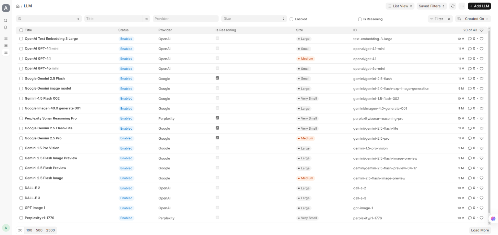
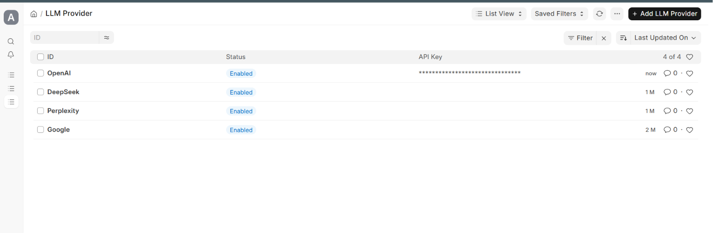
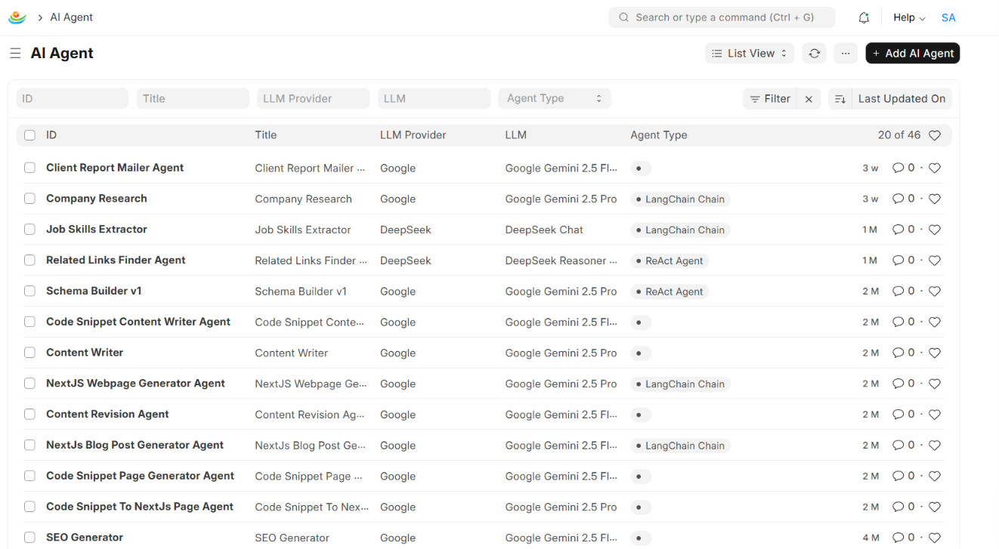
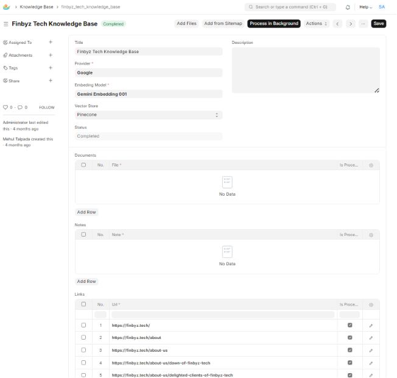

# FinByz AI

FinByz AI is a comprehensive, enterprise-grade AI integration platform built natively for the Frappe and ERPNext ecosystem. It provides the foundational infrastructure to orchestrate Large Language Models (LLMs), develop autonomous agents, manage dynamic tool invocation, and maintain scalable vector-based knowledge bases (RAG).

By bridging advanced AI capabilities with robust ERP data structures, FinByz AI enables developers and organizations to build intelligent, context-aware workflows directly within their existing Frappe applications.

## Table of Contents

- [Introduction](#introduction)
- [Core Capabilities](#core-capabilities)
- [Architecture Overview](#architecture-overview)
- [Supported Providers](#supported-providers)
- [Installation](#installation)
- [Configuration Guide](#configuration-guide)
  - [1. LLM Provider Setup](#1-llm-provider-setup)
  - [2. Vector Store Setup](#2-vector-store-setup)
  - [3. Creating an AI Agent](#3-creating-an-ai-agent)
- [Knowledge Base & RAG](#knowledge-base--rag)
- [Tracing and Observability](#tracing-and-observability)
- [Contributing](#contributing)
- [License](#license)

## Introduction

Modern enterprise applications require intelligent automation. FinByz AI solves the challenge of integrating complex AI frameworks (like LangChain and LangGraph) into Frappe. It abstracts the complexity of prompt engineering, conversational memory, and semantic search, offering a clean, declarative interface via standard Frappe Doctypes.

Whether you are building a specialized customer support chatbot, an intelligent document analyzer, or a multi-agent workflow, FinByz AI provides the required tools, caching mechanisms, and state management out-of-the-box.

## Core Capabilities

- **Universal Model Support**: Powered by LiteLLM, FinByz AI supports **100+ LLMs** natively. Switch seamlessly between any model from any provider without altering your agent logic.
- **Image Generation & Embeddings**: Full support for text generation, image generation, and embedding models across all LiteLLM-supported providers.
- **Autonomous Agents**: Support for ReAct (Reason+Act) agents, Conversational agents, and LangChain Chains.
- **Dynamic Tool Binding**: Bind custom python functions or external APIs as tools that agents can invoke autonomously.
- **Advanced Memory Management**: Built-in support for ConversationBufferMemory, VectorStoreRetrieverMemory, and Window-based memory.
- **Retrieval-Augmented Generation (RAG)**: Create Knowledge Bases from Web URLs, sitemaps, PDFs, and raw text notes. Includes automatic chunking (RecursiveCharacterTextSplitter) and background synchronization.
- **Native Vector Store Adapters**: Direct integration with Pinecone, Qdrant, Supabase, and Chroma.
- **Caching**: Built-in response caching mechanisms specifically optimized for Gemini and other high-latency models.

## Architecture Overview

FinByz AI introduces several specialized Doctypes that work in tandem:

- `LLM Provider` & `LLM`: Manages API keys, endpoint configurations, and specific model parameters (temperature, max tokens, etc.).
- `AI Agent`: The central orchestrator. Defines the system prompt, selects the LLM, configures memory, and binds tools.
- `AI Tool`: Represents an actionable skill (e.g., "Fetch Customer Balance") that an agent can execute.
- `Knowledge Base`: A container for RAG data sources. Manages the lifecycle of document extraction, text splitting, embedding generation, and vector store upsertion.
- `AI Conversation`: Persists the state and history of interactions, allowing agents to maintain long-term context across sessions.

## Supported Providers

FinByz AI leverages **LiteLLM** under the hood, meaning it supports **100+ LLMs from any provider** right out of the box.



**Supported Models Include (but are not limited to):**
- OpenAI (GPT-4o, GPT-4, GPT-3.5, DALL-E)
- Anthropic (Claude 3.5 Sonnet, Claude 3 Opus)
- Google (Gemini 1.5 Pro, Gemini Flash)
- Meta (Llama 3, Llama 2)
- Mistral, Cohere, TogetherAI, Groq, Ollama, and many more.

If LiteLLM supports it, FinByz AI supports it natively.

**Vector Databases:**
- Pinecone
- Qdrant
- Supabase (pgvector)
- Chroma (Local)

## Installation

FinByz AI is built as a standard Frappe app. You must have Frappe Bench installed and initialized.

```bash
# Fetch the application from the repository
bench get-app https://github.com/finbyz/finbyzai.git

# Install the application on your target site
bench --site [your-site-name] install-app finbyzai
```

## Configuration Guide

### 1. LLM Provider Setup



1. Navigate to **LLM Provider** in your Frappe Desk.
2. Create a new provider (e.g., "OpenAI").
3. Securely enter your API key. (Keys are stored using Frappe's encrypted password fields).
4. Navigate to **LLM** and define specific models (e.g., "gpt-4-turbo") linking them to the provider. Toggle "Is Embedding Model" if the model is intended for vectorization.

### 2. Vector Store Setup

If you intend to use Retrieval-Augmented Generation (RAG):

1. Navigate to your specific Vector Store Settings (e.g., **Pinecone Settings** or **Qdrant Settings**).
2. Enter your environment, API key, and index name.
3. Ensure you have configured an Embedding Model in the LLM Doctype.

### 3. Creating an AI Agent



1. Navigate to **AI Agent** and create a new record.
2. Select the `Agent Type` (e.g., ReAct Agent or Conversational Agent).
3. Select your pre-configured `LLM`.
4. Define the **System Message** to instruct the agent on its persona and constraints.
5. (Optional) Attach **AI Tools** to grant the agent execution capabilities.
6. Enable **Memory** if the agent needs to track multi-turn conversations.

## Knowledge Base & RAG



The Knowledge Base module automatically syncs your data into your configured Vector Store. 

1. Create a **Knowledge Base** record.
2. Add data sources in the child tables:
   - **AI Links**: Web URLs or Sitemaps.
   - **Knowledge Documents**: PDF, DOCX, or TXT files.
   - **AI Notes**: Direct markdown or text inputs.
3. Upon saving, a background job extracts the text, applies recursive character splitting (default 1000 chunk size with 200 overlap), generates embeddings, and upserts them to the Vector Store.
4. If a web route changes within Frappe (e.g., a Blog Post URL is updated), FinByz AI automatically detects the change, deletes the old vectors, and re-indexes the new content.

## Tracing and Observability

For production debugging and performance monitoring, FinByz AI supports LangSmith integration. 

To enable tracing for your LangChain and LangGraph executions:
1. Obtain an API key from LangSmith.
2. The environment variables are evaluated in `finbyzai.ai.agent.agent_service`. Ensure the backend environment running Frappe has access to the appropriate LangSmith variables.

## Contributing

We welcome contributions from the community. Please ensure that any pull requests follow standard Frappe development guidelines and include appropriate test coverage for new LLM providers or Vector Store integrations.

## License

This project is licensed under the GPL-3.0 License. See the `LICENSE` file for details.