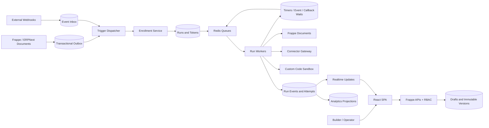
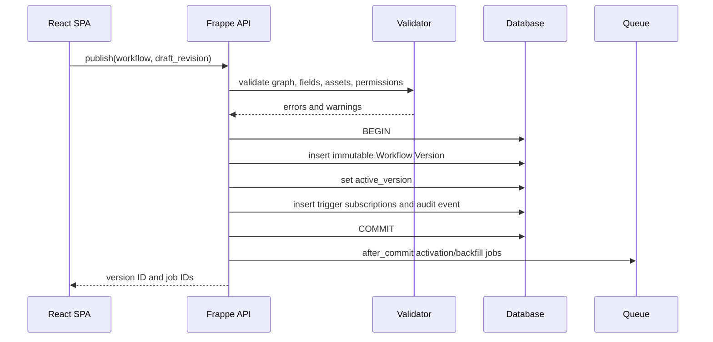
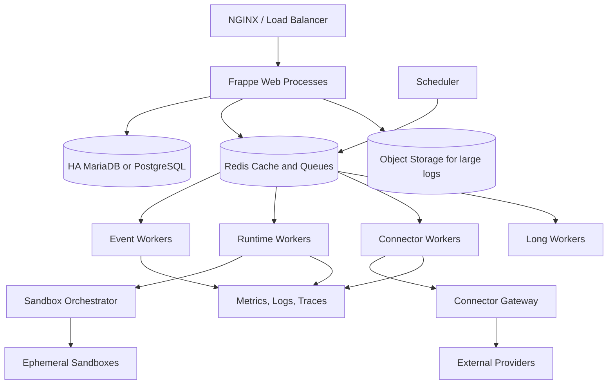

ww# HubSpot Automatic Workflows → Frappe + React (Raven-style) Engineering Specification

**Research/design date:** 2026-08-05  
**Edition:** 2.0 — exhaustive feature-by-feature implementation handbook  
**Deliverables:** Markdown engineering specification, interactive offline HTML explorer, and CSV implementation matrix.

> This document distinguishes documented HubSpot behavior, publicly inferable workflow semantics, and a recommended greenfield Frappe architecture. The recommended data model is not a claim about HubSpot proprietary internals.

## What is different in this edition

The earlier report was a capability catalog. This edition makes each capability implementable. Every feature defines configuration, state semantics, backend ownership, React components, failure modes, tests, and operational requirements. It also defines the common engine contracts that prevent inconsistent implementations across triggers and actions.

## Verified design inputs

- HubSpot documents event, filter, incoming-webhook, schedule, and manual enrollment approaches, and a maximum of 250 enrollment filters. [S1]
- Workflow actions vary by object, subscription, permissions, connected apps, seats, credits, and beta access. [S6][S9]
- Delay categories include fixed duration, calendar date, date property, event occurrence, weekday, and time of day. [S6][S8]
- Branching includes one-property/action-output, AND/OR, and random percentage distribution. [S6][S7]
- Current HubSpot custom-code documentation describes managed JavaScript/Python execution, secrets, typed inputs/outputs, logs, rate limits, retry behavior, a 20-second execution limit, and 128 MB memory. [S19]
- Frappe provides DocTypes, lifecycle hooks, `doc_events`, background queues, scheduler events, database transaction hooks, REST/RPC APIs, realtime, and roles. These are the platform primitives; the durable engine specified here must be added. [S24][S25][S26][S27][S28][S29]
- Raven and `frappe-react-sdk` demonstrate the practical Frappe-backend plus React-SPA pattern used for the proposed UI architecture. [S31][S32]

## Feature coverage index

**102 feature chapters across 10 categories.**

| ID | Category | Feature | Phase | Complexity |
|---|---|---|---|---|
| L01 | Authoring & lifecycle | [Create from scratch](#l01-create-from-scratch) | Foundation | M |
| L02 | Authoring & lifecycle | [Templates and cloning](#l02-templates-and-cloning) | Foundation | M |
| L03 | Authoring & lifecycle | [AI-assisted creation](#l03-ai-assisted-creation) | Advanced | L |
| L04 | Authoring & lifecycle | [Object type selection](#l04-object-type-selection) | Foundation | M |
| L05 | Authoring & lifecycle | [Placeholder actions](#l05-placeholder-actions) | Foundation | S |
| L06 | Authoring & lifecycle | [Comments and collaboration](#l06-comments-and-collaboration) | Operational MVP | M |
| L07 | Authoring & lifecycle | [Undo, redo, autosave, conflicts](#l07-undo-redo-autosave-conflicts) | Foundation | L |
| L08 | Authoring & lifecycle | [Review and publish](#l08-review-and-publish) | Foundation | XL |
| L09 | Authoring & lifecycle | [Activate, pause, disable, turn off](#l09-activate-pause-disable-turn-off) | Operational MVP | XL |
| L10 | Authoring & lifecycle | [Immutable revisions and visual diff](#l10-immutable-revisions-and-visual-diff) | Foundation | L |
| E01 | Enrollment | [Filter-based enrollment](#e01-filter-based-enrollment) | Foundation | XL |
| E02 | Enrollment | [Event-based enrollment](#e02-event-based-enrollment) | Operational MVP | XL |
| E03 | Enrollment | [Property-change event](#e03-property-change-event) | Foundation | L |
| E04 | Enrollment | [Schedule-based enrollment](#e04-schedule-based-enrollment) | Operational MVP | XL |
| E05 | Enrollment | [Webhook-based enrollment](#e05-webhook-based-enrollment) | Operational MVP | XL |
| E06 | Enrollment | [Manual enrollment](#e06-manual-enrollment) | Foundation | M |
| E07 | Enrollment | [Enrollment from another workflow](#e07-enrollment-from-another-workflow) | Advanced | L |
| E08 | Enrollment | [Re-enrollment](#e08-re-enrollment) | Operational MVP | XL |
| E09 | Enrollment | [Enroll existing records and backfill](#e09-enroll-existing-records-and-backfill) | Operational MVP | XL |
| E10 | Enrollment | [Merged-record handling](#e10-merged-record-handling) | Advanced | XL |
| D01 | Conditions & data | [Boolean condition builder](#d01-boolean-condition-builder) | Foundation | XL |
| D02 | Conditions & data | [Associated-record properties](#d02-associated-record-properties) | Foundation | XL |
| D03 | Conditions & data | [Activity and engagement criteria](#d03-activity-and-engagement-criteria) | Advanced | XL |
| D04 | Conditions & data | [List or segment membership](#d04-list-or-segment-membership) | Operational MVP | L |
| D05 | Conditions & data | [Line-item and commerce criteria](#d05-line-item-and-commerce-criteria) | Advanced | L |
| D06 | Conditions & data | [Date and relative-time logic](#d06-date-and-relative-time-logic) | Foundation | L |
| D07 | Conditions & data | [Action outputs and variables](#d07-action-outputs-and-variables) | Foundation | L |
| D08 | Conditions & data | [Personalization tokens](#d08-personalization-tokens) | Foundation | L |
| D09 | Conditions & data | [Formatting and transformation](#d09-formatting-and-transformation) | Operational MVP | L |
| D10 | Conditions & data | [Snapshot versus live data](#d10-snapshot-versus-live-data) | Foundation | L |
| O01 | Orchestration | [Fixed-duration delay](#o01-fixed-duration-delay) | Foundation | XL |
| O02 | Orchestration | [Calendar-date delay](#o02-calendar-date-delay) | Operational MVP | M |
| O03 | Orchestration | [Date-property delay](#o03-date-property-delay) | Operational MVP | L |
| O04 | Orchestration | [Day-of-week and time-of-day delay](#o04-day-of-week-and-time-of-day-delay) | Operational MVP | L |
| O05 | Orchestration | [Event-occurrence wait](#o05-event-occurrence-wait) | Advanced | XL |
| O06 | Orchestration | [AND/OR branch](#o06-and-or-branch) | Foundation | L |
| O07 | Orchestration | [Single-property value branch](#o07-single-property-value-branch) | Operational MVP | L |
| O08 | Orchestration | [Random split](#o08-random-split) | Advanced | L |
| O09 | Orchestration | [Go to action and branch convergence](#o09-go-to-action-and-branch-convergence) | Advanced | L |
| O10 | Orchestration | [Action sets and reusable subflows](#o10-action-sets-and-reusable-subflows) | Advanced | XL |
| O11 | Orchestration | [Goals and early completion](#o11-goals-and-early-completion) | Operational MVP | XL |
| O12 | Orchestration | [Suppression and hard exclusion](#o12-suppression-and-hard-exclusion) | Operational MVP | XL |
| O13 | Orchestration | [Unenroll when eligibility becomes false](#o13-unenroll-when-eligibility-becomes-false) | Operational MVP | XL |
| O14 | Orchestration | [Working hours and execution windows](#o14-working-hours-and-execution-windows) | Operational MVP | L |
| O15 | Orchestration | [Manual unenrollment and cancellation](#o15-manual-unenrollment-and-cancellation) | Foundation | L |
| A01 | CRM actions | [Edit record properties](#a01-edit-record-properties) | Foundation | XL |
| A02 | CRM actions | [Increase or decrease numeric property](#a02-increase-or-decrease-numeric-property) | Operational MVP | L |
| A03 | CRM actions | [Create record](#a03-create-record) | Operational MVP | XL |
| A04 | CRM actions | [Create task](#a04-create-task) | Foundation | M |
| A05 | CRM actions | [Create note or timeline entry](#a05-create-note-or-timeline-entry) | Foundation | M |
| A06 | CRM actions | [Delete or archive record](#a06-delete-or-archive-record) | Enterprise hardening | XL |
| A07 | CRM actions | [Owner rotation](#a07-owner-rotation) | Operational MVP | XL |
| A08 | CRM actions | [Create and manage associations](#a08-create-and-manage-associations) | Operational MVP | XL |
| A09 | CRM actions | [Line-item action](#a09-line-item-action) | Advanced | L |
| A10 | CRM actions | [Communication subscription and consent update](#a10-communication-subscription-and-consent-update) | Operational MVP | XL |
| A11 | CRM actions | [Cross-account record action](#a11-cross-account-record-action) | Enterprise hardening | XL |
| C01 | Communication | [Automated marketing email](#c01-automated-marketing-email) | Operational MVP | XL |
| C02 | Communication | [Internal email notification](#c02-internal-email-notification) | Foundation | M |
| C03 | Communication | [In-app notification](#c03-in-app-notification) | Foundation | M |
| C04 | Communication | [Sequence enrollment and unenrollment](#c04-sequence-enrollment-and-unenrollment) | Advanced | XL |
| C05 | Communication | [SMS](#c05-sms) | Advanced | XL |
| C06 | Communication | [WhatsApp](#c06-whatsapp) | Advanced | XL |
| C07 | Communication | [Survey](#c07-survey) | Advanced | L |
| C08 | Communication | [Conversation owner assignment](#c08-conversation-owner-assignment) | Advanced | L |
| M01 | Marketing actions | [Static list add or remove](#m01-static-list-add-or-remove) | Operational MVP | M |
| M02 | Marketing actions | [Ads audience add or remove](#m02-ads-audience-add-or-remove) | Advanced | XL |
| M03 | Marketing actions | [Campaign association](#m03-campaign-association) | Advanced | M |
| M04 | Marketing actions | [Marketing-contact status](#m04-marketing-contact-status) | Advanced | L |
| I01 | Integration & programmable automation | [Outbound webhook](#i01-outbound-webhook) | Operational MVP | XL |
| I02 | Integration & programmable automation | [Custom code action](#i02-custom-code-action) | Enterprise hardening | XXL |
| I03 | Integration & programmable automation | [Custom app action and plugin SDK](#i03-custom-app-action-and-plugin-sdk) | Advanced | XXL |
| I04 | Integration & programmable automation | [Asynchronous blocking action](#i04-asynchronous-blocking-action) | Advanced | XL |
| I05 | Integration & programmable automation | [Connected app action](#i05-connected-app-action) | Advanced | XL |
| I06 | Integration & programmable automation | [Data enrichment](#i06-data-enrichment) | Advanced | XL |
| I07 | Integration & programmable automation | [Phone validation and normalization](#i07-phone-validation-and-normalization) | Operational MVP | M |
| I08 | Integration & programmable automation | [AI and LLM action](#i08-ai-and-llm-action) | Advanced | XXL |
| R01 | Runtime & reliability | [Run state machine](#r01-run-state-machine) | Foundation | XXL |
| R02 | Runtime & reliability | [Node handler registry](#r02-node-handler-registry) | Foundation | XXL |
| R03 | Runtime & reliability | [Idempotency and effect ledger](#r03-idempotency-and-effect-ledger) | Foundation | XXL |
| R04 | Runtime & reliability | [Retry and error classification](#r04-retry-and-error-classification) | Foundation | XL |
| R05 | Runtime & reliability | [Rate limiting and fair scheduling](#r05-rate-limiting-and-fair-scheduling) | Operational MVP | XXL |
| R06 | Runtime & reliability | [Leasing and concurrency](#r06-leasing-and-concurrency) | Foundation | XXL |
| R07 | Runtime & reliability | [Transactional outbox](#r07-transactional-outbox) | Foundation | XXL |
| R08 | Runtime & reliability | [Event inbox and deduplication](#r08-event-inbox-and-deduplication) | Foundation | XL |
| R09 | Runtime & reliability | [Dead letters and recovery](#r09-dead-letters-and-recovery) | Operational MVP | XL |
| R10 | Runtime & reliability | [Loop and recursion protection](#r10-loop-and-recursion-protection) | Foundation | XL |
| R11 | Runtime & reliability | [Version pinning during execution](#r11-version-pinning-during-execution) | Foundation | L |
| R12 | Runtime & reliability | [Ambiguous timeout reconciliation](#r12-ambiguous-timeout-reconciliation) | Operational MVP | XL |
| R13 | Runtime & reliability | [Compensation and saga support](#r13-compensation-and-saga-support) | Enterprise hardening | XL |
| R14 | Runtime & reliability | [Multi-tenancy and site isolation](#r14-multi-tenancy-and-site-isolation) | Foundation | XXL |
| P01 | Operations & governance | [Workflow simulation with a record](#p01-workflow-simulation-with-a-record) | Foundation | XL |
| P02 | Operations & governance | [Action-level test](#p02-action-level-test) | Operational MVP | L |
| P03 | Operations & governance | [Enrollment history](#p03-enrollment-history) | Foundation | L |
| P04 | Operations & governance | [Action logs and attempts](#p04-action-logs-and-attempts) | Foundation | XL |
| P05 | Operations & governance | [Visual run path](#p05-visual-run-path) | Operational MVP | M |
| P06 | Operations & governance | [Analytics and conversion](#p06-analytics-and-conversion) | Operational MVP | XXL |
| P07 | Operations & governance | [Permissions and RBAC](#p07-permissions-and-rbac) | Foundation | XXL |
| P08 | Operations & governance | [Restricted and sensitive fields](#p08-restricted-and-sensitive-fields) | Enterprise hardening | XL |
| P09 | Operations & governance | [Secrets management](#p09-secrets-management) | Operational MVP | XL |
| P10 | Operations & governance | [Consent, privacy, deletion, retention](#p10-consent-privacy-deletion-retention) | Enterprise hardening | XXL |
| P11 | Operations & governance | [Alerting and incident grouping](#p11-alerting-and-incident-grouping) | Operational MVP | L |
| P12 | Operations & governance | [Archival, retention, cleanup](#p12-archival-retention-cleanup) | Enterprise hardening | XL |

# Part I — Authoring & lifecycle

<a id="l01-create-from-scratch"></a>
## L01 — Create from scratch

**Category:** Authoring & lifecycle  
**Delivery phase:** Foundation  
**Relative complexity:** M  
**Primary references:** [S9] [S31] [S32]

### Business purpose

Create a workflow with deliberate control over record type, trigger, and actions.

### HubSpot behavior and user experience

HubSpot supports trigger-first or object-first creation and the selected object type is a permanent compatibility boundary.

The exact actions visible in a HubSpot account can vary by workflow object, purchased Hub and tier, connected applications, user permissions, seats, credits, regional availability, and beta participation. A Frappe implementation should therefore drive its node catalog from a capability registry rather than hard-code one global action list.

### Configuration contract

Name; folder; description; primary object; start trigger; draft owner.

Every configuration field must have a stable machine name, type, validation rule, default, permission requirement, and migration behavior. The published version stores normalized values rather than labels that can change later.

### Runtime semantics

Create a mutable draft only; nothing runs before an immutable version is published and activated.

The engine writes evidence for every material decision. At minimum the evidence contains the pinned workflow version, record key, source event or clock, normalized inputs, policy result, selected path or outcome, and trace ID. This evidence is what makes a later explanation trustworthy after CRM data or configuration has changed.

### Edge cases and failure modes

- Object type changed after nodes exist.
- missing fields.
- concurrent editors.
- incomplete actions..

Additional cross-cutting failure cases include worker restarts, duplicate queue delivery, a user losing permission after publish, deletion of an external asset, and a workflow being paused while the node is active. Each case needs an explicit state transition rather than a generic exception.

### Frappe backend design

Automation Workflow plus one mutable Draft; graph-schema validation; object-capability registry.

Backend acceptance requirements:

- validate at draft-save and publish time;
- enforce object, field, property, action, and permission compatibility on the server;
- persist durable state before queueing or returning success;
- make every retried effect idempotent;
- separate transient, rate-limit, permission, validation, not-found, conflict, and ambiguous-commit errors;
- attach `site`, `workflow_id`, `workflow_version`, `run_id`, `node_id`, `attempt_id`, and `trace_id` to logs;
- redact secrets and protected property values before persistence;
- expose operator reconciliation for ambiguous or dead-lettered states.

### React frontend using a Raven-style approach

Creation wizard; object picker; trigger picker; autosave status; validation drawer.

The UI should use typed domain hooks over `frappe-react-sdk`; feature components should not contain arbitrary dotted Frappe method names. Simple node inspectors can be generated from a JSON Schema and UI Schema, while complex nodes such as branches, schedules, custom code, record creation, and event waits receive dedicated feature modules.

### API and event design

Recommended mutation envelope:

```json
{
  "workflow_id": "WF-00042",
  "draft_revision": 118,
  "idempotency_key": "client-generated-uuid",
  "payload": {}
}
```

Errors should return a stable code, retryability, node or field path, trace ID, and a safe explanation. Worker events should carry causation and correlation IDs so indirect workflow loops can be traced.

### Tests and acceptance criteria

- Create and reload draft.
- reject incompatible object switch.
- recover autosave.
- detect revision conflict..

The following are mandatory for every feature:

- duplicate jobs do not duplicate a completed business effect;
- a crash at each persistence boundary recovers to a valid state;
- authorization is server-side and cannot be bypassed from React;
- the run history explains why the node produced its outcome;
- old runs continue using their pinned workflow and node versions;
- sensitive values are absent from logs, analytics, and error messages.

### Observability

At minimum track execution count, success/failure, p50/p95/p99 duration, queue age, retries, policy blocks, and error fingerprint. Feature-specific dashboards should also expose waiting records, affected records, provider correlation IDs, and version distribution where relevant.

<a id="l02-templates-and-cloning"></a>
## L02 — Templates and cloning

**Category:** Authoring & lifecycle  
**Delivery phase:** Foundation  
**Relative complexity:** M  
**Primary references:** [S12] [S13]

### Business purpose

Reuse a known workflow pattern without rebuilding it.

### HubSpot behavior and user experience

HubSpot supports templates and cloning, but copied emails, lists, owners, integrations, and permissions can be account-specific.

The exact actions visible in a HubSpot account can vary by workflow object, purchased Hub and tier, connected applications, user permissions, seats, credits, regional availability, and beta participation. A Frappe implementation should therefore drive its node catalog from a capability registry rather than hard-code one global action list.

### Configuration contract

Source; target name; copy settings; asset remapping; target folder.

Every configuration field must have a stable machine name, type, validation rule, default, permission requirement, and migration behavior. The published version stores normalized values rather than labels that can change later.

### Runtime semantics

Generate new workflow, node, and edge IDs; copy external references as bindings that must pass compatibility validation.

The engine writes evidence for every material decision. At minimum the evidence contains the pinned workflow version, record key, source event or clock, normalized inputs, policy result, selected path or outcome, and trace ID. This evidence is what makes a later explanation trustworthy after CRM data or configuration has changed.

### Edge cases and failure modes

- Deleted assets.
- inaccessible apps.
- copied users.
- stale properties.
- beta-only actions..

Additional cross-cutting failure cases include worker restarts, duplicate queue delivery, a user losing permission after publish, deletion of an external asset, and a workflow being paused while the node is active. Each case needs an explicit state transition rather than a generic exception.

### Frappe backend design

Template, Template Version, Clone Mapping, unresolved binding report.

Backend acceptance requirements:

- validate at draft-save and publish time;
- enforce object, field, property, action, and permission compatibility on the server;
- persist durable state before queueing or returning success;
- make every retried effect idempotent;
- separate transient, rate-limit, permission, validation, not-found, conflict, and ambiguous-commit errors;
- attach `site`, `workflow_id`, `workflow_version`, `run_id`, `node_id`, `attempt_id`, and `trace_id` to logs;
- redact secrets and protected property values before persistence;
- expose operator reconciliation for ambiguous or dead-lettered states.

### React frontend using a Raven-style approach

Template gallery; clone dialog; asset remapping wizard; compatibility report.

The UI should use typed domain hooks over `frappe-react-sdk`; feature components should not contain arbitrary dotted Frappe method names. Simple node inspectors can be generated from a JSON Schema and UI Schema, while complex nodes such as branches, schedules, custom code, record creation, and event waits receive dedicated feature modules.

### API and event design

Recommended mutation envelope:

```json
{
  "workflow_id": "WF-00042",
  "draft_revision": 118,
  "idempotency_key": "client-generated-uuid",
  "payload": {}
}
```

Errors should return a stable code, retryability, node or field path, trace ID, and a safe explanation. Worker events should carry causation and correlation IDs so indirect workflow loops can be traced.

### Tests and acceptance criteria

- Clone with and without missing assets.
- permission denial.
- template update must not mutate existing workflow..

The following are mandatory for every feature:

- duplicate jobs do not duplicate a completed business effect;
- a crash at each persistence boundary recovers to a valid state;
- authorization is server-side and cannot be bypassed from React;
- the run history explains why the node produced its outcome;
- old runs continue using their pinned workflow and node versions;
- sensitive values are absent from logs, analytics, and error messages.

### Observability

At minimum track execution count, success/failure, p50/p95/p99 duration, queue age, retries, policy blocks, and error fingerprint. Feature-specific dashboards should also expose waiting records, affected records, provider correlation IDs, and version distribution where relevant.

<a id="l03-ai-assisted-creation"></a>
## L03 — AI-assisted creation

**Category:** Authoring & lifecycle  
**Delivery phase:** Advanced  
**Relative complexity:** L  
**Primary references:** [S6]

### Business purpose

Turn a natural-language automation objective into a reviewable draft.

### HubSpot behavior and user experience

HubSpot can suggest triggers and actions with AI; generated output remains subject to feature availability and review.

The exact actions visible in a HubSpot account can vary by workflow object, purchased Hub and tier, connected applications, user permissions, seats, credits, regional availability, and beta participation. A Frappe implementation should therefore drive its node catalog from a capability registry rather than hard-code one global action list.

### Configuration contract

Prompt; object; allowed actions; available assets; compliance constraints; budget.

Every configuration field must have a stable machine name, type, validation rule, default, permission requirement, and migration behavior. The published version stores normalized values rather than labels that can change later.

### Runtime semantics

AI may propose JSON patches but cannot bypass schema, permission, destructive-action, or data-disclosure policies.

The engine writes evidence for every material decision. At minimum the evidence contains the pinned workflow version, record key, source event or clock, normalized inputs, policy result, selected path or outcome, and trace ID. This evidence is what makes a later explanation trustworthy after CRM data or configuration has changed.

### Edge cases and failure modes

- Hallucinated fields.
- unsafe deletion.
- prompt injection from CRM content.
- nondeterminism..

Additional cross-cutting failure cases include worker restarts, duplicate queue delivery, a user losing permission after publish, deletion of an external asset, and a workflow being paused while the node is active. Each case needs an explicit state transition rather than a generic exception.

### Frappe backend design

AI Generation record; Prompt Audit; Allowed Capability Policy; Generated Patch.

Backend acceptance requirements:

- validate at draft-save and publish time;
- enforce object, field, property, action, and permission compatibility on the server;
- persist durable state before queueing or returning success;
- make every retried effect idempotent;
- separate transient, rate-limit, permission, validation, not-found, conflict, and ambiguous-commit errors;
- attach `site`, `workflow_id`, `workflow_version`, `run_id`, `node_id`, `attempt_id`, and `trace_id` to logs;
- redact secrets and protected property values before persistence;
- expose operator reconciliation for ambiguous or dead-lettered states.

### React frontend using a Raven-style approach

Assistant panel; visual diff; explanation; regenerate section; apply patch.

The UI should use typed domain hooks over `frappe-react-sdk`; feature components should not contain arbitrary dotted Frappe method names. Simple node inspectors can be generated from a JSON Schema and UI Schema, while complex nodes such as branches, schedules, custom code, record creation, and event waits receive dedicated feature modules.

### API and event design

Recommended mutation envelope:

```json
{
  "workflow_id": "WF-00042",
  "draft_revision": 118,
  "idempotency_key": "client-generated-uuid",
  "payload": {}
}
```

Errors should return a stable code, retryability, node or field path, trace ID, and a safe explanation. Worker events should carry causation and correlation IDs so indirect workflow loops can be traced.

### Tests and acceptance criteria

- Schema rejection.
- destructive-action confirmation.
- redaction.
- invalid association paths..

The following are mandatory for every feature:

- duplicate jobs do not duplicate a completed business effect;
- a crash at each persistence boundary recovers to a valid state;
- authorization is server-side and cannot be bypassed from React;
- the run history explains why the node produced its outcome;
- old runs continue using their pinned workflow and node versions;
- sensitive values are absent from logs, analytics, and error messages.

### Observability

At minimum track execution count, success/failure, p50/p95/p99 duration, queue age, retries, policy blocks, and error fingerprint. Feature-specific dashboards should also expose waiting records, affected records, provider correlation IDs, and version distribution where relevant.

<a id="l04-object-type-selection"></a>
## L04 — Object type selection

**Category:** Authoring & lifecycle  
**Delivery phase:** Foundation  
**Relative complexity:** M  
**Primary references:** [S9] [S27] [S29]

### Business purpose

Define the primary record type that enrolls and executes.

### HubSpot behavior and user experience

HubSpot exposes standard, subscription-gated, and custom workflow object types and does not allow changing the type later.

The exact actions visible in a HubSpot account can vary by workflow object, purchased Hub and tier, connected applications, user permissions, seats, credits, regional availability, and beta participation. A Frappe implementation should therefore drive its node catalog from a capability registry rather than hard-code one global action list.

### Configuration contract

Primary DocType; supported associated objects; entitlements; allowed triggers and nodes.

Every configuration field must have a stable machine name, type, validation rule, default, permission requirement, and migration behavior. The published version stores normalized values rather than labels that can change later.

### Runtime semantics

Store object type on every version and run; resolve all property paths and actions against its metadata.

The engine writes evidence for every material decision. At minimum the evidence contains the pinned workflow version, record key, source event or clock, normalized inputs, policy result, selected path or outcome, and trace ID. This evidence is what makes a later explanation trustworthy after CRM data or configuration has changed.

### Edge cases and failure modes

- Deleted custom DocType.
- schema migration.
- contact-only actions.
- site differences..

Additional cross-cutting failure cases include worker restarts, duplicate queue delivery, a user losing permission after publish, deletion of an external asset, and a workflow being paused while the node is active. Each case needs an explicit state transition rather than a generic exception.

### Frappe backend design

Object Type Registry with adapters and metadata-version cache.

Backend acceptance requirements:

- validate at draft-save and publish time;
- enforce object, field, property, action, and permission compatibility on the server;
- persist durable state before queueing or returning success;
- make every retried effect idempotent;
- separate transient, rate-limit, permission, validation, not-found, conflict, and ambiguous-commit errors;
- attach `site`, `workflow_id`, `workflow_version`, `run_id`, `node_id`, `attempt_id`, and `trace_id` to logs;
- redact secrets and protected property values before persistence;
- expose operator reconciliation for ambiguous or dead-lettered states.

### React frontend using a Raven-style approach

Searchable object picker; capability badges; use-case examples.

The UI should use typed domain hooks over `frappe-react-sdk`; feature components should not contain arbitrary dotted Frappe method names. Simple node inspectors can be generated from a JSON Schema and UI Schema, while complex nodes such as branches, schedules, custom code, record creation, and event waits receive dedicated feature modules.

### API and event design

Recommended mutation envelope:

```json
{
  "workflow_id": "WF-00042",
  "draft_revision": 118,
  "idempotency_key": "client-generated-uuid",
  "payload": {}
}
```

Errors should return a stable code, retryability, node or field path, trace ID, and a safe explanation. Worker events should carry causation and correlation IDs so indirect workflow loops can be traced.

### Tests and acceptance criteria

- Unsupported action.
- renamed field.
- restricted DocType.
- metadata refresh..

The following are mandatory for every feature:

- duplicate jobs do not duplicate a completed business effect;
- a crash at each persistence boundary recovers to a valid state;
- authorization is server-side and cannot be bypassed from React;
- the run history explains why the node produced its outcome;
- old runs continue using their pinned workflow and node versions;
- sensitive values are absent from logs, analytics, and error messages.

### Observability

At minimum track execution count, success/failure, p50/p95/p99 duration, queue age, retries, policy blocks, and error fingerprint. Feature-specific dashboards should also expose waiting records, affected records, provider correlation IDs, and version distribution where relevant.

<a id="l05-placeholder-actions"></a>
## L05 — Placeholder actions

**Category:** Authoring & lifecycle  
**Delivery phase:** Foundation  
**Relative complexity:** S  
**Primary references:** [S6]

### Business purpose

Design a flow before all action details are available.

### HubSpot behavior and user experience

HubSpot allows some placeholder actions but they must be completed before activation.

The exact actions visible in a HubSpot account can vary by workflow object, purchased Hub and tier, connected applications, user permissions, seats, credits, regional availability, and beta participation. A Frappe implementation should therefore drive its node catalog from a capability registry rather than hard-code one global action list.

### Configuration contract

Node type; placeholder state; required-field checklist; design note.

Every configuration field must have a stable machine name, type, validation rule, default, permission requirement, and migration behavior. The published version stores normalized values rather than labels that can change later.

### Runtime semantics

Placeholders are legal in drafts and absolute blockers at publish time, including inside unreachable branches.

The engine writes evidence for every material decision. At minimum the evidence contains the pinned workflow version, record key, source event or clock, normalized inputs, policy result, selected path or outcome, and trace ID. This evidence is what makes a later explanation trustworthy after CRM data or configuration has changed.

### Edge cases and failure modes

- Hidden required fields.
- cloned placeholders.
- unreachable placeholder..

Additional cross-cutting failure cases include worker restarts, duplicate queue delivery, a user losing permission after publish, deletion of an external asset, and a workflow being paused while the node is active. Each case needs an explicit state transition rather than a generic exception.

### Frappe backend design

Node config state placeholder/configured/invalid; publish validator traverses all nodes.

Backend acceptance requirements:

- validate at draft-save and publish time;
- enforce object, field, property, action, and permission compatibility on the server;
- persist durable state before queueing or returning success;
- make every retried effect idempotent;
- separate transient, rate-limit, permission, validation, not-found, conflict, and ambiguous-commit errors;
- attach `site`, `workflow_id`, `workflow_version`, `run_id`, `node_id`, `attempt_id`, and `trace_id` to logs;
- redact secrets and protected property values before persistence;
- expose operator reconciliation for ambiguous or dead-lettered states.

### React frontend using a Raven-style approach

Placeholder card; missing-field checklist; publish blocker panel.

The UI should use typed domain hooks over `frappe-react-sdk`; feature components should not contain arbitrary dotted Frappe method names. Simple node inspectors can be generated from a JSON Schema and UI Schema, while complex nodes such as branches, schedules, custom code, record creation, and event waits receive dedicated feature modules.

### API and event design

Recommended mutation envelope:

```json
{
  "workflow_id": "WF-00042",
  "draft_revision": 118,
  "idempotency_key": "client-generated-uuid",
  "payload": {}
}
```

Errors should return a stable code, retryability, node or field path, trace ID, and a safe explanation. Worker events should carry causation and correlation IDs so indirect workflow loops can be traced.

### Tests and acceptance criteria

- Publish blocked.
- dynamic requirements.
- clone preserves placeholder..

The following are mandatory for every feature:

- duplicate jobs do not duplicate a completed business effect;
- a crash at each persistence boundary recovers to a valid state;
- authorization is server-side and cannot be bypassed from React;
- the run history explains why the node produced its outcome;
- old runs continue using their pinned workflow and node versions;
- sensitive values are absent from logs, analytics, and error messages.

### Observability

At minimum track execution count, success/failure, p50/p95/p99 duration, queue age, retries, policy blocks, and error fingerprint. Feature-specific dashboards should also expose waiting records, affected records, provider correlation IDs, and version distribution where relevant.

<a id="l06-comments-and-collaboration"></a>
## L06 — Comments and collaboration

**Category:** Authoring & lifecycle  
**Delivery phase:** Operational MVP  
**Relative complexity:** M  
**Primary references:** [S16] [S31]

### Business purpose

Review workflows without changing runtime behavior.

### HubSpot behavior and user experience

HubSpot supports workflow collaboration aids such as comments and navigation tools.

The exact actions visible in a HubSpot account can vary by workflow object, purchased Hub and tier, connected applications, user permissions, seats, credits, regional availability, and beta participation. A Frappe implementation should therefore drive its node catalog from a capability registry rather than hard-code one global action list.

### Configuration contract

Target workflow/node/edge; mentions; thread status; visibility.

Every configuration field must have a stable machine name, type, validation rule, default, permission requirement, and migration behavior. The published version stores normalized values rather than labels that can change later.

### Runtime semantics

Persist collaboration separately from executable definitions; comments never create a runtime version.

The engine writes evidence for every material decision. At minimum the evidence contains the pinned workflow version, record key, source event or clock, normalized inputs, policy result, selected path or outcome, and trace ID. This evidence is what makes a later explanation trustworthy after CRM data or configuration has changed.

### Edge cases and failure modes

- Deleted node.
- deactivated user.
- permission change.
- PII attachment..

Additional cross-cutting failure cases include worker restarts, duplicate queue delivery, a user losing permission after publish, deletion of an external asset, and a workflow being paused while the node is active. Each case needs an explicit state transition rather than a generic exception.

### Frappe backend design

Automation Comment and Thread keyed to stable node UUID.

Backend acceptance requirements:

- validate at draft-save and publish time;
- enforce object, field, property, action, and permission compatibility on the server;
- persist durable state before queueing or returning success;
- make every retried effect idempotent;
- separate transient, rate-limit, permission, validation, not-found, conflict, and ambiguous-commit errors;
- attach `site`, `workflow_id`, `workflow_version`, `run_id`, `node_id`, `attempt_id`, and `trace_id` to logs;
- redact secrets and protected property values before persistence;
- expose operator reconciliation for ambiguous or dead-lettered states.

### React frontend using a Raven-style approach

Collaboration sidebar; node badges; mentions; resolve thread.

The UI should use typed domain hooks over `frappe-react-sdk`; feature components should not contain arbitrary dotted Frappe method names. Simple node inspectors can be generated from a JSON Schema and UI Schema, while complex nodes such as branches, schedules, custom code, record creation, and event waits receive dedicated feature modules.

### API and event design

Recommended mutation envelope:

```json
{
  "workflow_id": "WF-00042",
  "draft_revision": 118,
  "idempotency_key": "client-generated-uuid",
  "payload": {}
}
```

Errors should return a stable code, retryability, node or field path, trace ID, and a safe explanation. Worker events should carry causation and correlation IDs so indirect workflow loops can be traced.

### Tests and acceptance criteria

- Comment on deleted node.
- unauthorized viewer.
- realtime notification..

The following are mandatory for every feature:

- duplicate jobs do not duplicate a completed business effect;
- a crash at each persistence boundary recovers to a valid state;
- authorization is server-side and cannot be bypassed from React;
- the run history explains why the node produced its outcome;
- old runs continue using their pinned workflow and node versions;
- sensitive values are absent from logs, analytics, and error messages.

### Observability

At minimum track execution count, success/failure, p50/p95/p99 duration, queue age, retries, policy blocks, and error fingerprint. Feature-specific dashboards should also expose waiting records, affected records, provider correlation IDs, and version distribution where relevant.

<a id="l07-undo-redo-autosave-conflicts"></a>
## L07 — Undo, redo, autosave, conflicts

**Category:** Authoring & lifecycle  
**Delivery phase:** Foundation  
**Relative complexity:** L  
**Primary references:** [S12] [S31] [S32]

### Business purpose

Make complex visual editing safe and collaborative.

### HubSpot behavior and user experience

HubSpot exposes a modern canvas with undo and redo; a production clone also needs server revision control.

The exact actions visible in a HubSpot account can vary by workflow object, purchased Hub and tier, connected applications, user permissions, seats, credits, regional availability, and beta participation. A Frappe implementation should therefore drive its node catalog from a capability registry rather than hard-code one global action list.

### Configuration contract

Client operation log; autosave interval; draft revision; merge policy.

Every configuration field must have a stable machine name, type, validation rule, default, permission requirement, and migration behavior. The published version stores normalized values rather than labels that can change later.

### Runtime semantics

Apply command-based edits locally and save patches with optimistic concurrency; return 409 with changed paths on conflict.

The engine writes evidence for every material decision. At minimum the evidence contains the pinned workflow version, record key, source event or clock, normalized inputs, policy result, selected path or outcome, and trace ID. This evidence is what makes a later explanation trustworthy after CRM data or configuration has changed.

### Edge cases and failure modes

- Two editors edit same node.
- deletion versus edit.
- offline reconnect..

Additional cross-cutting failure cases include worker restarts, duplicate queue delivery, a user losing permission after publish, deletion of an external asset, and a workflow being paused while the node is active. Each case needs an explicit state transition rather than a generic exception.

### Frappe backend design

Draft Patch log plus compacted graph JSON and revision counter.

Backend acceptance requirements:

- validate at draft-save and publish time;
- enforce object, field, property, action, and permission compatibility on the server;
- persist durable state before queueing or returning success;
- make every retried effect idempotent;
- separate transient, rate-limit, permission, validation, not-found, conflict, and ambiguous-commit errors;
- attach `site`, `workflow_id`, `workflow_version`, `run_id`, `node_id`, `attempt_id`, and `trace_id` to logs;
- redact secrets and protected property values before persistence;
- expose operator reconciliation for ambiguous or dead-lettered states.

### React frontend using a Raven-style approach

Editor store; undo toolbar; conflict resolver; offline banner.

The UI should use typed domain hooks over `frappe-react-sdk`; feature components should not contain arbitrary dotted Frappe method names. Simple node inspectors can be generated from a JSON Schema and UI Schema, while complex nodes such as branches, schedules, custom code, record creation, and event waits receive dedicated feature modules.

### API and event design

Recommended mutation envelope:

```json
{
  "workflow_id": "WF-00042",
  "draft_revision": 118,
  "idempotency_key": "client-generated-uuid",
  "payload": {}
}
```

Errors should return a stable code, retryability, node or field path, trace ID, and a safe explanation. Worker events should carry causation and correlation IDs so indirect workflow loops can be traced.

### Tests and acceptance criteria

- Undo deletion.
- merge disjoint edits.
- reject same-path conflict.
- replay offline patch..

The following are mandatory for every feature:

- duplicate jobs do not duplicate a completed business effect;
- a crash at each persistence boundary recovers to a valid state;
- authorization is server-side and cannot be bypassed from React;
- the run history explains why the node produced its outcome;
- old runs continue using their pinned workflow and node versions;
- sensitive values are absent from logs, analytics, and error messages.

### Observability

At minimum track execution count, success/failure, p50/p95/p99 duration, queue age, retries, policy blocks, and error fingerprint. Feature-specific dashboards should also expose waiting records, affected records, provider correlation IDs, and version distribution where relevant.

<a id="l08-review-and-publish"></a>
## L08 — Review and publish

**Category:** Authoring & lifecycle  
**Delivery phase:** Foundation  
**Relative complexity:** XL  
**Primary references:** [S12] [S13] [S26]

### Business purpose

Create a validated immutable version and activate it safely.

### HubSpot behavior and user experience

HubSpot uses review and publish before a workflow is turned on.

The exact actions visible in a HubSpot account can vary by workflow object, purchased Hub and tier, connected applications, user permissions, seats, credits, regional availability, and beta participation. A Frappe implementation should therefore drive its node catalog from a capability registry rather than hard-code one global action list.

### Configuration contract

Existing-record enrollment; activation time; timing window; warnings; notifications.

Every configuration field must have a stable machine name, type, validation rule, default, permission requirement, and migration behavior. The published version stores normalized values rather than labels that can change later.

### Runtime semantics

Validate then transactionally insert version, set active version, build subscriptions, write audit/outbox, and enqueue activation after commit.

The engine writes evidence for every material decision. At minimum the evidence contains the pinned workflow version, record key, source event or clock, normalized inputs, policy result, selected path or outcome, and trace ID. This evidence is what makes a later explanation trustworthy after CRM data or configuration has changed.

### Edge cases and failure modes

- Concurrent publish.
- trigger registration failure.
- huge backfill.
- old active runs..

Additional cross-cutting failure cases include worker restarts, duplicate queue delivery, a user losing permission after publish, deletion of an external asset, and a workflow being paused while the node is active. Each case needs an explicit state transition rather than a generic exception.

### Frappe backend design

Workflow Version; Publish Audit; Trigger Subscriptions; Backfill Job.

Backend acceptance requirements:

- validate at draft-save and publish time;
- enforce object, field, property, action, and permission compatibility on the server;
- persist durable state before queueing or returning success;
- make every retried effect idempotent;
- separate transient, rate-limit, permission, validation, not-found, conflict, and ambiguous-commit errors;
- attach `site`, `workflow_id`, `workflow_version`, `run_id`, `node_id`, `attempt_id`, and `trace_id` to logs;
- redact secrets and protected property values before persistence;
- expose operator reconciliation for ambiguous or dead-lettered states.

### React frontend using a Raven-style approach

Publish wizard; diff; risk warnings; existing-record estimate.

The UI should use typed domain hooks over `frappe-react-sdk`; feature components should not contain arbitrary dotted Frappe method names. Simple node inspectors can be generated from a JSON Schema and UI Schema, while complex nodes such as branches, schedules, custom code, record creation, and event waits receive dedicated feature modules.

### API and event design

Recommended mutation envelope:

```json
{
  "workflow_id": "WF-00042",
  "draft_revision": 118,
  "idempotency_key": "client-generated-uuid",
  "payload": {}
}
```

Errors should return a stable code, retryability, node or field path, trace ID, and a safe explanation. Worker events should carry causation and correlation IDs so indirect workflow loops can be traced.

### Tests and acceptance criteria

- Concurrent revision conflict.
- reconciliation.
- graph hash.
- chunked backfill..

The following are mandatory for every feature:

- duplicate jobs do not duplicate a completed business effect;
- a crash at each persistence boundary recovers to a valid state;
- authorization is server-side and cannot be bypassed from React;
- the run history explains why the node produced its outcome;
- old runs continue using their pinned workflow and node versions;
- sensitive values are absent from logs, analytics, and error messages.

### Observability

At minimum track execution count, success/failure, p50/p95/p99 duration, queue age, retries, policy blocks, and error fingerprint. Feature-specific dashboards should also expose waiting records, affected records, provider correlation IDs, and version distribution where relevant.

<a id="l09-activate-pause-disable-turn-off"></a>
## L09 — Activate, pause, disable, turn off

**Category:** Authoring & lifecycle  
**Delivery phase:** Operational MVP  
**Relative complexity:** XL  
**Primary references:** [S18]

### Business purpose

Control future enrollment and active-run behavior predictably.

### HubSpot behavior and user experience

HubSpot turning off stops new enrollment and has specific skip behavior for existing records, actions, branches, delays, and schedules.

The exact actions visible in a HubSpot account can vary by workflow object, purchased Hub and tier, connected applications, user permissions, seats, credits, regional availability, and beta participation. A Frappe implementation should therefore drive its node catalog from a capability registry rather than hard-code one global action list.

### Configuration contract

Desired state; effective time; active-run policy; timer policy; resume mode.

Every configuration field must have a stable machine name, type, validation rule, default, permission requirement, and migration behavior. The published version stores normalized values rather than labels that can change later.

### Runtime semantics

Use explicit DRAFT, ACTIVE, PAUSED, DISABLED, ARCHIVED states; workers check policy before side effects.

The engine writes evidence for every material decision. At minimum the evidence contains the pinned workflow version, record key, source event or clock, normalized inputs, policy result, selected path or outcome, and trace ID. This evidence is what makes a later explanation trustworthy after CRM data or configuration has changed.

### Edge cases and failure modes

- Action leased during pause.
- timer matures.
- callback arrives.
- rapid toggles..

Additional cross-cutting failure cases include worker restarts, duplicate queue delivery, a user losing permission after publish, deletion of an external asset, and a workflow being paused while the node is active. Each case needs an explicit state transition rather than a generic exception.

### Frappe backend design

State Transition log; token holds; timer policy; cancellation mode.

Backend acceptance requirements:

- validate at draft-save and publish time;
- enforce object, field, property, action, and permission compatibility on the server;
- persist durable state before queueing or returning success;
- make every retried effect idempotent;
- separate transient, rate-limit, permission, validation, not-found, conflict, and ambiguous-commit errors;
- attach `site`, `workflow_id`, `workflow_version`, `run_id`, `node_id`, `attempt_id`, and `trace_id` to logs;
- redact secrets and protected property values before persistence;
- expose operator reconciliation for ambiguous or dead-lettered states.

### React frontend using a Raven-style approach

Status control; impact preview; active-run counts; resume options.

The UI should use typed domain hooks over `frappe-react-sdk`; feature components should not contain arbitrary dotted Frappe method names. Simple node inspectors can be generated from a JSON Schema and UI Schema, while complex nodes such as branches, schedules, custom code, record creation, and event waits receive dedicated feature modules.

### API and event design

Recommended mutation envelope:

```json
{
  "workflow_id": "WF-00042",
  "draft_revision": 118,
  "idempotency_key": "client-generated-uuid",
  "payload": {}
}
```

Errors should return a stable code, retryability, node or field path, trace ID, and a safe explanation. Worker events should carry causation and correlation IDs so indirect workflow loops can be traced.

### Tests and acceptance criteria

- Pause during delay.
- disable enrollment.
- resume missed timers.
- in-flight action..

The following are mandatory for every feature:

- duplicate jobs do not duplicate a completed business effect;
- a crash at each persistence boundary recovers to a valid state;
- authorization is server-side and cannot be bypassed from React;
- the run history explains why the node produced its outcome;
- old runs continue using their pinned workflow and node versions;
- sensitive values are absent from logs, analytics, and error messages.

### Observability

At minimum track execution count, success/failure, p50/p95/p99 duration, queue age, retries, policy blocks, and error fingerprint. Feature-specific dashboards should also expose waiting records, affected records, provider correlation IDs, and version distribution where relevant.

<a id="l10-immutable-revisions-and-visual-diff"></a>
## L10 — Immutable revisions and visual diff

**Category:** Authoring & lifecycle  
**Delivery phase:** Foundation  
**Relative complexity:** L  
**Primary references:** [S13]

### Business purpose

Explain which exact definition governed every run.

### HubSpot behavior and user experience

HubSpot exposes revision history from action logs, although not every setting may be represented.

The exact actions visible in a HubSpot account can vary by workflow object, purchased Hub and tier, connected applications, user permissions, seats, credits, regional availability, and beta participation. A Frappe implementation should therefore drive its node catalog from a capability registry rather than hard-code one global action list.

### Configuration contract

Version number; author; graph hash; release note; complete settings and binding snapshot.

Every configuration field must have a stable machine name, type, validation rule, default, permission requirement, and migration behavior. The published version stores normalized values rather than labels that can change later.

### Runtime semantics

Every run pins a version; published content never mutates; restore creates a new draft/version.

The engine writes evidence for every material decision. At minimum the evidence contains the pinned workflow version, record key, source event or clock, normalized inputs, policy result, selected path or outcome, and trace ID. This evidence is what makes a later explanation trustworthy after CRM data or configuration has changed.

### Edge cases and failure modes

- Secret rotation.
- plugin update.
- deleted user.
- property migration..

Additional cross-cutting failure cases include worker restarts, duplicate queue delivery, a user losing permission after publish, deletion of an external asset, and a workflow being paused while the node is active. Each case needs an explicit state transition rather than a generic exception.

### Frappe backend design

Workflow Version; Binding Version; Version Diff projection.

Backend acceptance requirements:

- validate at draft-save and publish time;
- enforce object, field, property, action, and permission compatibility on the server;
- persist durable state before queueing or returning success;
- make every retried effect idempotent;
- separate transient, rate-limit, permission, validation, not-found, conflict, and ambiguous-commit errors;
- attach `site`, `workflow_id`, `workflow_version`, `run_id`, `node_id`, `attempt_id`, and `trace_id` to logs;
- redact secrets and protected property values before persistence;
- expose operator reconciliation for ambiguous or dead-lettered states.

### React frontend using a Raven-style approach

Version timeline; visual diff; restore as draft; run version badge.

The UI should use typed domain hooks over `frappe-react-sdk`; feature components should not contain arbitrary dotted Frappe method names. Simple node inspectors can be generated from a JSON Schema and UI Schema, while complex nodes such as branches, schedules, custom code, record creation, and event waits receive dedicated feature modules.

### API and event design

Recommended mutation envelope:

```json
{
  "workflow_id": "WF-00042",
  "draft_revision": 118,
  "idempotency_key": "client-generated-uuid",
  "payload": {}
}
```

Errors should return a stable code, retryability, node or field path, trace ID, and a safe explanation. Worker events should carry causation and correlation IDs so indirect workflow loops can be traced.

### Tests and acceptance criteria

- Old run after new publish.
- rollback.
- asset binding.
- schema migration..

The following are mandatory for every feature:

- duplicate jobs do not duplicate a completed business effect;
- a crash at each persistence boundary recovers to a valid state;
- authorization is server-side and cannot be bypassed from React;
- the run history explains why the node produced its outcome;
- old runs continue using their pinned workflow and node versions;
- sensitive values are absent from logs, analytics, and error messages.

### Observability

At minimum track execution count, success/failure, p50/p95/p99 duration, queue age, retries, policy blocks, and error fingerprint. Feature-specific dashboards should also expose waiting records, affected records, provider correlation IDs, and version distribution where relevant.

# Part I — Enrollment

<a id="e01-filter-based-enrollment"></a>
## E01 — Filter-based enrollment

**Category:** Enrollment  
**Delivery phase:** Foundation  
**Relative complexity:** XL  
**Primary references:** [S1] [S2]

### Business purpose

Enroll a record when declarative criteria become true.

### HubSpot behavior and user experience

HubSpot supports property, association, activity, list, line-item, and other filters and documents up to 250 enrollment filters.

The exact actions visible in a HubSpot account can vary by workflow object, purchased Hub and tier, connected applications, user permissions, seats, credits, regional availability, and beta participation. A Frappe implementation should therefore drive its node catalog from a capability registry rather than hard-code one global action list.

### Configuration contract

Boolean AST; property paths; typed operators; timezone; null semantics.

Every configuration field must have a stable machine name, type, validation rule, default, permission requirement, and migration behavior. The published version stores normalized values rather than labels that can change later.

### Runtime semantics

Compile to an AST and dependency index; on relevant change, evaluate current state and create a deduplicated enrollment occurrence.

The engine writes evidence for every material decision. At minimum the evidence contains the pinned workflow version, record key, source event or clock, normalized inputs, policy result, selected path or outcome, and trace ID. This evidence is what makes a later explanation trustworthy after CRM data or configuration has changed.

### Edge cases and failure modes

- True then false before worker.
- null versus zero.
- removed association.
- expensive joins..

Additional cross-cutting failure cases include worker restarts, duplicate queue delivery, a user losing permission after publish, deletion of an external asset, and a workflow being paused while the node is active. Each case needs an explicit state transition rather than a generic exception.

### Frappe backend design

Trigger Subscription; Condition Evaluator; dependency index; Enrollment Service.

Backend acceptance requirements:

- validate at draft-save and publish time;
- enforce object, field, property, action, and permission compatibility on the server;
- persist durable state before queueing or returning success;
- make every retried effect idempotent;
- separate transient, rate-limit, permission, validation, not-found, conflict, and ambiguous-commit errors;
- attach `site`, `workflow_id`, `workflow_version`, `run_id`, `node_id`, `attempt_id`, and `trace_id` to logs;
- redact secrets and protected property values before persistence;
- expose operator reconciliation for ambiguous or dead-lettered states.

### React frontend using a Raven-style approach

Filter builder; property picker; operator editor; explain match; preview count.

The UI should use typed domain hooks over `frappe-react-sdk`; feature components should not contain arbitrary dotted Frappe method names. Simple node inspectors can be generated from a JSON Schema and UI Schema, while complex nodes such as branches, schedules, custom code, record creation, and event waits receive dedicated feature modules.

### API and event design

Recommended mutation envelope:

```json
{
  "workflow_id": "WF-00042",
  "draft_revision": 118,
  "idempotency_key": "client-generated-uuid",
  "payload": {}
}
```

Errors should return a stable code, retryability, node or field path, trace ID, and a safe explanation. Worker events should carry causation and correlation IDs so indirect workflow loops can be traced.

### Tests and acceptance criteria

- SQL and in-memory parity.
- 250-filter stress.
- race.
- null truth table..

The following are mandatory for every feature:

- duplicate jobs do not duplicate a completed business effect;
- a crash at each persistence boundary recovers to a valid state;
- authorization is server-side and cannot be bypassed from React;
- the run history explains why the node produced its outcome;
- old runs continue using their pinned workflow and node versions;
- sensitive values are absent from logs, analytics, and error messages.

### Observability

At minimum track execution count, success/failure, p50/p95/p99 duration, queue age, retries, policy blocks, and error fingerprint. Feature-specific dashboards should also expose waiting records, affected records, provider correlation IDs, and version distribution where relevant.

<a id="e02-event-based-enrollment"></a>
## E02 — Event-based enrollment

**Category:** Enrollment  
**Delivery phase:** Operational MVP  
**Relative complexity:** XL  
**Primary references:** [S1] [S23] [S25] [S26]

### Business purpose

Enroll on an occurrence rather than only on durable state.

### HubSpot behavior and user experience

HubSpot distinguishes events from filters and can enroll for occurrences such as submission or property change.

The exact actions visible in a HubSpot account can vary by workflow object, purchased Hub and tier, connected applications, user permissions, seats, credits, regional availability, and beta participation. A Frappe implementation should therefore drive its node catalog from a capability registry rather than hard-code one global action list.

### Configuration contract

Topic; event fields; refinements; correlation object; occurrence policy.

Every configuration field must have a stable machine name, type, validation rule, default, permission requirement, and migration behavior. The published version stores normalized values rather than labels that can change later.

### Runtime semantics

Persist event in Inbox, match subscriptions, and derive a unique occurrence key; event delivery may repeat or arrive out of order.

The engine writes evidence for every material decision. At minimum the evidence contains the pinned workflow version, record key, source event or clock, normalized inputs, policy result, selected path or outcome, and trace ID. This evidence is what makes a later explanation trustworthy after CRM data or configuration has changed.

### Edge cases and failure modes

- Duplicate.
- out-of-order.
- event before commit.
- missing record.
- replay..

Additional cross-cutting failure cases include worker restarts, duplicate queue delivery, a user losing permission after publish, deletion of an external asset, and a workflow being paused while the node is active. Each case needs an explicit state transition rather than a generic exception.

### Frappe backend design

Event Inbox; schema registry; dispatcher; deduplication.

Backend acceptance requirements:

- validate at draft-save and publish time;
- enforce object, field, property, action, and permission compatibility on the server;
- persist durable state before queueing or returning success;
- make every retried effect idempotent;
- separate transient, rate-limit, permission, validation, not-found, conflict, and ambiguous-commit errors;
- attach `site`, `workflow_id`, `workflow_version`, `run_id`, `node_id`, `attempt_id`, and `trace_id` to logs;
- redact secrets and protected property values before persistence;
- expose operator reconciliation for ambiguous or dead-lettered states.

### React frontend using a Raven-style approach

Event picker; event filters; sample payload; replay test.

The UI should use typed domain hooks over `frappe-react-sdk`; feature components should not contain arbitrary dotted Frappe method names. Simple node inspectors can be generated from a JSON Schema and UI Schema, while complex nodes such as branches, schedules, custom code, record creation, and event waits receive dedicated feature modules.

### API and event design

Recommended mutation envelope:

```json
{
  "workflow_id": "WF-00042",
  "draft_revision": 118,
  "idempotency_key": "client-generated-uuid",
  "payload": {}
}
```

Errors should return a stable code, retryability, node or field path, trace ID, and a safe explanation. Worker events should carry causation and correlation IDs so indirect workflow loops can be traced.

### Tests and acceptance criteria

- Duplicate delivery.
- ordering.
- replay.
- missing association.
- poison event..

The following are mandatory for every feature:

- duplicate jobs do not duplicate a completed business effect;
- a crash at each persistence boundary recovers to a valid state;
- authorization is server-side and cannot be bypassed from React;
- the run history explains why the node produced its outcome;
- old runs continue using their pinned workflow and node versions;
- sensitive values are absent from logs, analytics, and error messages.

### Observability

At minimum track execution count, success/failure, p50/p95/p99 duration, queue age, retries, policy blocks, and error fingerprint. Feature-specific dashboards should also expose waiting records, affected records, provider correlation IDs, and version distribution where relevant.

<a id="e03-property-change-event"></a>
## E03 — Property-change event

**Category:** Enrollment  
**Delivery phase:** Foundation  
**Relative complexity:** L  
**Primary references:** [S2] [S25] [S29]

### Business purpose

Enroll when a field changes, optionally from or to specific values.

### HubSpot behavior and user experience

Property change is a common event-style trigger in CRM automation.

The exact actions visible in a HubSpot account can vary by workflow object, purchased Hub and tier, connected applications, user permissions, seats, credits, regional availability, and beta participation. A Frappe implementation should therefore drive its node catalog from a capability registry rather than hard-code one global action list.

### Configuration contract

DocType; field; old/new rules; first-set behavior; same-value policy.

Every configuration field must have a stable machine name, type, validation rule, default, permission requirement, and migration behavior. The published version stores normalized values rather than labels that can change later.

### Runtime semantics

Capture previous and new values in outbox event and confirm current state only when policy requires it.

The engine writes evidence for every material decision. At minimum the evidence contains the pinned workflow version, record key, source event or clock, normalized inputs, policy result, selected path or outcome, and trace ID. This evidence is what makes a later explanation trustworthy after CRM data or configuration has changed.

### Edge cases and failure modes

- Direct SQL bypass.
- db_set.
- child-table changes.
- same value written..

Additional cross-cutting failure cases include worker restarts, duplicate queue delivery, a user losing permission after publish, deletion of an external asset, and a workflow being paused while the node is active. Each case needs an explicit state transition rather than a generic exception.

### Frappe backend design

Document Change Adapter; canonical serializer; dependency index.

Backend acceptance requirements:

- validate at draft-save and publish time;
- enforce object, field, property, action, and permission compatibility on the server;
- persist durable state before queueing or returning success;
- make every retried effect idempotent;
- separate transient, rate-limit, permission, validation, not-found, conflict, and ambiguous-commit errors;
- attach `site`, `workflow_id`, `workflow_version`, `run_id`, `node_id`, `attempt_id`, and `trace_id` to logs;
- redact secrets and protected property values before persistence;
- expose operator reconciliation for ambiguous or dead-lettered states.

### React frontend using a Raven-style approach

Before/after editor; field coverage warning; sample event.

The UI should use typed domain hooks over `frappe-react-sdk`; feature components should not contain arbitrary dotted Frappe method names. Simple node inspectors can be generated from a JSON Schema and UI Schema, while complex nodes such as branches, schedules, custom code, record creation, and event waits receive dedicated feature modules.

### API and event design

Recommended mutation envelope:

```json
{
  "workflow_id": "WF-00042",
  "draft_revision": 118,
  "idempotency_key": "client-generated-uuid",
  "payload": {}
}
```

Errors should return a stable code, retryability, node or field path, trace ID, and a safe explanation. Worker events should carry causation and correlation IDs so indirect workflow loops can be traced.

### Tests and acceptance criteria

- Same-value suppression.
- renamed field.
- direct update reconciliation.
- duplicate event..

The following are mandatory for every feature:

- duplicate jobs do not duplicate a completed business effect;
- a crash at each persistence boundary recovers to a valid state;
- authorization is server-side and cannot be bypassed from React;
- the run history explains why the node produced its outcome;
- old runs continue using their pinned workflow and node versions;
- sensitive values are absent from logs, analytics, and error messages.

### Observability

At minimum track execution count, success/failure, p50/p95/p99 duration, queue age, retries, policy blocks, and error fingerprint. Feature-specific dashboards should also expose waiting records, affected records, provider correlation IDs, and version distribution where relevant.

<a id="e04-schedule-based-enrollment"></a>
## E04 — Schedule-based enrollment

**Category:** Enrollment  
**Delivery phase:** Operational MVP  
**Relative complexity:** XL  
**Primary references:** [S3] [S24]

### Business purpose

Enroll eligible records once or on recurring dates.

### HubSpot behavior and user experience

HubSpot supports one-time, daily, weekly, monthly, and annual schedules using account timezone and additional filters.

The exact actions visible in a HubSpot account can vary by workflow object, purchased Hub and tier, connected applications, user permissions, seats, credits, regional availability, and beta participation. A Frappe implementation should therefore drive its node catalog from a capability registry rather than hard-code one global action list.

### Configuration contract

RRULE/cron; timezone; date property; eligibility filter; catch-up; period key.

Every configuration field must have a stable machine name, type, validation rule, default, permission requirement, and migration behavior. The published version stores normalized values rather than labels that can change later.

### Runtime semantics

Scheduler releases an occurrence; heavy scans run in queue pages and use workflow+record+period uniqueness.

The engine writes evidence for every material decision. At minimum the evidence contains the pinned workflow version, record key, source event or clock, normalized inputs, policy result, selected path or outcome, and trace ID. This evidence is what makes a later explanation trustworthy after CRM data or configuration has changed.

### Edge cases and failure modes

- DST.
- month-end.
- overlap.
- long scan.
- missing date..

Additional cross-cutting failure cases include worker restarts, duplicate queue delivery, a user losing permission after publish, deletion of an external asset, and a workflow being paused while the node is active. Each case needs an explicit state transition rather than a generic exception.

### Frappe backend design

Schedule; Occurrence; Enrollment Scan Cursor; Backfill-like chunks.

Backend acceptance requirements:

- validate at draft-save and publish time;
- enforce object, field, property, action, and permission compatibility on the server;
- persist durable state before queueing or returning success;
- make every retried effect idempotent;
- separate transient, rate-limit, permission, validation, not-found, conflict, and ambiguous-commit errors;
- attach `site`, `workflow_id`, `workflow_version`, `run_id`, `node_id`, `attempt_id`, and `trace_id` to logs;
- redact secrets and protected property values before persistence;
- expose operator reconciliation for ambiguous or dead-lettered states.

### React frontend using a Raven-style approach

Schedule builder; next occurrences; timezone preview; catch-up policy.

The UI should use typed domain hooks over `frappe-react-sdk`; feature components should not contain arbitrary dotted Frappe method names. Simple node inspectors can be generated from a JSON Schema and UI Schema, while complex nodes such as branches, schedules, custom code, record creation, and event waits receive dedicated feature modules.

### API and event design

Recommended mutation envelope:

```json
{
  "workflow_id": "WF-00042",
  "draft_revision": 118,
  "idempotency_key": "client-generated-uuid",
  "payload": {}
}
```

Errors should return a stable code, retryability, node or field path, trace ID, and a safe explanation. Worker events should carry causation and correlation IDs so indirect workflow loops can be traced.

### Tests and acceptance criteria

- DST and leap day.
- overlapping scans.
- resume cursor.
- period deduplication..

The following are mandatory for every feature:

- duplicate jobs do not duplicate a completed business effect;
- a crash at each persistence boundary recovers to a valid state;
- authorization is server-side and cannot be bypassed from React;
- the run history explains why the node produced its outcome;
- old runs continue using their pinned workflow and node versions;
- sensitive values are absent from logs, analytics, and error messages.

### Observability

At minimum track execution count, success/failure, p50/p95/p99 duration, queue age, retries, policy blocks, and error fingerprint. Feature-specific dashboards should also expose waiting records, affected records, provider correlation IDs, and version distribution where relevant.

<a id="e05-webhook-based-enrollment"></a>
## E05 — Webhook-based enrollment

**Category:** Enrollment  
**Delivery phase:** Operational MVP  
**Relative complexity:** XL  
**Primary references:** [S4] [S23]

### Business purpose

Accept an external event and match it to an existing record.

### HubSpot behavior and user experience

HubSpot webhook enrollment maps payload data to a unique CRM property and requires a matching record.

The exact actions visible in a HubSpot account can vary by workflow object, purchased Hub and tier, connected applications, user permissions, seats, credits, regional availability, and beta participation. A Frappe implementation should therefore drive its node catalog from a capability registry rather than hard-code one global action list.

### Configuration contract

Endpoint; signature; JSONPath mapping; target unique field; schema; replay window.

Every configuration field must have a stable machine name, type, validation rule, default, permission requirement, and migration behavior. The published version stores normalized values rather than labels that can change later.

### Runtime semantics

Authenticate, size-check, deduplicate, persist, return 202, then asynchronously resolve the record and enroll.

The engine writes evidence for every material decision. At minimum the evidence contains the pinned workflow version, record key, source event or clock, normalized inputs, policy result, selected path or outcome, and trace ID. This evidence is what makes a later explanation trustworthy after CRM data or configuration has changed.

### Edge cases and failure modes

- No match.
- multiple match.
- forged request.
- payload drift.
- burst..

Additional cross-cutting failure cases include worker restarts, duplicate queue delivery, a user losing permission after publish, deletion of an external asset, and a workflow being paused while the node is active. Each case needs an explicit state transition rather than a generic exception.

### Frappe backend design

Webhook Endpoint; Schema Version; Inbox; Signature Validator; rate policy.

Backend acceptance requirements:

- validate at draft-save and publish time;
- enforce object, field, property, action, and permission compatibility on the server;
- persist durable state before queueing or returning success;
- make every retried effect idempotent;
- separate transient, rate-limit, permission, validation, not-found, conflict, and ambiguous-commit errors;
- attach `site`, `workflow_id`, `workflow_version`, `run_id`, `node_id`, `attempt_id`, and `trace_id` to logs;
- redact secrets and protected property values before persistence;
- expose operator reconciliation for ambiguous or dead-lettered states.

### React frontend using a Raven-style approach

Setup wizard; payload mapper; test endpoint; delivery history.

The UI should use typed domain hooks over `frappe-react-sdk`; feature components should not contain arbitrary dotted Frappe method names. Simple node inspectors can be generated from a JSON Schema and UI Schema, while complex nodes such as branches, schedules, custom code, record creation, and event waits receive dedicated feature modules.

### API and event design

Recommended mutation envelope:

```json
{
  "workflow_id": "WF-00042",
  "draft_revision": 118,
  "idempotency_key": "client-generated-uuid",
  "payload": {}
}
```

Errors should return a stable code, retryability, node or field path, trace ID, and a safe explanation. Worker events should carry causation and correlation IDs so indirect workflow loops can be traced.

### Tests and acceptance criteria

- Invalid signature.
- duplicate.
- oversized body.
- no match.
- schema mismatch..

The following are mandatory for every feature:

- duplicate jobs do not duplicate a completed business effect;
- a crash at each persistence boundary recovers to a valid state;
- authorization is server-side and cannot be bypassed from React;
- the run history explains why the node produced its outcome;
- old runs continue using their pinned workflow and node versions;
- sensitive values are absent from logs, analytics, and error messages.

### Observability

At minimum track execution count, success/failure, p50/p95/p99 duration, queue age, retries, policy blocks, and error fingerprint. Feature-specific dashboards should also expose waiting records, affected records, provider correlation IDs, and version distribution where relevant.

<a id="e06-manual-enrollment"></a>
## E06 — Manual enrollment

**Category:** Enrollment  
**Delivery phase:** Foundation  
**Relative complexity:** M  
**Primary references:** [S1] [S11]

### Business purpose

Allow an authorized user to enroll one or many records.

### HubSpot behavior and user experience

HubSpot supports manual enrollment subject to suppression and unenrollment restrictions.

The exact actions visible in a HubSpot account can vary by workflow object, purchased Hub and tier, connected applications, user permissions, seats, credits, regional availability, and beta participation. A Frappe implementation should therefore drive its node catalog from a capability registry rather than hard-code one global action list.

### Configuration contract

Workflow; records; reason; bypass trigger; exclusion policy; version.

Every configuration field must have a stable machine name, type, validation rule, default, permission requirement, and migration behavior. The published version stores normalized values rather than labels that can change later.

### Runtime semantics

Permission-check each record, evaluate hard exclusions, and create source=MANUAL runs; bulk requests are chunked.

The engine writes evidence for every material decision. At minimum the evidence contains the pinned workflow version, record key, source event or clock, normalized inputs, policy result, selected path or outcome, and trace ID. This evidence is what makes a later explanation trustworthy after CRM data or configuration has changed.

### Edge cases and failure modes

- Already active.
- suppression.
- record deleted.
- user loses access..

Additional cross-cutting failure cases include worker restarts, duplicate queue delivery, a user losing permission after publish, deletion of an external asset, and a workflow being paused while the node is active. Each case needs an explicit state transition rather than a generic exception.

### Frappe backend design

Manual Enrollment Request and item results.

Backend acceptance requirements:

- validate at draft-save and publish time;
- enforce object, field, property, action, and permission compatibility on the server;
- persist durable state before queueing or returning success;
- make every retried effect idempotent;
- separate transient, rate-limit, permission, validation, not-found, conflict, and ambiguous-commit errors;
- attach `site`, `workflow_id`, `workflow_version`, `run_id`, `node_id`, `attempt_id`, and `trace_id` to logs;
- redact secrets and protected property values before persistence;
- expose operator reconciliation for ambiguous or dead-lettered states.

### React frontend using a Raven-style approach

Enroll dialog; record picker; bulk progress; exclusion explanation.

The UI should use typed domain hooks over `frappe-react-sdk`; feature components should not contain arbitrary dotted Frappe method names. Simple node inspectors can be generated from a JSON Schema and UI Schema, while complex nodes such as branches, schedules, custom code, record creation, and event waits receive dedicated feature modules.

### API and event design

Recommended mutation envelope:

```json
{
  "workflow_id": "WF-00042",
  "draft_revision": 118,
  "idempotency_key": "client-generated-uuid",
  "payload": {}
}
```

Errors should return a stable code, retryability, node or field path, trace ID, and a safe explanation. Worker events should carry causation and correlation IDs so indirect workflow loops can be traced.

### Tests and acceptance criteria

- Mixed results.
- duplicate request.
- active run.
- bulk restart..

The following are mandatory for every feature:

- duplicate jobs do not duplicate a completed business effect;
- a crash at each persistence boundary recovers to a valid state;
- authorization is server-side and cannot be bypassed from React;
- the run history explains why the node produced its outcome;
- old runs continue using their pinned workflow and node versions;
- sensitive values are absent from logs, analytics, and error messages.

### Observability

At minimum track execution count, success/failure, p50/p95/p99 duration, queue age, retries, policy blocks, and error fingerprint. Feature-specific dashboards should also expose waiting records, affected records, provider correlation IDs, and version distribution where relevant.

<a id="e07-enrollment-from-another-workflow"></a>
## E07 — Enrollment from another workflow

**Category:** Enrollment  
**Delivery phase:** Advanced  
**Relative complexity:** L  
**Primary references:** [S6]

### Business purpose

Start another workflow and continue the current one.

### HubSpot behavior and user experience

HubSpot Go to workflow enrolls into another workflow of the same type, bypassing triggers while retaining the original run.

The exact actions visible in a HubSpot account can vary by workflow object, purchased Hub and tier, connected applications, user permissions, seats, credits, regional availability, and beta participation. A Frappe implementation should therefore drive its node catalog from a capability registry rather than hard-code one global action list.

### Configuration contract

Target workflow; target-version policy; inputs; failure behavior; same-object rule.

Every configuration field must have a stable machine name, type, validation rule, default, permission requirement, and migration behavior. The published version stores normalized values rather than labels that can change later.

### Runtime semantics

Call Enrollment Service with parent run and idempotent child key; validate workflow call graph cycles and maximum depth.

The engine writes evidence for every material decision. At minimum the evidence contains the pinned workflow version, record key, source event or clock, normalized inputs, policy result, selected path or outcome, and trace ID. This evidence is what makes a later explanation trustworthy after CRM data or configuration has changed.

### Edge cases and failure modes

- A to B to A cycle.
- disabled target.
- active target run.
- version change..

Additional cross-cutting failure cases include worker restarts, duplicate queue delivery, a user losing permission after publish, deletion of an external asset, and a workflow being paused while the node is active. Each case needs an explicit state transition rather than a generic exception.

### Frappe backend design

Run Relation; Call Graph; child enrollment ledger.

Backend acceptance requirements:

- validate at draft-save and publish time;
- enforce object, field, property, action, and permission compatibility on the server;
- persist durable state before queueing or returning success;
- make every retried effect idempotent;
- separate transient, rate-limit, permission, validation, not-found, conflict, and ambiguous-commit errors;
- attach `site`, `workflow_id`, `workflow_version`, `run_id`, `node_id`, `attempt_id`, and `trace_id` to logs;
- redact secrets and protected property values before persistence;
- expose operator reconciliation for ambiguous or dead-lettered states.

### React frontend using a Raven-style approach

Target selector; dependency graph; cycle warning.

The UI should use typed domain hooks over `frappe-react-sdk`; feature components should not contain arbitrary dotted Frappe method names. Simple node inspectors can be generated from a JSON Schema and UI Schema, while complex nodes such as branches, schedules, custom code, record creation, and event waits receive dedicated feature modules.

### API and event design

Recommended mutation envelope:

```json
{
  "workflow_id": "WF-00042",
  "draft_revision": 118,
  "idempotency_key": "client-generated-uuid",
  "payload": {}
}
```

Errors should return a stable code, retryability, node or field path, trace ID, and a safe explanation. Worker events should carry causation and correlation IDs so indirect workflow loops can be traced.

### Tests and acceptance criteria

- Cycle rejection.
- retry idempotency.
- suppression.
- max depth..

The following are mandatory for every feature:

- duplicate jobs do not duplicate a completed business effect;
- a crash at each persistence boundary recovers to a valid state;
- authorization is server-side and cannot be bypassed from React;
- the run history explains why the node produced its outcome;
- old runs continue using their pinned workflow and node versions;
- sensitive values are absent from logs, analytics, and error messages.

### Observability

At minimum track execution count, success/failure, p50/p95/p99 duration, queue age, retries, policy blocks, and error fingerprint. Feature-specific dashboards should also expose waiting records, affected records, provider correlation IDs, and version distribution where relevant.

<a id="e08-re-enrollment"></a>
## E08 — Re-enrollment

**Category:** Enrollment  
**Delivery phase:** Operational MVP  
**Relative complexity:** XL  
**Primary references:** [S1] [S5]

### Business purpose

Permit repeat runs when configured occurrences happen.

### HubSpot behavior and user experience

HubSpot defaults to first-time enrollment and supports selected re-enrollment triggers or every event occurrence.

The exact actions visible in a HubSpot account can vary by workflow object, purchased Hub and tier, connected applications, user permissions, seats, credits, regional availability, and beta participation. A Frappe implementation should therefore drive its node catalog from a capability registry rather than hard-code one global action list.

### Configuration contract

Mode; qualifying triggers; cooldown; active-run policy; max occurrences.

Every configuration field must have a stable machine name, type, validation rule, default, permission requirement, and migration behavior. The published version stores normalized values rather than labels that can change later.

### Runtime semantics

Maintain a ledger per workflow and record; use transition or event occurrence keys; reject concurrency unless explicitly allowed.

The engine writes evidence for every material decision. At minimum the evidence contains the pinned workflow version, record key, source event or clock, normalized inputs, policy result, selected path or outcome, and trace ID. This evidence is what makes a later explanation trustworthy after CRM data or configuration has changed.

### Edge cases and failure modes

- Condition stays true.
- rapid toggle.
- duplicate event.
- active prior run..

Additional cross-cutting failure cases include worker restarts, duplicate queue delivery, a user losing permission after publish, deletion of an external asset, and a workflow being paused while the node is active. Each case needs an explicit state transition rather than a generic exception.

### Frappe backend design

Enrollment Ledger; last state; occurrence count; active run pointer.

Backend acceptance requirements:

- validate at draft-save and publish time;
- enforce object, field, property, action, and permission compatibility on the server;
- persist durable state before queueing or returning success;
- make every retried effect idempotent;
- separate transient, rate-limit, permission, validation, not-found, conflict, and ambiguous-commit errors;
- attach `site`, `workflow_id`, `workflow_version`, `run_id`, `node_id`, `attempt_id`, and `trace_id` to logs;
- redact secrets and protected property values before persistence;
- expose operator reconciliation for ambiguous or dead-lettered states.

### React frontend using a Raven-style approach

Re-enrollment settings; cooldown preview; record history.

The UI should use typed domain hooks over `frappe-react-sdk`; feature components should not contain arbitrary dotted Frappe method names. Simple node inspectors can be generated from a JSON Schema and UI Schema, while complex nodes such as branches, schedules, custom code, record creation, and event waits receive dedicated feature modules.

### API and event design

Recommended mutation envelope:

```json
{
  "workflow_id": "WF-00042",
  "draft_revision": 118,
  "idempotency_key": "client-generated-uuid",
  "payload": {}
}
```

Errors should return a stable code, retryability, node or field path, trace ID, and a safe explanation. Worker events should carry causation and correlation IDs so indirect workflow loops can be traced.

### Tests and acceptance criteria

- False-to-true.
- cooldown.
- concurrent events.
- ledger replay..

The following are mandatory for every feature:

- duplicate jobs do not duplicate a completed business effect;
- a crash at each persistence boundary recovers to a valid state;
- authorization is server-side and cannot be bypassed from React;
- the run history explains why the node produced its outcome;
- old runs continue using their pinned workflow and node versions;
- sensitive values are absent from logs, analytics, and error messages.

### Observability

At minimum track execution count, success/failure, p50/p95/p99 duration, queue age, retries, policy blocks, and error fingerprint. Feature-specific dashboards should also expose waiting records, affected records, provider correlation IDs, and version distribution where relevant.

<a id="e09-enroll-existing-records-and-backfill"></a>
## E09 — Enroll existing records and backfill

**Category:** Enrollment  
**Delivery phase:** Operational MVP  
**Relative complexity:** XL  
**Primary references:** [S12] [S24]

### Business purpose

Apply a published version to records already matching.

### HubSpot behavior and user experience

Publishing commonly offers enrollment of current matching records.

The exact actions visible in a HubSpot account can vary by workflow object, purchased Hub and tier, connected applications, user permissions, seats, credits, regional availability, and beta participation. A Frappe implementation should therefore drive its node catalog from a capability registry rather than hard-code one global action list.

### Configuration contract

Snapshot time; estimated count; max records; rate; dry run; cancellation.

Every configuration field must have a stable machine name, type, validation rule, default, permission requirement, and migration behavior. The published version stores normalized values rather than labels that can change later.

### Runtime semantics

Run a version-pinned cursor scan; evaluate each record; call standard Enrollment Service; resume safely after worker restart.

The engine writes evidence for every material decision. At minimum the evidence contains the pinned workflow version, record key, source event or clock, normalized inputs, policy result, selected path or outcome, and trace ID. This evidence is what makes a later explanation trustworthy after CRM data or configuration has changed.

### Edge cases and failure modes

- Millions of records.
- concurrent edits.
- stale estimate.
- deleted records..

Additional cross-cutting failure cases include worker restarts, duplicate queue delivery, a user losing permission after publish, deletion of an external asset, and a workflow being paused while the node is active. Each case needs an explicit state transition rather than a generic exception.

### Frappe backend design

Backfill Job; Chunk; Cursor; metrics; cancellation token.

Backend acceptance requirements:

- validate at draft-save and publish time;
- enforce object, field, property, action, and permission compatibility on the server;
- persist durable state before queueing or returning success;
- make every retried effect idempotent;
- separate transient, rate-limit, permission, validation, not-found, conflict, and ambiguous-commit errors;
- attach `site`, `workflow_id`, `workflow_version`, `run_id`, `node_id`, `attempt_id`, and `trace_id` to logs;
- redact secrets and protected property values before persistence;
- expose operator reconciliation for ambiguous or dead-lettered states.

### React frontend using a Raven-style approach

Count estimate; progress; pause/cancel; error samples.

The UI should use typed domain hooks over `frappe-react-sdk`; feature components should not contain arbitrary dotted Frappe method names. Simple node inspectors can be generated from a JSON Schema and UI Schema, while complex nodes such as branches, schedules, custom code, record creation, and event waits receive dedicated feature modules.

### API and event design

Recommended mutation envelope:

```json
{
  "workflow_id": "WF-00042",
  "draft_revision": 118,
  "idempotency_key": "client-generated-uuid",
  "payload": {}
}
```

Errors should return a stable code, retryability, node or field path, trace ID, and a safe explanation. Worker events should carry causation and correlation IDs so indirect workflow loops can be traced.

### Tests and acceptance criteria

- Resume.
- no duplicate.
- cancellation.
- throttling.
- estimate drift..

The following are mandatory for every feature:

- duplicate jobs do not duplicate a completed business effect;
- a crash at each persistence boundary recovers to a valid state;
- authorization is server-side and cannot be bypassed from React;
- the run history explains why the node produced its outcome;
- old runs continue using their pinned workflow and node versions;
- sensitive values are absent from logs, analytics, and error messages.

### Observability

At minimum track execution count, success/failure, p50/p95/p99 duration, queue age, retries, policy blocks, and error fingerprint. Feature-specific dashboards should also expose waiting records, affected records, provider correlation IDs, and version distribution where relevant.

<a id="e10-merged-record-handling"></a>
## E10 — Merged-record handling

**Category:** Enrollment  
**Delivery phase:** Advanced  
**Relative complexity:** XL  
**Primary references:** [S11]

### Business purpose

Define how duplicate-record merges affect eligibility and active runs.

### HubSpot behavior and user experience

HubSpot exposes contact-specific merged-record settings rather than blindly enrolling a merged record.

The exact actions visible in a HubSpot account can vary by workflow object, purchased Hub and tier, connected applications, user permissions, seats, credits, regional availability, and beta participation. A Frappe implementation should therefore drive its node catalog from a capability registry rather than hard-code one global action list.

### Configuration contract

Survivor; loser IDs; ledger merge policy; active-run policy.

Every configuration field must have a stable machine name, type, validation rule, default, permission requirement, and migration behavior. The published version stores normalized values rather than labels that can change later.

### Runtime semantics

Consume merge event, lock survivor ledger, alias retired IDs, and reconcile runs, waits, callbacks, and re-enrollment counts.

The engine writes evidence for every material decision. At minimum the evidence contains the pinned workflow version, record key, source event or clock, normalized inputs, policy result, selected path or outcome, and trace ID. This evidence is what makes a later explanation trustworthy after CRM data or configuration has changed.

### Edge cases and failure modes

- Both sources active.
- event wait uses loser ID.
- properties combine to match..

Additional cross-cutting failure cases include worker restarts, duplicate queue delivery, a user losing permission after publish, deletion of an external asset, and a workflow being paused while the node is active. Each case needs an explicit state transition rather than a generic exception.

### Frappe backend design

Record Alias; Merge Reconciliation; ledger merge.

Backend acceptance requirements:

- validate at draft-save and publish time;
- enforce object, field, property, action, and permission compatibility on the server;
- persist durable state before queueing or returning success;
- make every retried effect idempotent;
- separate transient, rate-limit, permission, validation, not-found, conflict, and ambiguous-commit errors;
- attach `site`, `workflow_id`, `workflow_version`, `run_id`, `node_id`, `attempt_id`, and `trace_id` to logs;
- redact secrets and protected property values before persistence;
- expose operator reconciliation for ambiguous or dead-lettered states.

### React frontend using a Raven-style approach

Merge policy; impact viewer; reconciliation status.

The UI should use typed domain hooks over `frappe-react-sdk`; feature components should not contain arbitrary dotted Frappe method names. Simple node inspectors can be generated from a JSON Schema and UI Schema, while complex nodes such as branches, schedules, custom code, record creation, and event waits receive dedicated feature modules.

### API and event design

Recommended mutation envelope:

```json
{
  "workflow_id": "WF-00042",
  "draft_revision": 118,
  "idempotency_key": "client-generated-uuid",
  "payload": {}
}
```

Errors should return a stable code, retryability, node or field path, trace ID, and a safe explanation. Worker events should carry causation and correlation IDs so indirect workflow loops can be traced.

### Tests and acceptance criteria

- Two active runs.
- aliases.
- callback correlation.
- count merge..

The following are mandatory for every feature:

- duplicate jobs do not duplicate a completed business effect;
- a crash at each persistence boundary recovers to a valid state;
- authorization is server-side and cannot be bypassed from React;
- the run history explains why the node produced its outcome;
- old runs continue using their pinned workflow and node versions;
- sensitive values are absent from logs, analytics, and error messages.

### Observability

At minimum track execution count, success/failure, p50/p95/p99 duration, queue age, retries, policy blocks, and error fingerprint. Feature-specific dashboards should also expose waiting records, affected records, provider correlation IDs, and version distribution where relevant.

# Part I — Conditions & data

<a id="d01-boolean-condition-builder"></a>
## D01 — Boolean condition builder

**Category:** Conditions & data  
**Delivery phase:** Foundation  
**Relative complexity:** XL  
**Primary references:** [S2] [S7]

### Business purpose

Represent nested AND/OR criteria safely.

### HubSpot behavior and user experience

HubSpot uses grouped filters for enrollment, branches, suppression, and goals.

The exact actions visible in a HubSpot account can vary by workflow object, purchased Hub and tier, connected applications, user permissions, seats, credits, regional availability, and beta participation. A Frappe implementation should therefore drive its node catalog from a capability registry rather than hard-code one global action list.

### Configuration contract

Expression groups; precedence; typed literals; relative dates; empty semantics.

Every configuration field must have a stable machine name, type, validation rule, default, permission requirement, and migration behavior. The published version stores normalized values rather than labels that can change later.

### Runtime semantics

Canonical AST nodes all/any/not/predicate; compile safe query plans and in-memory event evaluation.

The engine writes evidence for every material decision. At minimum the evidence contains the pinned workflow version, record key, source event or clock, normalized inputs, policy result, selected path or outcome, and trace ID. This evidence is what makes a later explanation trustworthy after CRM data or configuration has changed.

### Edge cases and failure modes

- Deep nesting.
- contradictions.
- locale dates.
- multi-select operators..

Additional cross-cutting failure cases include worker restarts, duplicate queue delivery, a user losing permission after publish, deletion of an external asset, and a workflow being paused while the node is active. Each case needs an explicit state transition rather than a generic exception.

### Frappe backend design

Condition AST; Operator Registry; Query Compiler; Explain Engine.

Backend acceptance requirements:

- validate at draft-save and publish time;
- enforce object, field, property, action, and permission compatibility on the server;
- persist durable state before queueing or returning success;
- make every retried effect idempotent;
- separate transient, rate-limit, permission, validation, not-found, conflict, and ambiguous-commit errors;
- attach `site`, `workflow_id`, `workflow_version`, `run_id`, `node_id`, `attempt_id`, and `trace_id` to logs;
- redact secrets and protected property values before persistence;
- expose operator reconciliation for ambiguous or dead-lettered states.

### React frontend using a Raven-style approach

Group editor; predicate row; readable summary; complexity meter.

The UI should use typed domain hooks over `frappe-react-sdk`; feature components should not contain arbitrary dotted Frappe method names. Simple node inspectors can be generated from a JSON Schema and UI Schema, while complex nodes such as branches, schedules, custom code, record creation, and event waits receive dedicated feature modules.

### API and event design

Recommended mutation envelope:

```json
{
  "workflow_id": "WF-00042",
  "draft_revision": 118,
  "idempotency_key": "client-generated-uuid",
  "payload": {}
}
```

Errors should return a stable code, retryability, node or field path, trace ID, and a safe explanation. Worker events should carry causation and correlation IDs so indirect workflow loops can be traced.

### Tests and acceptance criteria

- Truth tables.
- canonicalization.
- SQL parity.
- fuzzing..

The following are mandatory for every feature:

- duplicate jobs do not duplicate a completed business effect;
- a crash at each persistence boundary recovers to a valid state;
- authorization is server-side and cannot be bypassed from React;
- the run history explains why the node produced its outcome;
- old runs continue using their pinned workflow and node versions;
- sensitive values are absent from logs, analytics, and error messages.

### Observability

At minimum track execution count, success/failure, p50/p95/p99 duration, queue age, retries, policy blocks, and error fingerprint. Feature-specific dashboards should also expose waiting records, affected records, provider correlation IDs, and version distribution where relevant.

<a id="d02-associated-record-properties"></a>
## D02 — Associated-record properties

**Category:** Conditions & data  
**Delivery phase:** Foundation  
**Relative complexity:** XL  
**Primary references:** [S2] [S17]

### Business purpose

Use fields from linked records.

### HubSpot behavior and user experience

HubSpot can reference associated object data, with availability depending on workflow type and association.

The exact actions visible in a HubSpot account can vary by workflow object, purchased Hub and tier, connected applications, user permissions, seats, credits, regional availability, and beta participation. A Frappe implementation should therefore drive its node catalog from a capability registry rather than hard-code one global action list.

### Configuration contract

Association path; label; any/all/first rule; property; cardinality.

Every configuration field must have a stable machine name, type, validation rule, default, permission requirement, and migration behavior. The published version stores normalized values rather than labels that can change later.

### Runtime semantics

Resolve related records deterministically and encode existential or universal semantics explicitly.

The engine writes evidence for every material decision. At minimum the evidence contains the pinned workflow version, record key, source event or clock, normalized inputs, policy result, selected path or outcome, and trace ID. This evidence is what makes a later explanation trustworthy after CRM data or configuration has changed.

### Edge cases and failure modes

- Many associated companies.
- deleted link.
- circular path.
- label change..

Additional cross-cutting failure cases include worker restarts, duplicate queue delivery, a user losing permission after publish, deletion of an external asset, and a workflow being paused while the node is active. Each case needs an explicit state transition rather than a generic exception.

### Frappe backend design

Association Resolver; object adapters; metadata registry.

Backend acceptance requirements:

- validate at draft-save and publish time;
- enforce object, field, property, action, and permission compatibility on the server;
- persist durable state before queueing or returning success;
- make every retried effect idempotent;
- separate transient, rate-limit, permission, validation, not-found, conflict, and ambiguous-commit errors;
- attach `site`, `workflow_id`, `workflow_version`, `run_id`, `node_id`, `attempt_id`, and `trace_id` to logs;
- redact secrets and protected property values before persistence;
- expose operator reconciliation for ambiguous or dead-lettered states.

### React frontend using a Raven-style approach

Association path picker; cardinality warning; selection rule.

The UI should use typed domain hooks over `frappe-react-sdk`; feature components should not contain arbitrary dotted Frappe method names. Simple node inspectors can be generated from a JSON Schema and UI Schema, while complex nodes such as branches, schedules, custom code, record creation, and event waits receive dedicated feature modules.

### API and event design

Recommended mutation envelope:

```json
{
  "workflow_id": "WF-00042",
  "draft_revision": 118,
  "idempotency_key": "client-generated-uuid",
  "payload": {}
}
```

Errors should return a stable code, retryability, node or field path, trace ID, and a safe explanation. Worker events should carry causation and correlation IDs so indirect workflow loops can be traced.

### Tests and acceptance criteria

- None/one/many.
- label filter.
- deletion.
- permission scope..

The following are mandatory for every feature:

- duplicate jobs do not duplicate a completed business effect;
- a crash at each persistence boundary recovers to a valid state;
- authorization is server-side and cannot be bypassed from React;
- the run history explains why the node produced its outcome;
- old runs continue using their pinned workflow and node versions;
- sensitive values are absent from logs, analytics, and error messages.

### Observability

At minimum track execution count, success/failure, p50/p95/p99 duration, queue age, retries, policy blocks, and error fingerprint. Feature-specific dashboards should also expose waiting records, affected records, provider correlation IDs, and version distribution where relevant.

<a id="d03-activity-and-engagement-criteria"></a>
## D03 — Activity and engagement criteria

**Category:** Conditions & data  
**Delivery phase:** Advanced  
**Relative complexity:** XL  
**Primary references:** [S2]

### Business purpose

Use meetings, calls, tasks, notes, messages, and conversations.

### HubSpot behavior and user experience

HubSpot exposes activity-based criteria for relevant workflow objects, with some re-enrollment limitations.

The exact actions visible in a HubSpot account can vary by workflow object, purchased Hub and tier, connected applications, user permissions, seats, credits, regional availability, and beta participation. A Frappe implementation should therefore drive its node catalog from a capability registry rather than hard-code one global action list.

### Configuration contract

Activity type; status; timestamp window; owner; occurrence count.

Every configuration field must have a stable machine name, type, validation rule, default, permission requirement, and migration behavior. The published version stores normalized values rather than labels that can change later.

### Runtime semantics

Normalize Frappe tasks, communications, calls, and events into indexed aggregates instead of scanning full timelines.

The engine writes evidence for every material decision. At minimum the evidence contains the pinned workflow version, record key, source event or clock, normalized inputs, policy result, selected path or outcome, and trace ID. This evidence is what makes a later explanation trustworthy after CRM data or configuration has changed.

### Edge cases and failure modes

- Deleted/edited activity.
- duplicate sync.
- private note.
- email threading..

Additional cross-cutting failure cases include worker restarts, duplicate queue delivery, a user losing permission after publish, deletion of an external asset, and a workflow being paused while the node is active. Each case needs an explicit state transition rather than a generic exception.

### Frappe backend design

Activity Adapter; Activity Aggregate Projection; activity event topics.

Backend acceptance requirements:

- validate at draft-save and publish time;
- enforce object, field, property, action, and permission compatibility on the server;
- persist durable state before queueing or returning success;
- make every retried effect idempotent;
- separate transient, rate-limit, permission, validation, not-found, conflict, and ambiguous-commit errors;
- attach `site`, `workflow_id`, `workflow_version`, `run_id`, `node_id`, `attempt_id`, and `trace_id` to logs;
- redact secrets and protected property values before persistence;
- expose operator reconciliation for ambiguous or dead-lettered states.

### React frontend using a Raven-style approach

Activity filter; timeline sample; data-availability warning.

The UI should use typed domain hooks over `frappe-react-sdk`; feature components should not contain arbitrary dotted Frappe method names. Simple node inspectors can be generated from a JSON Schema and UI Schema, while complex nodes such as branches, schedules, custom code, record creation, and event waits receive dedicated feature modules.

### API and event design

Recommended mutation envelope:

```json
{
  "workflow_id": "WF-00042",
  "draft_revision": 118,
  "idempotency_key": "client-generated-uuid",
  "payload": {}
}
```

Errors should return a stable code, retryability, node or field path, trace ID, and a safe explanation. Worker events should carry causation and correlation IDs so indirect workflow loops can be traced.

### Tests and acceptance criteria

- Window boundaries.
- deletion reconciliation.
- permissions.
- timezone..

The following are mandatory for every feature:

- duplicate jobs do not duplicate a completed business effect;
- a crash at each persistence boundary recovers to a valid state;
- authorization is server-side and cannot be bypassed from React;
- the run history explains why the node produced its outcome;
- old runs continue using their pinned workflow and node versions;
- sensitive values are absent from logs, analytics, and error messages.

### Observability

At minimum track execution count, success/failure, p50/p95/p99 duration, queue age, retries, policy blocks, and error fingerprint. Feature-specific dashboards should also expose waiting records, affected records, provider correlation IDs, and version distribution where relevant.

<a id="d04-list-or-segment-membership"></a>
## D04 — List or segment membership

**Category:** Conditions & data  
**Delivery phase:** Operational MVP  
**Relative complexity:** L  
**Primary references:** [S2] [S6]

### Business purpose

Use membership for triggers, branches, suppression, and actions.

### HubSpot behavior and user experience

HubSpot supports list membership criteria and static-list add/remove actions.

The exact actions visible in a HubSpot account can vary by workflow object, purchased Hub and tier, connected applications, user permissions, seats, credits, regional availability, and beta participation. A Frappe implementation should therefore drive its node catalog from a capability registry rather than hard-code one global action list.

### Configuration contract

Segment type; membership event; snapshot; add/remove; ownership.

Every configuration field must have a stable machine name, type, validation rule, default, permission requirement, and migration behavior. The published version stores normalized values rather than labels that can change later.

### Runtime semantics

Static lists emit events; dynamic segments expose materialized changes or evaluate their rule; dependency cycles are guarded.

The engine writes evidence for every material decision. At minimum the evidence contains the pinned workflow version, record key, source event or clock, normalized inputs, policy result, selected path or outcome, and trace ID. This evidence is what makes a later explanation trustworthy after CRM data or configuration has changed.

### Edge cases and failure modes

- Workflow changes the list that triggers itself.
- archived list.
- refresh lag..

Additional cross-cutting failure cases include worker restarts, duplicate queue delivery, a user losing permission after publish, deletion of an external asset, and a workflow being paused while the node is active. Each case needs an explicit state transition rather than a generic exception.

### Frappe backend design

Segment Adapter; membership rows; Dependency Graph.

Backend acceptance requirements:

- validate at draft-save and publish time;
- enforce object, field, property, action, and permission compatibility on the server;
- persist durable state before queueing or returning success;
- make every retried effect idempotent;
- separate transient, rate-limit, permission, validation, not-found, conflict, and ambiguous-commit errors;
- attach `site`, `workflow_id`, `workflow_version`, `run_id`, `node_id`, `attempt_id`, and `trace_id` to logs;
- redact secrets and protected property values before persistence;
- expose operator reconciliation for ambiguous or dead-lettered states.

### React frontend using a Raven-style approach

Segment picker; membership history; recursion warning.

The UI should use typed domain hooks over `frappe-react-sdk`; feature components should not contain arbitrary dotted Frappe method names. Simple node inspectors can be generated from a JSON Schema and UI Schema, while complex nodes such as branches, schedules, custom code, record creation, and event waits receive dedicated feature modules.

### API and event design

Recommended mutation envelope:

```json
{
  "workflow_id": "WF-00042",
  "draft_revision": 118,
  "idempotency_key": "client-generated-uuid",
  "payload": {}
}
```

Errors should return a stable code, retryability, node or field path, trace ID, and a safe explanation. Worker events should carry causation and correlation IDs so indirect workflow loops can be traced.

### Tests and acceptance criteria

- Self-recursion.
- bulk change.
- deleted segment.
- dynamic lag..

The following are mandatory for every feature:

- duplicate jobs do not duplicate a completed business effect;
- a crash at each persistence boundary recovers to a valid state;
- authorization is server-side and cannot be bypassed from React;
- the run history explains why the node produced its outcome;
- old runs continue using their pinned workflow and node versions;
- sensitive values are absent from logs, analytics, and error messages.

### Observability

At minimum track execution count, success/failure, p50/p95/p99 duration, queue age, retries, policy blocks, and error fingerprint. Feature-specific dashboards should also expose waiting records, affected records, provider correlation IDs, and version distribution where relevant.

<a id="d05-line-item-and-commerce-criteria"></a>
## D05 — Line-item and commerce criteria

**Category:** Conditions & data  
**Delivery phase:** Advanced  
**Relative complexity:** L  
**Primary references:** [S2]

### Business purpose

Evaluate product, quantity, discount, and amount data.

### HubSpot behavior and user experience

HubSpot supports line-item criteria for relevant commercial records.

The exact actions visible in a HubSpot account can vary by workflow object, purchased Hub and tier, connected applications, user permissions, seats, credits, regional availability, and beta participation. A Frappe implementation should therefore drive its node catalog from a capability registry rather than hard-code one global action list.

### Configuration contract

Line-item relationship; aggregate; money; currency; product.

Every configuration field must have a stable machine name, type, validation rule, default, permission requirement, and migration behavior. The published version stores normalized values rather than labels that can change later.

### Runtime semantics

Use Decimal and explicit currency semantics; store line-item version in evaluation evidence.

The engine writes evidence for every material decision. At minimum the evidence contains the pinned workflow version, record key, source event or clock, normalized inputs, policy result, selected path or outcome, and trace ID. This evidence is what makes a later explanation trustworthy after CRM data or configuration has changed.

### Edge cases and failure modes

- Multi-currency.
- removed item.
- reassociation.
- rounding..

Additional cross-cutting failure cases include worker restarts, duplicate queue delivery, a user losing permission after publish, deletion of an external asset, and a workflow being paused while the node is active. Each case needs an explicit state transition rather than a generic exception.

### Frappe backend design

Commerce Adapter; Money type; line-item query service.

Backend acceptance requirements:

- validate at draft-save and publish time;
- enforce object, field, property, action, and permission compatibility on the server;
- persist durable state before queueing or returning success;
- make every retried effect idempotent;
- separate transient, rate-limit, permission, validation, not-found, conflict, and ambiguous-commit errors;
- attach `site`, `workflow_id`, `workflow_version`, `run_id`, `node_id`, `attempt_id`, and `trace_id` to logs;
- redact secrets and protected property values before persistence;
- expose operator reconciliation for ambiguous or dead-lettered states.

### React frontend using a Raven-style approach

Line-item editor; aggregate preview; currency warning.

The UI should use typed domain hooks over `frappe-react-sdk`; feature components should not contain arbitrary dotted Frappe method names. Simple node inspectors can be generated from a JSON Schema and UI Schema, while complex nodes such as branches, schedules, custom code, record creation, and event waits receive dedicated feature modules.

### API and event design

Recommended mutation envelope:

```json
{
  "workflow_id": "WF-00042",
  "draft_revision": 118,
  "idempotency_key": "client-generated-uuid",
  "payload": {}
}
```

Errors should return a stable code, retryability, node or field path, trace ID, and a safe explanation. Worker events should carry causation and correlation IDs so indirect workflow loops can be traced.

### Tests and acceptance criteria

- Currency.
- rounding.
- large item count.
- concurrent update..

The following are mandatory for every feature:

- duplicate jobs do not duplicate a completed business effect;
- a crash at each persistence boundary recovers to a valid state;
- authorization is server-side and cannot be bypassed from React;
- the run history explains why the node produced its outcome;
- old runs continue using their pinned workflow and node versions;
- sensitive values are absent from logs, analytics, and error messages.

### Observability

At minimum track execution count, success/failure, p50/p95/p99 duration, queue age, retries, policy blocks, and error fingerprint. Feature-specific dashboards should also expose waiting records, affected records, provider correlation IDs, and version distribution where relevant.

<a id="d06-date-and-relative-time-logic"></a>
## D06 — Date and relative-time logic

**Category:** Conditions & data  
**Delivery phase:** Foundation  
**Relative complexity:** L  
**Primary references:** [S2] [S3] [S8]

### Business purpose

Compare dates and datetimes correctly across timezones.

### HubSpot behavior and user experience

HubSpot supports relative-date filters, schedule triggers, and date-property delays.

The exact actions visible in a HubSpot account can vary by workflow object, purchased Hub and tier, connected applications, user permissions, seats, credits, regional availability, and beta participation. A Frappe implementation should therefore drive its node catalog from a capability registry rather than hard-code one global action list.

### Configuration contract

Date field; date/datetime type; timezone; offset; missing policy.

Every configuration field must have a stable machine name, type, validation rule, default, permission requirement, and migration behavior. The published version stores normalized values rather than labels that can change later.

### Runtime semantics

Normalize instants to UTC while retaining source timezone; treat date-only values as local-day intervals.

The engine writes evidence for every material decision. At minimum the evidence contains the pinned workflow version, record key, source event or clock, normalized inputs, policy result, selected path or outcome, and trace ID. This evidence is what makes a later explanation trustworthy after CRM data or configuration has changed.

### Edge cases and failure modes

- DST.
- leap day.
- date-only.
- past target.
- timezone change..

Additional cross-cutting failure cases include worker restarts, duplicate queue delivery, a user losing permission after publish, deletion of an external asset, and a workflow being paused while the node is active. Each case needs an explicit state transition rather than a generic exception.

### Frappe backend design

Temporal Expression engine; Calendar Service.

Backend acceptance requirements:

- validate at draft-save and publish time;
- enforce object, field, property, action, and permission compatibility on the server;
- persist durable state before queueing or returning success;
- make every retried effect idempotent;
- separate transient, rate-limit, permission, validation, not-found, conflict, and ambiguous-commit errors;
- attach `site`, `workflow_id`, `workflow_version`, `run_id`, `node_id`, `attempt_id`, and `trace_id` to logs;
- redact secrets and protected property values before persistence;
- expose operator reconciliation for ambiguous or dead-lettered states.

### React frontend using a Raven-style approach

Date editor; next evaluation; timezone badge.

The UI should use typed domain hooks over `frappe-react-sdk`; feature components should not contain arbitrary dotted Frappe method names. Simple node inspectors can be generated from a JSON Schema and UI Schema, while complex nodes such as branches, schedules, custom code, record creation, and event waits receive dedicated feature modules.

### API and event design

Recommended mutation envelope:

```json
{
  "workflow_id": "WF-00042",
  "draft_revision": 118,
  "idempotency_key": "client-generated-uuid",
  "payload": {}
}
```

Errors should return a stable code, retryability, node or field path, trace ID, and a safe explanation. Worker events should carry causation and correlation IDs so indirect workflow loops can be traced.

### Tests and acceptance criteria

- DST.
- leap.
- month-end.
- negative offset.
- invalid date..

The following are mandatory for every feature:

- duplicate jobs do not duplicate a completed business effect;
- a crash at each persistence boundary recovers to a valid state;
- authorization is server-side and cannot be bypassed from React;
- the run history explains why the node produced its outcome;
- old runs continue using their pinned workflow and node versions;
- sensitive values are absent from logs, analytics, and error messages.

### Observability

At minimum track execution count, success/failure, p50/p95/p99 duration, queue age, retries, policy blocks, and error fingerprint. Feature-specific dashboards should also expose waiting records, affected records, provider correlation IDs, and version distribution where relevant.

<a id="d07-action-outputs-and-variables"></a>
## D07 — Action outputs and variables

**Category:** Conditions & data  
**Delivery phase:** Foundation  
**Relative complexity:** L  
**Primary references:** [S19] [S21]

### Business purpose

Use output from earlier actions in later nodes.

### HubSpot behavior and user experience

HubSpot custom code and integrations can expose typed outputs.

The exact actions visible in a HubSpot account can vary by workflow object, purchased Hub and tier, connected applications, user permissions, seats, credits, regional availability, and beta participation. A Frappe implementation should therefore drive its node catalog from a capability registry rather than hard-code one global action list.

### Configuration contract

Output schema; name; type; sensitivity; fallback.

Every configuration field must have a stable machine name, type, validation rule, default, permission requirement, and migration behavior. The published version stores normalized values rather than labels that can change later.

### Runtime semantics

Each attempt writes immutable outputs; run context resolves by node UUID and output name; large data uses object storage reference.

The engine writes evidence for every material decision. At minimum the evidence contains the pinned workflow version, record key, source event or clock, normalized inputs, policy result, selected path or outcome, and trace ID. This evidence is what makes a later explanation trustworthy after CRM data or configuration has changed.

### Edge cases and failure modes

- Producer skipped.
- retry differs.
- secret output.
- schema change..

Additional cross-cutting failure cases include worker restarts, duplicate queue delivery, a user losing permission after publish, deletion of an external asset, and a workflow being paused while the node is active. Each case needs an explicit state transition rather than a generic exception.

### Frappe backend design

Run Variable; Output Schema; redaction policy.

Backend acceptance requirements:

- validate at draft-save and publish time;
- enforce object, field, property, action, and permission compatibility on the server;
- persist durable state before queueing or returning success;
- make every retried effect idempotent;
- separate transient, rate-limit, permission, validation, not-found, conflict, and ambiguous-commit errors;
- attach `site`, `workflow_id`, `workflow_version`, `run_id`, `node_id`, `attempt_id`, and `trace_id` to logs;
- redact secrets and protected property values before persistence;
- expose operator reconciliation for ambiguous or dead-lettered states.

### React frontend using a Raven-style approach

Data token picker; schema viewer; missing-value behavior.

The UI should use typed domain hooks over `frappe-react-sdk`; feature components should not contain arbitrary dotted Frappe method names. Simple node inspectors can be generated from a JSON Schema and UI Schema, while complex nodes such as branches, schedules, custom code, record creation, and event waits receive dedicated feature modules.

### API and event design

Recommended mutation envelope:

```json
{
  "workflow_id": "WF-00042",
  "draft_revision": 118,
  "idempotency_key": "client-generated-uuid",
  "payload": {}
}
```

Errors should return a stable code, retryability, node or field path, trace ID, and a safe explanation. Worker events should carry causation and correlation IDs so indirect workflow loops can be traced.

### Tests and acceptance criteria

- Missing producer.
- type mismatch.
- redaction.
- retry immutability..

The following are mandatory for every feature:

- duplicate jobs do not duplicate a completed business effect;
- a crash at each persistence boundary recovers to a valid state;
- authorization is server-side and cannot be bypassed from React;
- the run history explains why the node produced its outcome;
- old runs continue using their pinned workflow and node versions;
- sensitive values are absent from logs, analytics, and error messages.

### Observability

At minimum track execution count, success/failure, p50/p95/p99 duration, queue age, retries, policy blocks, and error fingerprint. Feature-specific dashboards should also expose waiting records, affected records, provider correlation IDs, and version distribution where relevant.

<a id="d08-personalization-tokens"></a>
## D08 — Personalization tokens

**Category:** Conditions & data  
**Delivery phase:** Foundation  
**Relative complexity:** L  
**Primary references:** [S6]

### Business purpose

Insert record and workflow values into messages and fields.

### HubSpot behavior and user experience

HubSpot actions use tokens from enrolled and associated records and action outputs.

The exact actions visible in a HubSpot account can vary by workflow object, purchased Hub and tier, connected applications, user permissions, seats, credits, regional availability, and beta participation. A Frappe implementation should therefore drive its node catalog from a capability registry rather than hard-code one global action list.

### Configuration contract

Source; fallback; formatting; escaping context; locale.

Every configuration field must have a stable machine name, type, validation rule, default, permission requirement, and migration behavior. The published version stores normalized values rather than labels that can change later.

### Runtime semantics

Compile templates at publish; resolve at execution; escape for HTML, text, URL, or JSON sinks.

The engine writes evidence for every material decision. At minimum the evidence contains the pinned workflow version, record key, source event or clock, normalized inputs, policy result, selected path or outcome, and trace ID. This evidence is what makes a later explanation trustworthy after CRM data or configuration has changed.

### Edge cases and failure modes

- Missing field.
- XSS.
- stale association.
- URL encoding..

Additional cross-cutting failure cases include worker restarts, duplicate queue delivery, a user losing permission after publish, deletion of an external asset, and a workflow being paused while the node is active. Each case needs an explicit state transition rather than a generic exception.

### Frappe backend design

Template Compiler; Context Resolver; sink encoders.

Backend acceptance requirements:

- validate at draft-save and publish time;
- enforce object, field, property, action, and permission compatibility on the server;
- persist durable state before queueing or returning success;
- make every retried effect idempotent;
- separate transient, rate-limit, permission, validation, not-found, conflict, and ambiguous-commit errors;
- attach `site`, `workflow_id`, `workflow_version`, `run_id`, `node_id`, `attempt_id`, and `trace_id` to logs;
- redact secrets and protected property values before persistence;
- expose operator reconciliation for ambiguous or dead-lettered states.

### React frontend using a Raven-style approach

Token picker; sample preview; fallback warning.

The UI should use typed domain hooks over `frappe-react-sdk`; feature components should not contain arbitrary dotted Frappe method names. Simple node inspectors can be generated from a JSON Schema and UI Schema, while complex nodes such as branches, schedules, custom code, record creation, and event waits receive dedicated feature modules.

### API and event design

Recommended mutation envelope:

```json
{
  "workflow_id": "WF-00042",
  "draft_revision": 118,
  "idempotency_key": "client-generated-uuid",
  "payload": {}
}
```

Errors should return a stable code, retryability, node or field path, trace ID, and a safe explanation. Worker events should carry causation and correlation IDs so indirect workflow loops can be traced.

### Tests and acceptance criteria

- XSS.
- null fallback.
- Unicode.
- long output.
- restricted field..

The following are mandatory for every feature:

- duplicate jobs do not duplicate a completed business effect;
- a crash at each persistence boundary recovers to a valid state;
- authorization is server-side and cannot be bypassed from React;
- the run history explains why the node produced its outcome;
- old runs continue using their pinned workflow and node versions;
- sensitive values are absent from logs, analytics, and error messages.

### Observability

At minimum track execution count, success/failure, p50/p95/p99 duration, queue age, retries, policy blocks, and error fingerprint. Feature-specific dashboards should also expose waiting records, affected records, provider correlation IDs, and version distribution where relevant.

<a id="d09-formatting-and-transformation"></a>
## D09 — Formatting and transformation

**Category:** Conditions & data  
**Delivery phase:** Operational MVP  
**Relative complexity:** L  
**Primary references:** [S6]

### Business purpose

Normalize, calculate, and reshape data before use.

### HubSpot behavior and user experience

HubSpot Data Ops includes formatting actions whose output may feed an edit action.

The exact actions visible in a HubSpot account can vary by workflow object, purchased Hub and tier, connected applications, user permissions, seats, credits, regional availability, and beta participation. A Frappe implementation should therefore drive its node catalog from a capability registry rather than hard-code one global action list.

### Configuration contract

Operation chain; input; output type; locale; error policy.

Every configuration field must have a stable machine name, type, validation rule, default, permission requirement, and migration behavior. The published version stores normalized values rather than labels that can change later.

### Runtime semantics

Run pure deterministic transforms synchronously with resource limits and store typed output.

The engine writes evidence for every material decision. At minimum the evidence contains the pinned workflow version, record key, source event or clock, normalized inputs, policy result, selected path or outcome, and trace ID. This evidence is what makes a later explanation trustworthy after CRM data or configuration has changed.

### Edge cases and failure modes

- Invalid value.
- locale decimal.
- divide by zero.
- catastrophic regex..

Additional cross-cutting failure cases include worker restarts, duplicate queue delivery, a user losing permission after publish, deletion of an external asset, and a workflow being paused while the node is active. Each case needs an explicit state transition rather than a generic exception.

### Frappe backend design

Transform Registry; safe regex/time limits.

Backend acceptance requirements:

- validate at draft-save and publish time;
- enforce object, field, property, action, and permission compatibility on the server;
- persist durable state before queueing or returning success;
- make every retried effect idempotent;
- separate transient, rate-limit, permission, validation, not-found, conflict, and ambiguous-commit errors;
- attach `site`, `workflow_id`, `workflow_version`, `run_id`, `node_id`, `attempt_id`, and `trace_id` to logs;
- redact secrets and protected property values before persistence;
- expose operator reconciliation for ambiguous or dead-lettered states.

### React frontend using a Raven-style approach

Transform builder; before/after preview; type inspector.

The UI should use typed domain hooks over `frappe-react-sdk`; feature components should not contain arbitrary dotted Frappe method names. Simple node inspectors can be generated from a JSON Schema and UI Schema, while complex nodes such as branches, schedules, custom code, record creation, and event waits receive dedicated feature modules.

### API and event design

Recommended mutation envelope:

```json
{
  "workflow_id": "WF-00042",
  "draft_revision": 118,
  "idempotency_key": "client-generated-uuid",
  "payload": {}
}
```

Errors should return a stable code, retryability, node or field path, trace ID, and a safe explanation. Worker events should carry causation and correlation IDs so indirect workflow loops can be traced.

### Tests and acceptance criteria

- Property tests.
- regex timeout.
- type conversion.
- null..

The following are mandatory for every feature:

- duplicate jobs do not duplicate a completed business effect;
- a crash at each persistence boundary recovers to a valid state;
- authorization is server-side and cannot be bypassed from React;
- the run history explains why the node produced its outcome;
- old runs continue using their pinned workflow and node versions;
- sensitive values are absent from logs, analytics, and error messages.

### Observability

At minimum track execution count, success/failure, p50/p95/p99 duration, queue age, retries, policy blocks, and error fingerprint. Feature-specific dashboards should also expose waiting records, affected records, provider correlation IDs, and version distribution where relevant.

<a id="d10-snapshot-versus-live-data"></a>
## D10 — Snapshot versus live data

**Category:** Conditions & data  
**Delivery phase:** Foundation  
**Relative complexity:** L  
**Primary references:** [S1] [S13]

### Business purpose

Make data freshness semantics explicit.

### HubSpot behavior and user experience

Workflow behavior can combine event snapshots and current CRM values; ambiguity causes surprises.

The exact actions visible in a HubSpot account can vary by workflow object, purchased Hub and tier, connected applications, user permissions, seats, credits, regional availability, and beta participation. A Frappe implementation should therefore drive its node catalog from a capability registry rather than hard-code one global action list.

### Configuration contract

Read mode per token: event, enrollment snapshot, node-start snapshot, or current.

Every configuration field must have a stable machine name, type, validation rule, default, permission requirement, and migration behavior. The published version stores normalized values rather than labels that can change later.

### Runtime semantics

Store minimal evidence at enrollment; default mutations and communications to current reads while preserving event facts.

The engine writes evidence for every material decision. At minimum the evidence contains the pinned workflow version, record key, source event or clock, normalized inputs, policy result, selected path or outcome, and trace ID. This evidence is what makes a later explanation trustworthy after CRM data or configuration has changed.

### Edge cases and failure modes

- Record changes during delay.
- deleted record.
- association changes.
- replay..

Additional cross-cutting failure cases include worker restarts, duplicate queue delivery, a user losing permission after publish, deletion of an external asset, and a workflow being paused while the node is active. Each case needs an explicit state transition rather than a generic exception.

### Frappe backend design

Run Snapshot; Record Read Service; evidence store.

Backend acceptance requirements:

- validate at draft-save and publish time;
- enforce object, field, property, action, and permission compatibility on the server;
- persist durable state before queueing or returning success;
- make every retried effect idempotent;
- separate transient, rate-limit, permission, validation, not-found, conflict, and ambiguous-commit errors;
- attach `site`, `workflow_id`, `workflow_version`, `run_id`, `node_id`, `attempt_id`, and `trace_id` to logs;
- redact secrets and protected property values before persistence;
- expose operator reconciliation for ambiguous or dead-lettered states.

### React frontend using a Raven-style approach

Freshness badge; snapshot diff; token metadata.

The UI should use typed domain hooks over `frappe-react-sdk`; feature components should not contain arbitrary dotted Frappe method names. Simple node inspectors can be generated from a JSON Schema and UI Schema, while complex nodes such as branches, schedules, custom code, record creation, and event waits receive dedicated feature modules.

### API and event design

Recommended mutation envelope:

```json
{
  "workflow_id": "WF-00042",
  "draft_revision": 118,
  "idempotency_key": "client-generated-uuid",
  "payload": {}
}
```

Errors should return a stable code, retryability, node or field path, trace ID, and a safe explanation. Worker events should carry causation and correlation IDs so indirect workflow loops can be traced.

### Tests and acceptance criteria

- Mutation during wait.
- deletion.
- replay.
- snapshot drift..

The following are mandatory for every feature:

- duplicate jobs do not duplicate a completed business effect;
- a crash at each persistence boundary recovers to a valid state;
- authorization is server-side and cannot be bypassed from React;
- the run history explains why the node produced its outcome;
- old runs continue using their pinned workflow and node versions;
- sensitive values are absent from logs, analytics, and error messages.

### Observability

At minimum track execution count, success/failure, p50/p95/p99 duration, queue age, retries, policy blocks, and error fingerprint. Feature-specific dashboards should also expose waiting records, affected records, provider correlation IDs, and version distribution where relevant.

# Part I — Orchestration

<a id="o01-fixed-duration-delay"></a>
## O01 — Fixed-duration delay

**Category:** Orchestration  
**Delivery phase:** Foundation  
**Relative complexity:** XL  
**Primary references:** [S8] [S24]

### Business purpose

Pause for minutes, hours, or days without occupying a worker.

### HubSpot behavior and user experience

HubSpot supports a set-amount-of-time delay.

The exact actions visible in a HubSpot account can vary by workflow object, purchased Hub and tier, connected applications, user permissions, seats, credits, regional availability, and beta participation. A Frappe implementation should therefore drive its node catalog from a capability registry rather than hard-code one global action list.

### Configuration contract

Duration; business-hours option; maximum wait; pause behavior.

Every configuration field must have a stable machine name, type, validation rule, default, permission requirement, and migration behavior. The published version stores normalized values rather than labels that can change later.

### Runtime semantics

Insert a durable timer and transition the token to waiting in one transaction; a releaser leases due timers and requeues tokens.

The engine writes evidence for every material decision. At minimum the evidence contains the pinned workflow version, record key, source event or clock, normalized inputs, policy result, selected path or outcome, and trace ID. This evidence is what makes a later explanation trustworthy after CRM data or configuration has changed.

### Edge cases and failure modes

- Crash after insert.
- duplicate release.
- clock skew.
- cancellation while waiting..

Additional cross-cutting failure cases include worker restarts, duplicate queue delivery, a user losing permission after publish, deletion of an external asset, and a workflow being paused while the node is active. Each case needs an explicit state transition rather than a generic exception.

### Frappe backend design

Automation Timer with due_at, lease, status, token, unique occurrence key.

Backend acceptance requirements:

- validate at draft-save and publish time;
- enforce object, field, property, action, and permission compatibility on the server;
- persist durable state before queueing or returning success;
- make every retried effect idempotent;
- separate transient, rate-limit, permission, validation, not-found, conflict, and ambiguous-commit errors;
- attach `site`, `workflow_id`, `workflow_version`, `run_id`, `node_id`, `attempt_id`, and `trace_id` to logs;
- redact secrets and protected property values before persistence;
- expose operator reconciliation for ambiguous or dead-lettered states.

### React frontend using a Raven-style approach

Delay inspector; due preview; waiting count; unenroll control.

The UI should use typed domain hooks over `frappe-react-sdk`; feature components should not contain arbitrary dotted Frappe method names. Simple node inspectors can be generated from a JSON Schema and UI Schema, while complex nodes such as branches, schedules, custom code, record creation, and event waits receive dedicated feature modules.

### API and event design

Recommended mutation envelope:

```json
{
  "workflow_id": "WF-00042",
  "draft_revision": 118,
  "idempotency_key": "client-generated-uuid",
  "payload": {}
}
```

Errors should return a stable code, retryability, node or field path, trace ID, and a safe explanation. Worker events should carry causation and correlation IDs so indirect workflow loops can be traced.

### Tests and acceptance criteria

- Worker crash.
- duplicate scheduler.
- cancellation.
- millions of timers..

The following are mandatory for every feature:

- duplicate jobs do not duplicate a completed business effect;
- a crash at each persistence boundary recovers to a valid state;
- authorization is server-side and cannot be bypassed from React;
- the run history explains why the node produced its outcome;
- old runs continue using their pinned workflow and node versions;
- sensitive values are absent from logs, analytics, and error messages.

### Observability

At minimum track execution count, success/failure, p50/p95/p99 duration, queue age, retries, policy blocks, and error fingerprint. Feature-specific dashboards should also expose waiting records, affected records, provider correlation IDs, and version distribution where relevant.

<a id="o02-calendar-date-delay"></a>
## O02 — Calendar-date delay

**Category:** Orchestration  
**Delivery phase:** Operational MVP  
**Relative complexity:** M  
**Primary references:** [S6] [S8]

### Business purpose

Wait until one fixed date and time.

### HubSpot behavior and user experience

HubSpot supports a calendar-date delay.

The exact actions visible in a HubSpot account can vary by workflow object, purchased Hub and tier, connected applications, user permissions, seats, credits, regional availability, and beta participation. A Frappe implementation should therefore drive its node catalog from a capability registry rather than hard-code one global action list.

### Configuration contract

Timestamp; timezone; past-date policy; execution window.

Every configuration field must have a stable machine name, type, validation rule, default, permission requirement, and migration behavior. The published version stores normalized values rather than labels that can change later.

### Runtime semantics

Resolve due_at when token reaches node and persist evidence; past targets execute, skip, or fail only by explicit policy.

The engine writes evidence for every material decision. At minimum the evidence contains the pinned workflow version, record key, source event or clock, normalized inputs, policy result, selected path or outcome, and trace ID. This evidence is what makes a later explanation trustworthy after CRM data or configuration has changed.

### Edge cases and failure modes

- Published after date.
- timezone changes.
- pause crosses date..

Additional cross-cutting failure cases include worker restarts, duplicate queue delivery, a user losing permission after publish, deletion of an external asset, and a workflow being paused while the node is active. Each case needs an explicit state transition rather than a generic exception.

### Frappe backend design

Timer plus temporal resolution evidence.

Backend acceptance requirements:

- validate at draft-save and publish time;
- enforce object, field, property, action, and permission compatibility on the server;
- persist durable state before queueing or returning success;
- make every retried effect idempotent;
- separate transient, rate-limit, permission, validation, not-found, conflict, and ambiguous-commit errors;
- attach `site`, `workflow_id`, `workflow_version`, `run_id`, `node_id`, `attempt_id`, and `trace_id` to logs;
- redact secrets and protected property values before persistence;
- expose operator reconciliation for ambiguous or dead-lettered states.

### React frontend using a Raven-style approach

Calendar inspector; timezone preview; past warning.

The UI should use typed domain hooks over `frappe-react-sdk`; feature components should not contain arbitrary dotted Frappe method names. Simple node inspectors can be generated from a JSON Schema and UI Schema, while complex nodes such as branches, schedules, custom code, record creation, and event waits receive dedicated feature modules.

### API and event design

Recommended mutation envelope:

```json
{
  "workflow_id": "WF-00042",
  "draft_revision": 118,
  "idempotency_key": "client-generated-uuid",
  "payload": {}
}
```

Errors should return a stable code, retryability, node or field path, trace ID, and a safe explanation. Worker events should carry causation and correlation IDs so indirect workflow loops can be traced.

### Tests and acceptance criteria

- Past date.
- DST.
- resume.
- exact boundary..

The following are mandatory for every feature:

- duplicate jobs do not duplicate a completed business effect;
- a crash at each persistence boundary recovers to a valid state;
- authorization is server-side and cannot be bypassed from React;
- the run history explains why the node produced its outcome;
- old runs continue using their pinned workflow and node versions;
- sensitive values are absent from logs, analytics, and error messages.

### Observability

At minimum track execution count, success/failure, p50/p95/p99 duration, queue age, retries, policy blocks, and error fingerprint. Feature-specific dashboards should also expose waiting records, affected records, provider correlation IDs, and version distribution where relevant.

<a id="o03-date-property-delay"></a>
## O03 — Date-property delay

**Category:** Orchestration  
**Delivery phase:** Operational MVP  
**Relative complexity:** L  
**Primary references:** [S6] [S8]

### Business purpose

Wait until or relative to a record date field.

### HubSpot behavior and user experience

HubSpot supports delays based on date or datetime properties.

The exact actions visible in a HubSpot account can vary by workflow object, purchased Hub and tier, connected applications, user permissions, seats, credits, regional availability, and beta participation. A Frappe implementation should therefore drive its node catalog from a capability registry rather than hard-code one global action list.

### Configuration contract

Property path; offset; timezone; missing policy; reschedule policy.

Every configuration field must have a stable machine name, type, validation rule, default, permission requirement, and migration behavior. The published version stores normalized values rather than labels that can change later.

### Runtime semantics

Freeze due_at by default; optional follow-changes mode registers field dependency and updates timer transactionally.

The engine writes evidence for every material decision. At minimum the evidence contains the pinned workflow version, record key, source event or clock, normalized inputs, policy result, selected path or outcome, and trace ID. This evidence is what makes a later explanation trustworthy after CRM data or configuration has changed.

### Edge cases and failure modes

- Property cleared.
- changed.
- target past.
- association replaced..

Additional cross-cutting failure cases include worker restarts, duplicate queue delivery, a user losing permission after publish, deletion of an external asset, and a workflow being paused while the node is active. Each case needs an explicit state transition rather than a generic exception.

### Frappe backend design

Timer Resolution; source property snapshot; dependency subscription.

Backend acceptance requirements:

- validate at draft-save and publish time;
- enforce object, field, property, action, and permission compatibility on the server;
- persist durable state before queueing or returning success;
- make every retried effect idempotent;
- separate transient, rate-limit, permission, validation, not-found, conflict, and ambiguous-commit errors;
- attach `site`, `workflow_id`, `workflow_version`, `run_id`, `node_id`, `attempt_id`, and `trace_id` to logs;
- redact secrets and protected property values before persistence;
- expose operator reconciliation for ambiguous or dead-lettered states.

### React frontend using a Raven-style approach

Date-property inspector; source preview; reschedule toggle.

The UI should use typed domain hooks over `frappe-react-sdk`; feature components should not contain arbitrary dotted Frappe method names. Simple node inspectors can be generated from a JSON Schema and UI Schema, while complex nodes such as branches, schedules, custom code, record creation, and event waits receive dedicated feature modules.

### API and event design

Recommended mutation envelope:

```json
{
  "workflow_id": "WF-00042",
  "draft_revision": 118,
  "idempotency_key": "client-generated-uuid",
  "payload": {}
}
```

Errors should return a stable code, retryability, node or field path, trace ID, and a safe explanation. Worker events should carry causation and correlation IDs so indirect workflow loops can be traced.

### Tests and acceptance criteria

- Clear.
- change.
- association update.
- past target..

The following are mandatory for every feature:

- duplicate jobs do not duplicate a completed business effect;
- a crash at each persistence boundary recovers to a valid state;
- authorization is server-side and cannot be bypassed from React;
- the run history explains why the node produced its outcome;
- old runs continue using their pinned workflow and node versions;
- sensitive values are absent from logs, analytics, and error messages.

### Observability

At minimum track execution count, success/failure, p50/p95/p99 duration, queue age, retries, policy blocks, and error fingerprint. Feature-specific dashboards should also expose waiting records, affected records, provider correlation IDs, and version distribution where relevant.

<a id="o04-day-of-week-and-time-of-day-delay"></a>
## O04 — Day-of-week and time-of-day delay

**Category:** Orchestration  
**Delivery phase:** Operational MVP  
**Relative complexity:** L  
**Primary references:** [S8]

### Business purpose

Continue only on allowed local times.

### HubSpot behavior and user experience

HubSpot supports weekday and time-of-day delay behavior.

The exact actions visible in a HubSpot account can vary by workflow object, purchased Hub and tier, connected applications, user permissions, seats, credits, regional availability, and beta participation. A Frappe implementation should therefore drive its node catalog from a capability registry rather than hard-code one global action list.

### Configuration contract

Weekdays; local time; timezone; holiday calendar; DST policy.

Every configuration field must have a stable machine name, type, validation rule, default, permission requirement, and migration behavior. The published version stores normalized values rather than labels that can change later.

### Runtime semantics

Calendar service computes next allowed instant and persists it; no worker sleeps.

The engine writes evidence for every material decision. At minimum the evidence contains the pinned workflow version, record key, source event or clock, normalized inputs, policy result, selected path or outcome, and trace ID. This evidence is what makes a later explanation trustworthy after CRM data or configuration has changed.

### Edge cases and failure modes

- DST gap.
- weekend plus holiday.
- timezone change.
- boundary..

Additional cross-cutting failure cases include worker restarts, duplicate queue delivery, a user losing permission after publish, deletion of an external asset, and a workflow being paused while the node is active. Each case needs an explicit state transition rather than a generic exception.

### Frappe backend design

Business Calendar; policy timer.

Backend acceptance requirements:

- validate at draft-save and publish time;
- enforce object, field, property, action, and permission compatibility on the server;
- persist durable state before queueing or returning success;
- make every retried effect idempotent;
- separate transient, rate-limit, permission, validation, not-found, conflict, and ambiguous-commit errors;
- attach `site`, `workflow_id`, `workflow_version`, `run_id`, `node_id`, `attempt_id`, and `trace_id` to logs;
- redact secrets and protected property values before persistence;
- expose operator reconciliation for ambiguous or dead-lettered states.

### React frontend using a Raven-style approach

Weekly-window editor; next occurrences; holiday view.

The UI should use typed domain hooks over `frappe-react-sdk`; feature components should not contain arbitrary dotted Frappe method names. Simple node inspectors can be generated from a JSON Schema and UI Schema, while complex nodes such as branches, schedules, custom code, record creation, and event waits receive dedicated feature modules.

### API and event design

Recommended mutation envelope:

```json
{
  "workflow_id": "WF-00042",
  "draft_revision": 118,
  "idempotency_key": "client-generated-uuid",
  "payload": {}
}
```

Errors should return a stable code, retryability, node or field path, trace ID, and a safe explanation. Worker events should carry causation and correlation IDs so indirect workflow loops can be traced.

### Tests and acceptance criteria

- DST.
- holiday.
- exact boundary.
- policy update..

The following are mandatory for every feature:

- duplicate jobs do not duplicate a completed business effect;
- a crash at each persistence boundary recovers to a valid state;
- authorization is server-side and cannot be bypassed from React;
- the run history explains why the node produced its outcome;
- old runs continue using their pinned workflow and node versions;
- sensitive values are absent from logs, analytics, and error messages.

### Observability

At minimum track execution count, success/failure, p50/p95/p99 duration, queue age, retries, policy blocks, and error fingerprint. Feature-specific dashboards should also expose waiting records, affected records, provider correlation IDs, and version distribution where relevant.

<a id="o05-event-occurrence-wait"></a>
## O05 — Event-occurrence wait

**Category:** Orchestration  
**Delivery phase:** Advanced  
**Relative complexity:** XL  
**Primary references:** [S6] [S8] [S23]

### Business purpose

Pause until a correlated event or timeout.

### HubSpot behavior and user experience

HubSpot can delay until a specified event, such as a page visit or form submission.

The exact actions visible in a HubSpot account can vary by workflow object, purchased Hub and tier, connected applications, user permissions, seats, credits, regional availability, and beta participation. A Frappe implementation should therefore drive its node catalog from a capability registry rather than hard-code one global action list.

### Configuration contract

Topic; correlation; filters; timeout; timeout path; consume policy.

Every configuration field must have a stable machine name, type, validation rule, default, permission requirement, and migration behavior. The published version stores normalized values rather than labels that can change later.

### Runtime semantics

Register wait and timeout atomically, then query inbox for early matching events; event and timeout compete through one state transition.

The engine writes evidence for every material decision. At minimum the evidence contains the pinned workflow version, record key, source event or clock, normalized inputs, policy result, selected path or outcome, and trace ID. This evidence is what makes a later explanation trustworthy after CRM data or configuration has changed.

### Edge cases and failure modes

- Event before wait commit.
- duplicate event.
- event-timeout race.
- changed key..

Additional cross-cutting failure cases include worker restarts, duplicate queue delivery, a user losing permission after publish, deletion of an external asset, and a workflow being paused while the node is active. Each case needs an explicit state transition rather than a generic exception.

### Frappe backend design

Event Wait; Timeout Timer; correlation index; matched event.

Backend acceptance requirements:

- validate at draft-save and publish time;
- enforce object, field, property, action, and permission compatibility on the server;
- persist durable state before queueing or returning success;
- make every retried effect idempotent;
- separate transient, rate-limit, permission, validation, not-found, conflict, and ambiguous-commit errors;
- attach `site`, `workflow_id`, `workflow_version`, `run_id`, `node_id`, `attempt_id`, and `trace_id` to logs;
- redact secrets and protected property values before persistence;
- expose operator reconciliation for ambiguous or dead-lettered states.

### React frontend using a Raven-style approach

Wait inspector; correlation preview; timeout branch; active waits.

The UI should use typed domain hooks over `frappe-react-sdk`; feature components should not contain arbitrary dotted Frappe method names. Simple node inspectors can be generated from a JSON Schema and UI Schema, while complex nodes such as branches, schedules, custom code, record creation, and event waits receive dedicated feature modules.

### API and event design

Recommended mutation envelope:

```json
{
  "workflow_id": "WF-00042",
  "draft_revision": 118,
  "idempotency_key": "client-generated-uuid",
  "payload": {}
}
```

Errors should return a stable code, retryability, node or field path, trace ID, and a safe explanation. Worker events should carry causation and correlation IDs so indirect workflow loops can be traced.

### Tests and acceptance criteria

- Early event.
- race.
- duplicate.
- cancellation.
- high volume..

The following are mandatory for every feature:

- duplicate jobs do not duplicate a completed business effect;
- a crash at each persistence boundary recovers to a valid state;
- authorization is server-side and cannot be bypassed from React;
- the run history explains why the node produced its outcome;
- old runs continue using their pinned workflow and node versions;
- sensitive values are absent from logs, analytics, and error messages.

### Observability

At minimum track execution count, success/failure, p50/p95/p99 duration, queue age, retries, policy blocks, and error fingerprint. Feature-specific dashboards should also expose waiting records, affected records, provider correlation IDs, and version distribution where relevant.

<a id="o06-and-or-branch"></a>
## O06 — AND/OR branch

**Category:** Orchestration  
**Delivery phase:** Foundation  
**Relative complexity:** L  
**Primary references:** [S7]

### Business purpose

Route a run using complex criteria.

### HubSpot behavior and user experience

HubSpot supports branches based on AND/OR filter logic.

The exact actions visible in a HubSpot account can vary by workflow object, purchased Hub and tier, connected applications, user permissions, seats, credits, regional availability, and beta participation. A Frappe implementation should therefore drive its node catalog from a capability registry rather than hard-code one global action list.

### Configuration contract

Ordered branches; expression per branch; default; read mode.

Every configuration field must have a stable machine name, type, validation rule, default, permission requirement, and migration behavior. The published version stores normalized values rather than labels that can change later.

### Runtime semantics

Evaluate against one node-start snapshot; choose deterministically; persist all predicate outcomes as evidence.

The engine writes evidence for every material decision. At minimum the evidence contains the pinned workflow version, record key, source event or clock, normalized inputs, policy result, selected path or outcome, and trace ID. This evidence is what makes a later explanation trustworthy after CRM data or configuration has changed.

### Edge cases and failure modes

- Multiple match.
- no default.
- data changes mid-evaluation..

Additional cross-cutting failure cases include worker restarts, duplicate queue delivery, a user losing permission after publish, deletion of an external asset, and a workflow being paused while the node is active. Each case needs an explicit state transition rather than a generic exception.

### Frappe backend design

Branch Node; Evaluation Evidence; edge labels.

Backend acceptance requirements:

- validate at draft-save and publish time;
- enforce object, field, property, action, and permission compatibility on the server;
- persist durable state before queueing or returning success;
- make every retried effect idempotent;
- separate transient, rate-limit, permission, validation, not-found, conflict, and ambiguous-commit errors;
- attach `site`, `workflow_id`, `workflow_version`, `run_id`, `node_id`, `attempt_id`, and `trace_id` to logs;
- redact secrets and protected property values before persistence;
- expose operator reconciliation for ambiguous or dead-lettered states.

### React frontend using a Raven-style approach

Branch editor; test record; match explanation; path labels.

The UI should use typed domain hooks over `frappe-react-sdk`; feature components should not contain arbitrary dotted Frappe method names. Simple node inspectors can be generated from a JSON Schema and UI Schema, while complex nodes such as branches, schedules, custom code, record creation, and event waits receive dedicated feature modules.

### API and event design

Recommended mutation envelope:

```json
{
  "workflow_id": "WF-00042",
  "draft_revision": 118,
  "idempotency_key": "client-generated-uuid",
  "payload": {}
}
```

Errors should return a stable code, retryability, node or field path, trace ID, and a safe explanation. Worker events should carry causation and correlation IDs so indirect workflow loops can be traced.

### Tests and acceptance criteria

- Multiple match.
- no match.
- null.
- concurrent edit..

The following are mandatory for every feature:

- duplicate jobs do not duplicate a completed business effect;
- a crash at each persistence boundary recovers to a valid state;
- authorization is server-side and cannot be bypassed from React;
- the run history explains why the node produced its outcome;
- old runs continue using their pinned workflow and node versions;
- sensitive values are absent from logs, analytics, and error messages.

### Observability

At minimum track execution count, success/failure, p50/p95/p99 duration, queue age, retries, policy blocks, and error fingerprint. Feature-specific dashboards should also expose waiting records, affected records, provider correlation IDs, and version distribution where relevant.

<a id="o07-single-property-value-branch"></a>
## O07 — Single-property value branch

**Category:** Orchestration  
**Delivery phase:** Operational MVP  
**Relative complexity:** L  
**Primary references:** [S6] [S7]

### Business purpose

Generate many paths from one property or action output.

### HubSpot behavior and user experience

HubSpot supports single-property or action-output branches and documents up to 250 unique branches.

The exact actions visible in a HubSpot account can vary by workflow object, purchased Hub and tier, connected applications, user permissions, seats, credits, regional availability, and beta participation. A Frappe implementation should therefore drive its node catalog from a capability registry rather than hard-code one global action list.

### Configuration contract

Input token; exact values or ranges; normalization; default.

Every configuration field must have a stable machine name, type, validation rule, default, permission requirement, and migration behavior. The published version stores normalized values rather than labels that can change later.

### Runtime semantics

Resolve one value and use compiled hash/range lookup rather than evaluating hundreds of expressions.

The engine writes evidence for every material decision. At minimum the evidence contains the pinned workflow version, record key, source event or clock, normalized inputs, policy result, selected path or outcome, and trace ID. This evidence is what makes a later explanation trustworthy after CRM data or configuration has changed.

### Edge cases and failure modes

- Deleted option.
- case.
- multi-select.
- null.
- 250 branches..

Additional cross-cutting failure cases include worker restarts, duplicate queue delivery, a user losing permission after publish, deletion of an external asset, and a workflow being paused while the node is active. Each case needs an explicit state transition rather than a generic exception.

### Frappe backend design

Value Branch node; compiled case map.

Backend acceptance requirements:

- validate at draft-save and publish time;
- enforce object, field, property, action, and permission compatibility on the server;
- persist durable state before queueing or returning success;
- make every retried effect idempotent;
- separate transient, rate-limit, permission, validation, not-found, conflict, and ambiguous-commit errors;
- attach `site`, `workflow_id`, `workflow_version`, `run_id`, `node_id`, `attempt_id`, and `trace_id` to logs;
- redact secrets and protected property values before persistence;
- expose operator reconciliation for ambiguous or dead-lettered states.

### React frontend using a Raven-style approach

Generate from property options; unmapped warning; range editor.

The UI should use typed domain hooks over `frappe-react-sdk`; feature components should not contain arbitrary dotted Frappe method names. Simple node inspectors can be generated from a JSON Schema and UI Schema, while complex nodes such as branches, schedules, custom code, record creation, and event waits receive dedicated feature modules.

### API and event design

Recommended mutation envelope:

```json
{
  "workflow_id": "WF-00042",
  "draft_revision": 118,
  "idempotency_key": "client-generated-uuid",
  "payload": {}
}
```

Errors should return a stable code, retryability, node or field path, trace ID, and a safe explanation. Worker events should carry causation and correlation IDs so indirect workflow loops can be traced.

### Tests and acceptance criteria

- 250-branch performance.
- deleted option.
- null.
- range overlap..

The following are mandatory for every feature:

- duplicate jobs do not duplicate a completed business effect;
- a crash at each persistence boundary recovers to a valid state;
- authorization is server-side and cannot be bypassed from React;
- the run history explains why the node produced its outcome;
- old runs continue using their pinned workflow and node versions;
- sensitive values are absent from logs, analytics, and error messages.

### Observability

At minimum track execution count, success/failure, p50/p95/p99 duration, queue age, retries, policy blocks, and error fingerprint. Feature-specific dashboards should also expose waiting records, affected records, provider correlation IDs, and version distribution where relevant.

<a id="o08-random-split"></a>
## O08 — Random split

**Category:** Orchestration  
**Delivery phase:** Advanced  
**Relative complexity:** L  
**Primary references:** [S6] [S7]

### Business purpose

Distribute enrollments into experimental groups.

### HubSpot behavior and user experience

HubSpot offers percentage-based random distribution in eligible subscriptions.

The exact actions visible in a HubSpot account can vary by workflow object, purchased Hub and tier, connected applications, user permissions, seats, credits, regional availability, and beta participation. A Frappe implementation should therefore drive its node catalog from a capability registry rather than hard-code one global action list.

### Configuration contract

Buckets; weights; experiment ID; sticky policy; exclusions.

Every configuration field must have a stable machine name, type, validation rule, default, permission requirement, and migration behavior. The published version stores normalized values rather than labels that can change later.

### Runtime semantics

Hash experiment ID, stable record key, and occurrence for deterministic horizontally scalable assignment.

The engine writes evidence for every material decision. At minimum the evidence contains the pinned workflow version, record key, source event or clock, normalized inputs, policy result, selected path or outcome, and trace ID. This evidence is what makes a later explanation trustworthy after CRM data or configuration has changed.

### Edge cases and failure modes

- Weight edit.
- re-enrollment.
- merge.
- small samples..

Additional cross-cutting failure cases include worker restarts, duplicate queue delivery, a user losing permission after publish, deletion of an external asset, and a workflow being paused while the node is active. Each case needs an explicit state transition rather than a generic exception.

### Frappe backend design

Experiment Definition; Assignment Ledger; metrics.

Backend acceptance requirements:

- validate at draft-save and publish time;
- enforce object, field, property, action, and permission compatibility on the server;
- persist durable state before queueing or returning success;
- make every retried effect idempotent;
- separate transient, rate-limit, permission, validation, not-found, conflict, and ambiguous-commit errors;
- attach `site`, `workflow_id`, `workflow_version`, `run_id`, `node_id`, `attempt_id`, and `trace_id` to logs;
- redact secrets and protected property values before persistence;
- expose operator reconciliation for ambiguous or dead-lettered states.

### React frontend using a Raven-style approach

Allocation editor; balance chart; conversion comparison.

The UI should use typed domain hooks over `frappe-react-sdk`; feature components should not contain arbitrary dotted Frappe method names. Simple node inspectors can be generated from a JSON Schema and UI Schema, while complex nodes such as branches, schedules, custom code, record creation, and event waits receive dedicated feature modules.

### API and event design

Recommended mutation envelope:

```json
{
  "workflow_id": "WF-00042",
  "draft_revision": 118,
  "idempotency_key": "client-generated-uuid",
  "payload": {}
}
```

Errors should return a stable code, retryability, node or field path, trace ID, and a safe explanation. Worker events should carry causation and correlation IDs so indirect workflow loops can be traced.

### Tests and acceptance criteria

- Distribution test.
- deterministic replay.
- versioned weights..

The following are mandatory for every feature:

- duplicate jobs do not duplicate a completed business effect;
- a crash at each persistence boundary recovers to a valid state;
- authorization is server-side and cannot be bypassed from React;
- the run history explains why the node produced its outcome;
- old runs continue using their pinned workflow and node versions;
- sensitive values are absent from logs, analytics, and error messages.

### Observability

At minimum track execution count, success/failure, p50/p95/p99 duration, queue age, retries, policy blocks, and error fingerprint. Feature-specific dashboards should also expose waiting records, affected records, provider correlation IDs, and version distribution where relevant.

<a id="o09-go-to-action-and-branch-convergence"></a>
## O09 — Go to action and branch convergence

**Category:** Orchestration  
**Delivery phase:** Advanced  
**Relative complexity:** L  
**Primary references:** [S6] [S7]

### Business purpose

Reuse downstream actions while preventing loops.

### HubSpot behavior and user experience

HubSpot allows connecting branch paths to actions in other branches and blocks invalid loops.

The exact actions visible in a HubSpot account can vary by workflow object, purchased Hub and tier, connected applications, user permissions, seats, credits, regional availability, and beta participation. A Frappe implementation should therefore drive its node catalog from a capability registry rather than hard-code one global action list.

### Configuration contract

Target node; scope; variable merge; convergence policy.

Every configuration field must have a stable machine name, type, validation rule, default, permission requirement, and migration behavior. The published version stores normalized values rather than labels that can change later.

### Runtime semantics

Represent convergence as graph edges; validate DAG; use token deduplication when multiple paths reach one node.

The engine writes evidence for every material decision. At minimum the evidence contains the pinned workflow version, record key, source event or clock, normalized inputs, policy result, selected path or outcome, and trace ID. This evidence is what makes a later explanation trustworthy after CRM data or configuration has changed.

### Edge cases and failure modes

- Hidden cycle.
- target deleted.
- two paths converge.
- variable disagreement..

Additional cross-cutting failure cases include worker restarts, duplicate queue delivery, a user losing permission after publish, deletion of an external asset, and a workflow being paused while the node is active. Each case needs an explicit state transition rather than a generic exception.

### Frappe backend design

Graph Validator; reachability; token occurrence key.

Backend acceptance requirements:

- validate at draft-save and publish time;
- enforce object, field, property, action, and permission compatibility on the server;
- persist durable state before queueing or returning success;
- make every retried effect idempotent;
- separate transient, rate-limit, permission, validation, not-found, conflict, and ambiguous-commit errors;
- attach `site`, `workflow_id`, `workflow_version`, `run_id`, `node_id`, `attempt_id`, and `trace_id` to logs;
- redact secrets and protected property values before persistence;
- expose operator reconciliation for ambiguous or dead-lettered states.

### React frontend using a Raven-style approach

Connect tool; cycle highlight; merge warning.

The UI should use typed domain hooks over `frappe-react-sdk`; feature components should not contain arbitrary dotted Frappe method names. Simple node inspectors can be generated from a JSON Schema and UI Schema, while complex nodes such as branches, schedules, custom code, record creation, and event waits receive dedicated feature modules.

### API and event design

Recommended mutation envelope:

```json
{
  "workflow_id": "WF-00042",
  "draft_revision": 118,
  "idempotency_key": "client-generated-uuid",
  "payload": {}
}
```

Errors should return a stable code, retryability, node or field path, trace ID, and a safe explanation. Worker events should carry causation and correlation IDs so indirect workflow loops can be traced.

### Tests and acceptance criteria

- Cycle.
- duplicate convergence.
- unreachable target.
- merge policy..

The following are mandatory for every feature:

- duplicate jobs do not duplicate a completed business effect;
- a crash at each persistence boundary recovers to a valid state;
- authorization is server-side and cannot be bypassed from React;
- the run history explains why the node produced its outcome;
- old runs continue using their pinned workflow and node versions;
- sensitive values are absent from logs, analytics, and error messages.

### Observability

At minimum track execution count, success/failure, p50/p95/p99 duration, queue age, retries, policy blocks, and error fingerprint. Feature-specific dashboards should also expose waiting records, affected records, provider correlation IDs, and version distribution where relevant.

<a id="o10-action-sets-and-reusable-subflows"></a>
## O10 — Action sets and reusable subflows

**Category:** Orchestration  
**Delivery phase:** Advanced  
**Relative complexity:** XL  
**Primary references:** [S18]

### Business purpose

Reuse governed action groups.

### HubSpot behavior and user experience

HubSpot supports action sets for reusable workflow sections.

The exact actions visible in a HubSpot account can vary by workflow object, purchased Hub and tier, connected applications, user permissions, seats, credits, regional availability, and beta participation. A Frappe implementation should therefore drive its node catalog from a capability registry rather than hard-code one global action list.

### Configuration contract

Action-set version; inputs; outputs; object types; pinning.

Every configuration field must have a stable machine name, type, validation rule, default, permission requirement, and migration behavior. The published version stores normalized values rather than labels that can change later.

### Runtime semantics

Publish action sets immutably and pin a version; never follow a mutable latest reference during a run.

The engine writes evidence for every material decision. At minimum the evidence contains the pinned workflow version, record key, source event or clock, normalized inputs, policy result, selected path or outcome, and trace ID. This evidence is what makes a later explanation trustworthy after CRM data or configuration has changed.

### Edge cases and failure modes

- Nested cycles.
- breaking input.
- deleted set.
- permission..

Additional cross-cutting failure cases include worker restarts, duplicate queue delivery, a user losing permission after publish, deletion of an external asset, and a workflow being paused while the node is active. Each case needs an explicit state transition rather than a generic exception.

### Frappe backend design

Action Set; Version; Input/Output Schema; dependency graph.

Backend acceptance requirements:

- validate at draft-save and publish time;
- enforce object, field, property, action, and permission compatibility on the server;
- persist durable state before queueing or returning success;
- make every retried effect idempotent;
- separate transient, rate-limit, permission, validation, not-found, conflict, and ambiguous-commit errors;
- attach `site`, `workflow_id`, `workflow_version`, `run_id`, `node_id`, `attempt_id`, and `trace_id` to logs;
- redact secrets and protected property values before persistence;
- expose operator reconciliation for ambiguous or dead-lettered states.

### React frontend using a Raven-style approach

Action-set library; binding editor; dependency view.

The UI should use typed domain hooks over `frappe-react-sdk`; feature components should not contain arbitrary dotted Frappe method names. Simple node inspectors can be generated from a JSON Schema and UI Schema, while complex nodes such as branches, schedules, custom code, record creation, and event waits receive dedicated feature modules.

### API and event design

Recommended mutation envelope:

```json
{
  "workflow_id": "WF-00042",
  "draft_revision": 118,
  "idempotency_key": "client-generated-uuid",
  "payload": {}
}
```

Errors should return a stable code, retryability, node or field path, trace ID, and a safe explanation. Worker events should carry causation and correlation IDs so indirect workflow loops can be traced.

### Tests and acceptance criteria

- Cycle.
- version compatibility.
- restore.
- missing input..

The following are mandatory for every feature:

- duplicate jobs do not duplicate a completed business effect;
- a crash at each persistence boundary recovers to a valid state;
- authorization is server-side and cannot be bypassed from React;
- the run history explains why the node produced its outcome;
- old runs continue using their pinned workflow and node versions;
- sensitive values are absent from logs, analytics, and error messages.

### Observability

At minimum track execution count, success/failure, p50/p95/p99 duration, queue age, retries, policy blocks, and error fingerprint. Feature-specific dashboards should also expose waiting records, affected records, provider correlation IDs, and version distribution where relevant.

<a id="o11-goals-and-early-completion"></a>
## O11 — Goals and early completion

**Category:** Orchestration  
**Delivery phase:** Operational MVP  
**Relative complexity:** XL  
**Primary references:** [S11] [S12] [S15]

### Business purpose

Stop a nurture run after the desired outcome is achieved.

### HubSpot behavior and user experience

HubSpot goals can unenroll contacts and support conversion analysis.

The exact actions visible in a HubSpot account can vary by workflow object, purchased Hub and tier, connected applications, user permissions, seats, credits, regional availability, and beta participation. A Frappe implementation should therefore drive its node catalog from a capability registry rather than hard-code one global action list.

### Configuration contract

Goal condition; evaluation events; check-before-action; attribution.

Every configuration field must have a stable machine name, type, validation rule, default, permission requirement, and migration behavior. The published version stores normalized values rather than labels that can change later.

### Runtime semantics

Subscribe to goal dependencies and atomically complete active runs; recheck immediately before communications.

The engine writes evidence for every material decision. At minimum the evidence contains the pinned workflow version, record key, source event or clock, normalized inputs, policy result, selected path or outcome, and trace ID. This evidence is what makes a later explanation trustworthy after CRM data or configuration has changed.

### Edge cases and failure modes

- Goal and action race.
- already met.
- becomes false later.
- multiple goals..

Additional cross-cutting failure cases include worker restarts, duplicate queue delivery, a user losing permission after publish, deletion of an external asset, and a workflow being paused while the node is active. Each case needs an explicit state transition rather than a generic exception.

### Frappe backend design

Automation Goal; completion reason; goal evidence.

Backend acceptance requirements:

- validate at draft-save and publish time;
- enforce object, field, property, action, and permission compatibility on the server;
- persist durable state before queueing or returning success;
- make every retried effect idempotent;
- separate transient, rate-limit, permission, validation, not-found, conflict, and ambiguous-commit errors;
- attach `site`, `workflow_id`, `workflow_version`, `run_id`, `node_id`, `attempt_id`, and `trace_id` to logs;
- redact secrets and protected property values before persistence;
- expose operator reconciliation for ambiguous or dead-lettered states.

### React frontend using a Raven-style approach

Goal builder; conversion panel; test goal.

The UI should use typed domain hooks over `frappe-react-sdk`; feature components should not contain arbitrary dotted Frappe method names. Simple node inspectors can be generated from a JSON Schema and UI Schema, while complex nodes such as branches, schedules, custom code, record creation, and event waits receive dedicated feature modules.

### API and event design

Recommended mutation envelope:

```json
{
  "workflow_id": "WF-00042",
  "draft_revision": 118,
  "idempotency_key": "client-generated-uuid",
  "payload": {}
}
```

Errors should return a stable code, retryability, node or field path, trace ID, and a safe explanation. Worker events should carry causation and correlation IDs so indirect workflow loops can be traced.

### Tests and acceptance criteria

- Race.
- met at enrollment.
- no reactivation.
- conversion attribution..

The following are mandatory for every feature:

- duplicate jobs do not duplicate a completed business effect;
- a crash at each persistence boundary recovers to a valid state;
- authorization is server-side and cannot be bypassed from React;
- the run history explains why the node produced its outcome;
- old runs continue using their pinned workflow and node versions;
- sensitive values are absent from logs, analytics, and error messages.

### Observability

At minimum track execution count, success/failure, p50/p95/p99 duration, queue age, retries, policy blocks, and error fingerprint. Feature-specific dashboards should also expose waiting records, affected records, provider correlation IDs, and version distribution where relevant.

<a id="o12-suppression-and-hard-exclusion"></a>
## O12 — Suppression and hard exclusion

**Category:** Orchestration  
**Delivery phase:** Operational MVP  
**Relative complexity:** XL  
**Primary references:** [S10] [S11] [S12]

### Business purpose

Prevent enrollment or cancel active runs under policy.

### HubSpot behavior and user experience

HubSpot supports suppression lists or segments and unenrollment conditions.

The exact actions visible in a HubSpot account can vary by workflow object, purchased Hub and tier, connected applications, user permissions, seats, credits, regional availability, and beta participation. A Frappe implementation should therefore drive its node catalog from a capability registry rather than hard-code one global action list.

### Configuration contract

Rule; scope; check times; reason; override capability.

Every configuration field must have a stable machine name, type, validation rule, default, permission requirement, and migration behavior. The published version stores normalized values rather than labels that can change later.

### Runtime semantics

Check at enrollment, dependency changes, and immediately before high-risk actions; write a suppression decision.

The engine writes evidence for every material decision. At minimum the evidence contains the pinned workflow version, record key, source event or clock, normalized inputs, policy result, selected path or outcome, and trace ID. This evidence is what makes a later explanation trustworthy after CRM data or configuration has changed.

### Edge cases and failure modes

- Suppressed during provider call.
- list lag.
- override.
- rule removed..

Additional cross-cutting failure cases include worker restarts, duplicate queue delivery, a user losing permission after publish, deletion of an external asset, and a workflow being paused while the node is active. Each case needs an explicit state transition rather than a generic exception.

### Frappe backend design

Suppression Rule; Decision Log; override audit.

Backend acceptance requirements:

- validate at draft-save and publish time;
- enforce object, field, property, action, and permission compatibility on the server;
- persist durable state before queueing or returning success;
- make every retried effect idempotent;
- separate transient, rate-limit, permission, validation, not-found, conflict, and ambiguous-commit errors;
- attach `site`, `workflow_id`, `workflow_version`, `run_id`, `node_id`, `attempt_id`, and `trace_id` to logs;
- redact secrets and protected property values before persistence;
- expose operator reconciliation for ambiguous or dead-lettered states.

### React frontend using a Raven-style approach

Suppression settings; exclusion explanation; override dialog.

The UI should use typed domain hooks over `frappe-react-sdk`; feature components should not contain arbitrary dotted Frappe method names. Simple node inspectors can be generated from a JSON Schema and UI Schema, while complex nodes such as branches, schedules, custom code, record creation, and event waits receive dedicated feature modules.

### API and event design

Recommended mutation envelope:

```json
{
  "workflow_id": "WF-00042",
  "draft_revision": 118,
  "idempotency_key": "client-generated-uuid",
  "payload": {}
}
```

Errors should return a stable code, retryability, node or field path, trace ID, and a safe explanation. Worker events should carry causation and correlation IDs so indirect workflow loops can be traced.

### Tests and acceptance criteria

- Enrollment block.
- mid-run.
- pre-send.
- override permission..

The following are mandatory for every feature:

- duplicate jobs do not duplicate a completed business effect;
- a crash at each persistence boundary recovers to a valid state;
- authorization is server-side and cannot be bypassed from React;
- the run history explains why the node produced its outcome;
- old runs continue using their pinned workflow and node versions;
- sensitive values are absent from logs, analytics, and error messages.

### Observability

At minimum track execution count, success/failure, p50/p95/p99 duration, queue age, retries, policy blocks, and error fingerprint. Feature-specific dashboards should also expose waiting records, affected records, provider correlation IDs, and version distribution where relevant.

<a id="o13-unenroll-when-eligibility-becomes-false"></a>
## O13 — Unenroll when eligibility becomes false

**Category:** Orchestration  
**Delivery phase:** Operational MVP  
**Relative complexity:** XL  
**Primary references:** [S11] [S12]

### Business purpose

Remove active records that no longer meet filter eligibility.

### HubSpot behavior and user experience

HubSpot can remove contacts that no longer meet filter-based enrollment criteria.

The exact actions visible in a HubSpot account can vary by workflow object, purchased Hub and tier, connected applications, user permissions, seats, credits, regional availability, and beta participation. A Frappe implementation should therefore drive its node catalog from a capability registry rather than hard-code one global action list.

### Configuration contract

Enable; dependencies; grace period; manual-enrollment policy.

Every configuration field must have a stable machine name, type, validation rule, default, permission requirement, and migration behavior. The published version stores normalized values rather than labels that can change later.

### Runtime semantics

Subscribe to condition dependencies and cancel atomically after current-state reevaluation.

The engine writes evidence for every material decision. At minimum the evidence contains the pinned workflow version, record key, source event or clock, normalized inputs, policy result, selected path or outcome, and trace ID. This evidence is what makes a later explanation trustworthy after CRM data or configuration has changed.

### Edge cases and failure modes

- False during delay.
- rapid false/true.
- association removed.
- manual enrollment..

Additional cross-cutting failure cases include worker restarts, duplicate queue delivery, a user losing permission after publish, deletion of an external asset, and a workflow being paused while the node is active. Each case needs an explicit state transition rather than a generic exception.

### Frappe backend design

Eligibility Watch subscription; run lock; cancellation event.

Backend acceptance requirements:

- validate at draft-save and publish time;
- enforce object, field, property, action, and permission compatibility on the server;
- persist durable state before queueing or returning success;
- make every retried effect idempotent;
- separate transient, rate-limit, permission, validation, not-found, conflict, and ambiguous-commit errors;
- attach `site`, `workflow_id`, `workflow_version`, `run_id`, `node_id`, `attempt_id`, and `trace_id` to logs;
- redact secrets and protected property values before persistence;
- expose operator reconciliation for ambiguous or dead-lettered states.

### React frontend using a Raven-style approach

Eligibility settings; run eligibility timeline.

The UI should use typed domain hooks over `frappe-react-sdk`; feature components should not contain arbitrary dotted Frappe method names. Simple node inspectors can be generated from a JSON Schema and UI Schema, while complex nodes such as branches, schedules, custom code, record creation, and event waits receive dedicated feature modules.

### API and event design

Recommended mutation envelope:

```json
{
  "workflow_id": "WF-00042",
  "draft_revision": 118,
  "idempotency_key": "client-generated-uuid",
  "payload": {}
}
```

Errors should return a stable code, retryability, node or field path, trace ID, and a safe explanation. Worker events should carry causation and correlation IDs so indirect workflow loops can be traced.

### Tests and acceptance criteria

- Toggle.
- delay.
- association.
- manual policy..

The following are mandatory for every feature:

- duplicate jobs do not duplicate a completed business effect;
- a crash at each persistence boundary recovers to a valid state;
- authorization is server-side and cannot be bypassed from React;
- the run history explains why the node produced its outcome;
- old runs continue using their pinned workflow and node versions;
- sensitive values are absent from logs, analytics, and error messages.

### Observability

At minimum track execution count, success/failure, p50/p95/p99 duration, queue age, retries, policy blocks, and error fingerprint. Feature-specific dashboards should also expose waiting records, affected records, provider correlation IDs, and version distribution where relevant.

<a id="o14-working-hours-and-execution-windows"></a>
## O14 — Working hours and execution windows

**Category:** Orchestration  
**Delivery phase:** Operational MVP  
**Relative complexity:** L  
**Primary references:** [S10]

### Business purpose

Restrict side effects to selected days and hours.

### HubSpot behavior and user experience

HubSpot timing settings control when workflow actions execute.

The exact actions visible in a HubSpot account can vary by workflow object, purchased Hub and tier, connected applications, user permissions, seats, credits, regional availability, and beta participation. A Frappe implementation should therefore drive its node catalog from a capability registry rather than hard-code one global action list.

### Configuration contract

Timezone; windows; holidays; per-action override; carryover.

Every configuration field must have a stable machine name, type, validation rule, default, permission requirement, and migration behavior. The published version stores normalized values rather than labels that can change later.

### Runtime semantics

Before a side-effect node, compute next allowed time; persist a policy timer if outside the window.

The engine writes evidence for every material decision. At minimum the evidence contains the pinned workflow version, record key, source event or clock, normalized inputs, policy result, selected path or outcome, and trace ID. This evidence is what makes a later explanation trustworthy after CRM data or configuration has changed.

### Edge cases and failure modes

- Window changes.
- DST.
- multiple windows.
- urgent override..

Additional cross-cutting failure cases include worker restarts, duplicate queue delivery, a user losing permission after publish, deletion of an external asset, and a workflow being paused while the node is active. Each case needs an explicit state transition rather than a generic exception.

### Frappe backend design

Execution Calendar; policy defer reason; timer.

Backend acceptance requirements:

- validate at draft-save and publish time;
- enforce object, field, property, action, and permission compatibility on the server;
- persist durable state before queueing or returning success;
- make every retried effect idempotent;
- separate transient, rate-limit, permission, validation, not-found, conflict, and ambiguous-commit errors;
- attach `site`, `workflow_id`, `workflow_version`, `run_id`, `node_id`, `attempt_id`, and `trace_id` to logs;
- redact secrets and protected property values before persistence;
- expose operator reconciliation for ambiguous or dead-lettered states.

### React frontend using a Raven-style approach

Timing settings; calendar preview; waiting-by-window.

The UI should use typed domain hooks over `frappe-react-sdk`; feature components should not contain arbitrary dotted Frappe method names. Simple node inspectors can be generated from a JSON Schema and UI Schema, while complex nodes such as branches, schedules, custom code, record creation, and event waits receive dedicated feature modules.

### API and event design

Recommended mutation envelope:

```json
{
  "workflow_id": "WF-00042",
  "draft_revision": 118,
  "idempotency_key": "client-generated-uuid",
  "payload": {}
}
```

Errors should return a stable code, retryability, node or field path, trace ID, and a safe explanation. Worker events should carry causation and correlation IDs so indirect workflow loops can be traced.

### Tests and acceptance criteria

- DST.
- policy update.
- exact boundary.
- pause interaction..

The following are mandatory for every feature:

- duplicate jobs do not duplicate a completed business effect;
- a crash at each persistence boundary recovers to a valid state;
- authorization is server-side and cannot be bypassed from React;
- the run history explains why the node produced its outcome;
- old runs continue using their pinned workflow and node versions;
- sensitive values are absent from logs, analytics, and error messages.

### Observability

At minimum track execution count, success/failure, p50/p95/p99 duration, queue age, retries, policy blocks, and error fingerprint. Feature-specific dashboards should also expose waiting records, affected records, provider correlation IDs, and version distribution where relevant.

<a id="o15-manual-unenrollment-and-cancellation"></a>
## O15 — Manual unenrollment and cancellation

**Category:** Orchestration  
**Delivery phase:** Foundation  
**Relative complexity:** L  
**Primary references:** [S6] [S10]

### Business purpose

Stop future actions without undoing completed effects.

### HubSpot behavior and user experience

HubSpot manual unenrollment removes active records and does not reverse prior actions.

The exact actions visible in a HubSpot account can vary by workflow object, purchased Hub and tier, connected applications, user permissions, seats, credits, regional availability, and beta participation. A Frappe implementation should therefore drive its node catalog from a capability registry rather than hard-code one global action list.

### Configuration contract

Actor; reason; cancel waits; child-run policy; re-enrollment block.

Every configuration field must have a stable machine name, type, validation rule, default, permission requirement, and migration behavior. The published version stores normalized values rather than labels that can change later.

### Runtime semantics

Mark cancellation requested, cancel tokens/timers/waits, and make workers check before effects; compensation is separate.

The engine writes evidence for every material decision. At minimum the evidence contains the pinned workflow version, record key, source event or clock, normalized inputs, policy result, selected path or outcome, and trace ID. This evidence is what makes a later explanation trustworthy after CRM data or configuration has changed.

### Edge cases and failure modes

- Provider in flight.
- callback later.
- repeated cancel.
- child workflow..

Additional cross-cutting failure cases include worker restarts, duplicate queue delivery, a user losing permission after publish, deletion of an external asset, and a workflow being paused while the node is active. Each case needs an explicit state transition rather than a generic exception.

### Frappe backend design

Cancellation Request; Run Event; optional child policy.

Backend acceptance requirements:

- validate at draft-save and publish time;
- enforce object, field, property, action, and permission compatibility on the server;
- persist durable state before queueing or returning success;
- make every retried effect idempotent;
- separate transient, rate-limit, permission, validation, not-found, conflict, and ambiguous-commit errors;
- attach `site`, `workflow_id`, `workflow_version`, `run_id`, `node_id`, `attempt_id`, and `trace_id` to logs;
- redact secrets and protected property values before persistence;
- expose operator reconciliation for ambiguous or dead-lettered states.

### React frontend using a Raven-style approach

Unenroll dialog; impact list; progress.

The UI should use typed domain hooks over `frappe-react-sdk`; feature components should not contain arbitrary dotted Frappe method names. Simple node inspectors can be generated from a JSON Schema and UI Schema, while complex nodes such as branches, schedules, custom code, record creation, and event waits receive dedicated feature modules.

### API and event design

Recommended mutation envelope:

```json
{
  "workflow_id": "WF-00042",
  "draft_revision": 118,
  "idempotency_key": "client-generated-uuid",
  "payload": {}
}
```

Errors should return a stable code, retryability, node or field path, trace ID, and a safe explanation. Worker events should carry causation and correlation IDs so indirect workflow loops can be traced.

### Tests and acceptance criteria

- Timer.
- external call.
- duplicate cancel.
- late callback..

The following are mandatory for every feature:

- duplicate jobs do not duplicate a completed business effect;
- a crash at each persistence boundary recovers to a valid state;
- authorization is server-side and cannot be bypassed from React;
- the run history explains why the node produced its outcome;
- old runs continue using their pinned workflow and node versions;
- sensitive values are absent from logs, analytics, and error messages.

### Observability

At minimum track execution count, success/failure, p50/p95/p99 duration, queue age, retries, policy blocks, and error fingerprint. Feature-specific dashboards should also expose waiting records, affected records, provider correlation IDs, and version distribution where relevant.

# Part I — CRM actions

<a id="a01-edit-record-properties"></a>
## A01 — Edit record properties

**Category:** CRM actions  
**Delivery phase:** Foundation  
**Relative complexity:** XL  
**Primary references:** [S6] [S26] [S27]

### Business purpose

Set, copy, append, replace, or clear a property.

### HubSpot behavior and user experience

HubSpot Edit record works on enrolled or associated records and enforces type compatibility and restricted-property behavior.

The exact actions visible in a HubSpot account can vary by workflow object, purchased Hub and tier, connected applications, user permissions, seats, credits, regional availability, and beta participation. A Frappe implementation should therefore drive its node catalog from a capability registry rather than hard-code one global action list.

### Configuration contract

Target; field; operation; value expression; append/overwrite.

Every configuration field must have a stable machine name, type, validation rule, default, permission requirement, and migration behavior. The published version stores normalized values rather than labels that can change later.

### Runtime semantics

Resolve target deterministically, validate metadata, save through Document API, and attach workflow origin for recursion control.

The engine writes evidence for every material decision. At minimum the evidence contains the pinned workflow version, record key, source event or clock, normalized inputs, policy result, selected path or outcome, and trace ID. This evidence is what makes a later explanation trustworthy after CRM data or configuration has changed.

### Edge cases and failure modes

- Type mismatch.
- read-only.
- concurrent edit.
- recursion.
- many targets..

Additional cross-cutting failure cases include worker restarts, duplicate queue delivery, a user losing permission after publish, deletion of an external asset, and a workflow being paused while the node is active. Each case needs an explicit state transition rather than a generic exception.

### Frappe backend design

Property Handler; Mutation Guard; compare-and-set option.

Backend acceptance requirements:

- validate at draft-save and publish time;
- enforce object, field, property, action, and permission compatibility on the server;
- persist durable state before queueing or returning success;
- make every retried effect idempotent;
- separate transient, rate-limit, permission, validation, not-found, conflict, and ambiguous-commit errors;
- attach `site`, `workflow_id`, `workflow_version`, `run_id`, `node_id`, `attempt_id`, and `trace_id` to logs;
- redact secrets and protected property values before persistence;
- expose operator reconciliation for ambiguous or dead-lettered states.

### React frontend using a Raven-style approach

Field picker; value editor; target selector; mutation preview.

The UI should use typed domain hooks over `frappe-react-sdk`; feature components should not contain arbitrary dotted Frappe method names. Simple node inspectors can be generated from a JSON Schema and UI Schema, while complex nodes such as branches, schedules, custom code, record creation, and event waits receive dedicated feature modules.

### API and event design

Recommended mutation envelope:

```json
{
  "workflow_id": "WF-00042",
  "draft_revision": 118,
  "idempotency_key": "client-generated-uuid",
  "payload": {}
}
```

Errors should return a stable code, retryability, node or field path, trace ID, and a safe explanation. Worker events should carry causation and correlation IDs so indirect workflow loops can be traced.

### Tests and acceptance criteria

- Type.
- conflict.
- restricted field.
- recursion.
- partial target failure..

The following are mandatory for every feature:

- duplicate jobs do not duplicate a completed business effect;
- a crash at each persistence boundary recovers to a valid state;
- authorization is server-side and cannot be bypassed from React;
- the run history explains why the node produced its outcome;
- old runs continue using their pinned workflow and node versions;
- sensitive values are absent from logs, analytics, and error messages.

### Observability

At minimum track execution count, success/failure, p50/p95/p99 duration, queue age, retries, policy blocks, and error fingerprint. Feature-specific dashboards should also expose waiting records, affected records, provider correlation IDs, and version distribution where relevant.

<a id="a02-increase-or-decrease-numeric-property"></a>
## A02 — Increase or decrease numeric property

**Category:** CRM actions  
**Delivery phase:** Operational MVP  
**Relative complexity:** L  
**Primary references:** [S6] [S26]

### Business purpose

Atomically adjust a number.

### HubSpot behavior and user experience

HubSpot provides increment and decrement actions for numeric properties.

The exact actions visible in a HubSpot account can vary by workflow object, purchased Hub and tier, connected applications, user permissions, seats, credits, regional availability, and beta participation. A Frappe implementation should therefore drive its node catalog from a capability registry rather than hard-code one global action list.

### Configuration contract

Field; delta; bounds; null-as-zero.

Every configuration field must have a stable machine name, type, validation rule, default, permission requirement, and migration behavior. The published version stores normalized values rather than labels that can change later.

### Runtime semantics

Use atomic update or row lock plus effect key; never unprotected read-modify-write.

The engine writes evidence for every material decision. At minimum the evidence contains the pinned workflow version, record key, source event or clock, normalized inputs, policy result, selected path or outcome, and trace ID. This evidence is what makes a later explanation trustworthy after CRM data or configuration has changed.

### Edge cases and failure modes

- Duplicate retry.
- null.
- overflow.
- precision.
- concurrency..

Additional cross-cutting failure cases include worker restarts, duplicate queue delivery, a user losing permission after publish, deletion of an external asset, and a workflow being paused while the node is active. Each case needs an explicit state transition rather than a generic exception.

### Frappe backend design

Numeric Mutation Handler; Effect Ledger.

Backend acceptance requirements:

- validate at draft-save and publish time;
- enforce object, field, property, action, and permission compatibility on the server;
- persist durable state before queueing or returning success;
- make every retried effect idempotent;
- separate transient, rate-limit, permission, validation, not-found, conflict, and ambiguous-commit errors;
- attach `site`, `workflow_id`, `workflow_version`, `run_id`, `node_id`, `attempt_id`, and `trace_id` to logs;
- redact secrets and protected property values before persistence;
- expose operator reconciliation for ambiguous or dead-lettered states.

### React frontend using a Raven-style approach

Delta editor; bounds; result preview.

The UI should use typed domain hooks over `frappe-react-sdk`; feature components should not contain arbitrary dotted Frappe method names. Simple node inspectors can be generated from a JSON Schema and UI Schema, while complex nodes such as branches, schedules, custom code, record creation, and event waits receive dedicated feature modules.

### API and event design

Recommended mutation envelope:

```json
{
  "workflow_id": "WF-00042",
  "draft_revision": 118,
  "idempotency_key": "client-generated-uuid",
  "payload": {}
}
```

Errors should return a stable code, retryability, node or field path, trace ID, and a safe explanation. Worker events should carry causation and correlation IDs so indirect workflow loops can be traced.

### Tests and acceptance criteria

- Duplicate.
- bounds.
- Decimal.
- high concurrency..

The following are mandatory for every feature:

- duplicate jobs do not duplicate a completed business effect;
- a crash at each persistence boundary recovers to a valid state;
- authorization is server-side and cannot be bypassed from React;
- the run history explains why the node produced its outcome;
- old runs continue using their pinned workflow and node versions;
- sensitive values are absent from logs, analytics, and error messages.

### Observability

At minimum track execution count, success/failure, p50/p95/p99 duration, queue age, retries, policy blocks, and error fingerprint. Feature-specific dashboards should also expose waiting records, affected records, provider correlation IDs, and version distribution where relevant.

<a id="a03-create-record"></a>
## A03 — Create record

**Category:** CRM actions  
**Delivery phase:** Operational MVP  
**Relative complexity:** XL  
**Primary references:** [S6] [S16] [S27]

### Business purpose

Create contacts, companies, deals, tickets, leads, or custom records and associations.

### HubSpot behavior and user experience

HubSpot Create record supports field mapping, associations, labels, and some commerce data.

The exact actions visible in a HubSpot account can vary by workflow object, purchased Hub and tier, connected applications, user permissions, seats, credits, regional availability, and beta participation. A Frappe implementation should therefore drive its node catalog from a capability registry rather than hard-code one global action list.

### Configuration contract

Target type; fields; duplicate policy; associations; naming; child rows.

Every configuration field must have a stable machine name, type, validation rule, default, permission requirement, and migration behavior. The published version stores normalized values rather than labels that can change later.

### Runtime semantics

Create in a transaction through Document API and store effect key so timeout or retry returns the existing record.

The engine writes evidence for every material decision. At minimum the evidence contains the pinned workflow version, record key, source event or clock, normalized inputs, policy result, selected path or outcome, and trace ID. This evidence is what makes a later explanation trustworthy after CRM data or configuration has changed.

### Edge cases and failure modes

- Timeout after commit.
- validation.
- duplicate identity.
- naming collision.
- partial association..

Additional cross-cutting failure cases include worker restarts, duplicate queue delivery, a user losing permission after publish, deletion of an external asset, and a workflow being paused while the node is active. Each case needs an explicit state transition rather than a generic exception.

### Frappe backend design

Create Handler; Effect Ledger; Association Service; reconciliation.

Backend acceptance requirements:

- validate at draft-save and publish time;
- enforce object, field, property, action, and permission compatibility on the server;
- persist durable state before queueing or returning success;
- make every retried effect idempotent;
- separate transient, rate-limit, permission, validation, not-found, conflict, and ambiguous-commit errors;
- attach `site`, `workflow_id`, `workflow_version`, `run_id`, `node_id`, `attempt_id`, and `trace_id` to logs;
- redact secrets and protected property values before persistence;
- expose operator reconciliation for ambiguous or dead-lettered states.

### React frontend using a Raven-style approach

Field mapping; association builder; duplicate policy; preview.

The UI should use typed domain hooks over `frappe-react-sdk`; feature components should not contain arbitrary dotted Frappe method names. Simple node inspectors can be generated from a JSON Schema and UI Schema, while complex nodes such as branches, schedules, custom code, record creation, and event waits receive dedicated feature modules.

### API and event design

Recommended mutation envelope:

```json
{
  "workflow_id": "WF-00042",
  "draft_revision": 118,
  "idempotency_key": "client-generated-uuid",
  "payload": {}
}
```

Errors should return a stable code, retryability, node or field path, trace ID, and a safe explanation. Worker events should carry causation and correlation IDs so indirect workflow loops can be traced.

### Tests and acceptance criteria

- Reconciliation.
- duplicate.
- mandatory field.
- rollback.
- idempotency..

The following are mandatory for every feature:

- duplicate jobs do not duplicate a completed business effect;
- a crash at each persistence boundary recovers to a valid state;
- authorization is server-side and cannot be bypassed from React;
- the run history explains why the node produced its outcome;
- old runs continue using their pinned workflow and node versions;
- sensitive values are absent from logs, analytics, and error messages.

### Observability

At minimum track execution count, success/failure, p50/p95/p99 duration, queue age, retries, policy blocks, and error fingerprint. Feature-specific dashboards should also expose waiting records, affected records, provider correlation IDs, and version distribution where relevant.

<a id="a04-create-task"></a>
## A04 — Create task

**Category:** CRM actions  
**Delivery phase:** Foundation  
**Relative complexity:** M  
**Primary references:** [S6] [S27]

### Business purpose

Create an assigned task with due date and record links.

### HubSpot behavior and user experience

HubSpot includes Create task as a CRM action.

The exact actions visible in a HubSpot account can vary by workflow object, purchased Hub and tier, connected applications, user permissions, seats, credits, regional availability, and beta participation. A Frappe implementation should therefore drive its node catalog from a capability registry rather than hard-code one global action list.

### Configuration contract

Subject; body; assignee strategy; due expression; priority; associations.

Every configuration field must have a stable machine name, type, validation rule, default, permission requirement, and migration behavior. The published version stores normalized values rather than labels that can change later.

### Runtime semantics

Resolve assignee and due time, create Task or ToDo idempotently, and notify after commit.

The engine writes evidence for every material decision. At minimum the evidence contains the pinned workflow version, record key, source event or clock, normalized inputs, policy result, selected path or outcome, and trace ID. This evidence is what makes a later explanation trustworthy after CRM data or configuration has changed.

### Edge cases and failure modes

- Inactive owner.
- due past.
- no access.
- duplicate retry..

Additional cross-cutting failure cases include worker restarts, duplicate queue delivery, a user losing permission after publish, deletion of an external asset, and a workflow being paused while the node is active. Each case needs an explicit state transition rather than a generic exception.

### Frappe backend design

Task Adapter; Recipient Resolver; Effect Ledger.

Backend acceptance requirements:

- validate at draft-save and publish time;
- enforce object, field, property, action, and permission compatibility on the server;
- persist durable state before queueing or returning success;
- make every retried effect idempotent;
- separate transient, rate-limit, permission, validation, not-found, conflict, and ambiguous-commit errors;
- attach `site`, `workflow_id`, `workflow_version`, `run_id`, `node_id`, `attempt_id`, and `trace_id` to logs;
- redact secrets and protected property values before persistence;
- expose operator reconciliation for ambiguous or dead-lettered states.

### React frontend using a Raven-style approach

Task inspector; assignee picker; due builder.

The UI should use typed domain hooks over `frappe-react-sdk`; feature components should not contain arbitrary dotted Frappe method names. Simple node inspectors can be generated from a JSON Schema and UI Schema, while complex nodes such as branches, schedules, custom code, record creation, and event waits receive dedicated feature modules.

### API and event design

Recommended mutation envelope:

```json
{
  "workflow_id": "WF-00042",
  "draft_revision": 118,
  "idempotency_key": "client-generated-uuid",
  "payload": {}
}
```

Errors should return a stable code, retryability, node or field path, trace ID, and a safe explanation. Worker events should carry causation and correlation IDs so indirect workflow loops can be traced.

### Tests and acceptance criteria

- Fallback.
- duplicate.
- permission.
- notification failure..

The following are mandatory for every feature:

- duplicate jobs do not duplicate a completed business effect;
- a crash at each persistence boundary recovers to a valid state;
- authorization is server-side and cannot be bypassed from React;
- the run history explains why the node produced its outcome;
- old runs continue using their pinned workflow and node versions;
- sensitive values are absent from logs, analytics, and error messages.

### Observability

At minimum track execution count, success/failure, p50/p95/p99 duration, queue age, retries, policy blocks, and error fingerprint. Feature-specific dashboards should also expose waiting records, affected records, provider correlation IDs, and version distribution where relevant.

<a id="a05-create-note-or-timeline-entry"></a>
## A05 — Create note or timeline entry

**Category:** CRM actions  
**Delivery phase:** Foundation  
**Relative complexity:** M  
**Primary references:** [S6]

### Business purpose

Add a tokenized note to the record.

### HubSpot behavior and user experience

HubSpot can create notes associated with enrolled records.

The exact actions visible in a HubSpot account can vary by workflow object, purchased Hub and tier, connected applications, user permissions, seats, credits, regional availability, and beta participation. A Frappe implementation should therefore drive its node catalog from a capability registry rather than hard-code one global action list.

### Configuration contract

Rich text; tokens; associations; visibility.

Every configuration field must have a stable machine name, type, validation rule, default, permission requirement, and migration behavior. The published version stores normalized values rather than labels that can change later.

### Runtime semantics

Render with sink-aware escaping, sanitize HTML, insert idempotently through timeline adapter.

The engine writes evidence for every material decision. At minimum the evidence contains the pinned workflow version, record key, source event or clock, normalized inputs, policy result, selected path or outcome, and trace ID. This evidence is what makes a later explanation trustworthy after CRM data or configuration has changed.

### Edge cases and failure modes

- XSS.
- oversized content.
- missing token.
- deleted record..

Additional cross-cutting failure cases include worker restarts, duplicate queue delivery, a user losing permission after publish, deletion of an external asset, and a workflow being paused while the node is active. Each case needs an explicit state transition rather than a generic exception.

### Frappe backend design

Timeline Adapter; Sanitizer; Effect Ledger.

Backend acceptance requirements:

- validate at draft-save and publish time;
- enforce object, field, property, action, and permission compatibility on the server;
- persist durable state before queueing or returning success;
- make every retried effect idempotent;
- separate transient, rate-limit, permission, validation, not-found, conflict, and ambiguous-commit errors;
- attach `site`, `workflow_id`, `workflow_version`, `run_id`, `node_id`, `attempt_id`, and `trace_id` to logs;
- redact secrets and protected property values before persistence;
- expose operator reconciliation for ambiguous or dead-lettered states.

### React frontend using a Raven-style approach

Rich editor; token picker; preview.

The UI should use typed domain hooks over `frappe-react-sdk`; feature components should not contain arbitrary dotted Frappe method names. Simple node inspectors can be generated from a JSON Schema and UI Schema, while complex nodes such as branches, schedules, custom code, record creation, and event waits receive dedicated feature modules.

### API and event design

Recommended mutation envelope:

```json
{
  "workflow_id": "WF-00042",
  "draft_revision": 118,
  "idempotency_key": "client-generated-uuid",
  "payload": {}
}
```

Errors should return a stable code, retryability, node or field path, trace ID, and a safe explanation. Worker events should carry causation and correlation IDs so indirect workflow loops can be traced.

### Tests and acceptance criteria

- Sanitization.
- duplicate.
- size.
- restricted token..

The following are mandatory for every feature:

- duplicate jobs do not duplicate a completed business effect;
- a crash at each persistence boundary recovers to a valid state;
- authorization is server-side and cannot be bypassed from React;
- the run history explains why the node produced its outcome;
- old runs continue using their pinned workflow and node versions;
- sensitive values are absent from logs, analytics, and error messages.

### Observability

At minimum track execution count, success/failure, p50/p95/p99 duration, queue age, retries, policy blocks, and error fingerprint. Feature-specific dashboards should also expose waiting records, affected records, provider correlation IDs, and version distribution where relevant.

<a id="a06-delete-or-archive-record"></a>
## A06 — Delete or archive record

**Category:** CRM actions  
**Delivery phase:** Enterprise hardening  
**Relative complexity:** XL  
**Primary references:** [S6]

### Business purpose

Remove data under strict governance.

### HubSpot behavior and user experience

HubSpot exposes contact deletion in contact workflows and platform-specific restoration behavior.

The exact actions visible in a HubSpot account can vary by workflow object, purchased Hub and tier, connected applications, user permissions, seats, credits, regional availability, and beta participation. A Frappe implementation should therefore drive its node catalog from a capability registry rather than hard-code one global action list.

### Configuration contract

Mode; eligibility; approval; retention; legal hold; association policy.

Every configuration field must have a stable machine name, type, validation rule, default, permission requirement, and migration behavior. The published version stores normalized values rather than labels that can change later.

### Runtime semantics

Prefer soft delete; require privileged publish and possibly runtime approval; cancel runs and write tombstone.

The engine writes evidence for every material decision. At minimum the evidence contains the pinned workflow version, record key, source event or clock, normalized inputs, policy result, selected path or outcome, and trace ID. This evidence is what makes a later explanation trustworthy after CRM data or configuration has changed.

### Edge cases and failure modes

- Recursive deletion.
- legal hold.
- provider residue.
- retry..

Additional cross-cutting failure cases include worker restarts, duplicate queue delivery, a user losing permission after publish, deletion of an external asset, and a workflow being paused while the node is active. Each case needs an explicit state transition rather than a generic exception.

### Frappe backend design

Deletion Policy; Tombstone; Approval; Privacy Orchestrator.

Backend acceptance requirements:

- validate at draft-save and publish time;
- enforce object, field, property, action, and permission compatibility on the server;
- persist durable state before queueing or returning success;
- make every retried effect idempotent;
- separate transient, rate-limit, permission, validation, not-found, conflict, and ambiguous-commit errors;
- attach `site`, `workflow_id`, `workflow_version`, `run_id`, `node_id`, `attempt_id`, and `trace_id` to logs;
- redact secrets and protected property values before persistence;
- expose operator reconciliation for ambiguous or dead-lettered states.

### React frontend using a Raven-style approach

Danger zone; impact estimate; approval status.

The UI should use typed domain hooks over `frappe-react-sdk`; feature components should not contain arbitrary dotted Frappe method names. Simple node inspectors can be generated from a JSON Schema and UI Schema, while complex nodes such as branches, schedules, custom code, record creation, and event waits receive dedicated feature modules.

### API and event design

Recommended mutation envelope:

```json
{
  "workflow_id": "WF-00042",
  "draft_revision": 118,
  "idempotency_key": "client-generated-uuid",
  "payload": {}
}
```

Errors should return a stable code, retryability, node or field path, trace ID, and a safe explanation. Worker events should carry causation and correlation IDs so indirect workflow loops can be traced.

### Tests and acceptance criteria

- Hold.
- duplicate.
- restore.
- partial external deletion.
- approval timeout..

The following are mandatory for every feature:

- duplicate jobs do not duplicate a completed business effect;
- a crash at each persistence boundary recovers to a valid state;
- authorization is server-side and cannot be bypassed from React;
- the run history explains why the node produced its outcome;
- old runs continue using their pinned workflow and node versions;
- sensitive values are absent from logs, analytics, and error messages.

### Observability

At minimum track execution count, success/failure, p50/p95/p99 duration, queue age, retries, policy blocks, and error fingerprint. Feature-specific dashboards should also expose waiting records, affected records, provider correlation IDs, and version distribution where relevant.

<a id="a07-owner-rotation"></a>
## A07 — Owner rotation

**Category:** CRM actions  
**Delivery phase:** Operational MVP  
**Relative complexity:** XL  
**Primary references:** [S6]

### Business purpose

Distribute records fairly to eligible users or team members.

### HubSpot behavior and user experience

HubSpot rotates evenly, supports overwrite rules, considers eligible users, resets counts after configuration changes, and serializes assignments for fairness.

The exact actions visible in a HubSpot account can vary by workflow object, purchased Hub and tier, connected applications, user permissions, seats, credits, regional availability, and beta participation. A Frappe implementation should therefore drive its node catalog from a capability registry rather than hard-code one global action list.

### Configuration contract

Candidate set; weights; overwrite; eligibility; fallback.

Every configuration field must have a stable machine name, type, validation rule, default, permission requirement, and migration behavior. The published version stores normalized values rather than labels that can change later.

### Runtime semantics

Lock a rotation-state row, pick eligible owner, advance counters, and update record with idempotent assignment ledger.

The engine writes evidence for every material decision. At minimum the evidence contains the pinned workflow version, record key, source event or clock, normalized inputs, policy result, selected path or outcome, and trace ID. This evidence is what makes a later explanation trustworthy after CRM data or configuration has changed.

### Edge cases and failure modes

- Deactivated user.
- no candidate.
- contention.
- config change.
- external sync overwrites..

Additional cross-cutting failure cases include worker restarts, duplicate queue delivery, a user losing permission after publish, deletion of an external asset, and a workflow being paused while the node is active. Each case needs an explicit state transition rather than a generic exception.

### Frappe backend design

Rotation State; Candidate Snapshot; Assignment Ledger.

Backend acceptance requirements:

- validate at draft-save and publish time;
- enforce object, field, property, action, and permission compatibility on the server;
- persist durable state before queueing or returning success;
- make every retried effect idempotent;
- separate transient, rate-limit, permission, validation, not-found, conflict, and ambiguous-commit errors;
- attach `site`, `workflow_id`, `workflow_version`, `run_id`, `node_id`, `attempt_id`, and `trace_id` to logs;
- redact secrets and protected property values before persistence;
- expose operator reconciliation for ambiguous or dead-lettered states.

### React frontend using a Raven-style approach

Candidate health; distribution chart; reset warning.

The UI should use typed domain hooks over `frappe-react-sdk`; feature components should not contain arbitrary dotted Frappe method names. Simple node inspectors can be generated from a JSON Schema and UI Schema, while complex nodes such as branches, schedules, custom code, record creation, and event waits receive dedicated feature modules.

### API and event design

Recommended mutation envelope:

```json
{
  "workflow_id": "WF-00042",
  "draft_revision": 118,
  "idempotency_key": "client-generated-uuid",
  "payload": {}
}
```

Errors should return a stable code, retryability, node or field path, trace ID, and a safe explanation. Worker events should carry causation and correlation IDs so indirect workflow loops can be traced.

### Tests and acceptance criteria

- Fairness load.
- removal.
- no candidate.
- retry.
- lock wait..

The following are mandatory for every feature:

- duplicate jobs do not duplicate a completed business effect;
- a crash at each persistence boundary recovers to a valid state;
- authorization is server-side and cannot be bypassed from React;
- the run history explains why the node produced its outcome;
- old runs continue using their pinned workflow and node versions;
- sensitive values are absent from logs, analytics, and error messages.

### Observability

At minimum track execution count, success/failure, p50/p95/p99 duration, queue age, retries, policy blocks, and error fingerprint. Feature-specific dashboards should also expose waiting records, affected records, provider correlation IDs, and version distribution where relevant.

<a id="a08-create-and-manage-associations"></a>
## A08 — Create and manage associations

**Category:** CRM actions  
**Delivery phase:** Operational MVP  
**Relative complexity:** XL  
**Primary references:** [S17]

### Business purpose

Create links and add, update, or remove labels.

### HubSpot behavior and user experience

HubSpot supports association creation and label management in workflows.

The exact actions visible in a HubSpot account can vary by workflow object, purchased Hub and tier, connected applications, user permissions, seats, credits, regional availability, and beta participation. A Frappe implementation should therefore drive its node catalog from a capability registry rather than hard-code one global action list.

### Configuration contract

Source; target matching; labels; cardinality; operation.

Every configuration field must have a stable machine name, type, validation rule, default, permission requirement, and migration behavior. The published version stores normalized values rather than labels that can change later.

### Runtime semantics

Resolve targets and mutate through Association Service with chunking and effect ledger.

The engine writes evidence for every material decision. At minimum the evidence contains the pinned workflow version, record key, source event or clock, normalized inputs, policy result, selected path or outcome, and trace ID. This evidence is what makes a later explanation trustworthy after CRM data or configuration has changed.

### Edge cases and failure modes

- Many matches.
- deleted label.
- partial chunk.
- circular relationship..

Additional cross-cutting failure cases include worker restarts, duplicate queue delivery, a user losing permission after publish, deletion of an external asset, and a workflow being paused while the node is active. Each case needs an explicit state transition rather than a generic exception.

### Frappe backend design

Association Adapter; Type Registry; Mutation Ledger.

Backend acceptance requirements:

- validate at draft-save and publish time;
- enforce object, field, property, action, and permission compatibility on the server;
- persist durable state before queueing or returning success;
- make every retried effect idempotent;
- separate transient, rate-limit, permission, validation, not-found, conflict, and ambiguous-commit errors;
- attach `site`, `workflow_id`, `workflow_version`, `run_id`, `node_id`, `attempt_id`, and `trace_id` to logs;
- redact secrets and protected property values before persistence;
- expose operator reconciliation for ambiguous or dead-lettered states.

### React frontend using a Raven-style approach

Match preview; cardinality guard; label picker.

The UI should use typed domain hooks over `frappe-react-sdk`; feature components should not contain arbitrary dotted Frappe method names. Simple node inspectors can be generated from a JSON Schema and UI Schema, while complex nodes such as branches, schedules, custom code, record creation, and event waits receive dedicated feature modules.

### API and event design

Recommended mutation envelope:

```json
{
  "workflow_id": "WF-00042",
  "draft_revision": 118,
  "idempotency_key": "client-generated-uuid",
  "payload": {}
}
```

Errors should return a stable code, retryability, node or field path, trace ID, and a safe explanation. Worker events should carry causation and correlation IDs so indirect workflow loops can be traced.

### Tests and acceptance criteria

- No match.
- too many.
- duplicate.
- partial retry.
- label migration..

The following are mandatory for every feature:

- duplicate jobs do not duplicate a completed business effect;
- a crash at each persistence boundary recovers to a valid state;
- authorization is server-side and cannot be bypassed from React;
- the run history explains why the node produced its outcome;
- old runs continue using their pinned workflow and node versions;
- sensitive values are absent from logs, analytics, and error messages.

### Observability

At minimum track execution count, success/failure, p50/p95/p99 duration, queue age, retries, policy blocks, and error fingerprint. Feature-specific dashboards should also expose waiting records, affected records, provider correlation IDs, and version distribution where relevant.

<a id="a09-line-item-action"></a>
## A09 — Line-item action

**Category:** CRM actions  
**Delivery phase:** Advanced  
**Relative complexity:** L  
**Primary references:** [S6] [S16]

### Business purpose

Add products or line items to a commercial record.

### HubSpot behavior and user experience

HubSpot supports adding line items to deals and during some create-record operations.

The exact actions visible in a HubSpot account can vary by workflow object, purchased Hub and tier, connected applications, user permissions, seats, credits, regional availability, and beta participation. A Frappe implementation should therefore drive its node catalog from a capability registry rather than hard-code one global action list.

### Configuration contract

Product; quantity; price; discount; tax; currency.

Every configuration field must have a stable machine name, type, validation rule, default, permission requirement, and migration behavior. The published version stores normalized values rather than labels that can change later.

### Runtime semantics

Use commerce adapter, Decimal money, catalog snapshot, and idempotent child-row creation.

The engine writes evidence for every material decision. At minimum the evidence contains the pinned workflow version, record key, source event or clock, normalized inputs, policy result, selected path or outcome, and trace ID. This evidence is what makes a later explanation trustworthy after CRM data or configuration has changed.

### Edge cases and failure modes

- Inactive product.
- currency mismatch.
- price change.
- closed deal..

Additional cross-cutting failure cases include worker restarts, duplicate queue delivery, a user losing permission after publish, deletion of an external asset, and a workflow being paused while the node is active. Each case needs an explicit state transition rather than a generic exception.

### Frappe backend design

Line Item Ledger; Commerce Adapter.

Backend acceptance requirements:

- validate at draft-save and publish time;
- enforce object, field, property, action, and permission compatibility on the server;
- persist durable state before queueing or returning success;
- make every retried effect idempotent;
- separate transient, rate-limit, permission, validation, not-found, conflict, and ambiguous-commit errors;
- attach `site`, `workflow_id`, `workflow_version`, `run_id`, `node_id`, `attempt_id`, and `trace_id` to logs;
- redact secrets and protected property values before persistence;
- expose operator reconciliation for ambiguous or dead-lettered states.

### React frontend using a Raven-style approach

Product picker; price preview; currency warning.

The UI should use typed domain hooks over `frappe-react-sdk`; feature components should not contain arbitrary dotted Frappe method names. Simple node inspectors can be generated from a JSON Schema and UI Schema, while complex nodes such as branches, schedules, custom code, record creation, and event waits receive dedicated feature modules.

### API and event design

Recommended mutation envelope:

```json
{
  "workflow_id": "WF-00042",
  "draft_revision": 118,
  "idempotency_key": "client-generated-uuid",
  "payload": {}
}
```

Errors should return a stable code, retryability, node or field path, trace ID, and a safe explanation. Worker events should carry causation and correlation IDs so indirect workflow loops can be traced.

### Tests and acceptance criteria

- Inactive.
- currency.
- duplicate.
- closed.
- rounding..

The following are mandatory for every feature:

- duplicate jobs do not duplicate a completed business effect;
- a crash at each persistence boundary recovers to a valid state;
- authorization is server-side and cannot be bypassed from React;
- the run history explains why the node produced its outcome;
- old runs continue using their pinned workflow and node versions;
- sensitive values are absent from logs, analytics, and error messages.

### Observability

At minimum track execution count, success/failure, p50/p95/p99 duration, queue age, retries, policy blocks, and error fingerprint. Feature-specific dashboards should also expose waiting records, affected records, provider correlation IDs, and version distribution where relevant.

<a id="a10-communication-subscription-and-consent-update"></a>
## A10 — Communication subscription and consent update

**Category:** CRM actions  
**Delivery phase:** Operational MVP  
**Relative complexity:** XL  
**Primary references:** [S6]

### Business purpose

Record channel consent and lawful basis.

### HubSpot behavior and user experience

HubSpot workflows can manage communication subscriptions and communication actions depend on valid opt-in or policy.

The exact actions visible in a HubSpot account can vary by workflow object, purchased Hub and tier, connected applications, user permissions, seats, credits, regional availability, and beta participation. A Frappe implementation should therefore drive its node catalog from a capability registry rather than hard-code one global action list.

### Configuration contract

Channel; purpose; status; legal basis; evidence; jurisdiction.

Every configuration field must have a stable machine name, type, validation rule, default, permission requirement, and migration behavior. The published version stores normalized values rather than labels that can change later.

### Runtime semantics

Append to Consent Ledger; never erase history; communication nodes query current effective consent immediately before send.

The engine writes evidence for every material decision. At minimum the evidence contains the pinned workflow version, record key, source event or clock, normalized inputs, policy result, selected path or outcome, and trace ID. This evidence is what makes a later explanation trustworthy after CRM data or configuration has changed.

### Edge cases and failure modes

- Conflicting source.
- global unsubscribe.
- merge.
- backdated decision..

Additional cross-cutting failure cases include worker restarts, duplicate queue delivery, a user losing permission after publish, deletion of an external asset, and a workflow being paused while the node is active. Each case needs an explicit state transition rather than a generic exception.

### Frappe backend design

Consent Ledger; Policy Engine; evidence.

Backend acceptance requirements:

- validate at draft-save and publish time;
- enforce object, field, property, action, and permission compatibility on the server;
- persist durable state before queueing or returning success;
- make every retried effect idempotent;
- separate transient, rate-limit, permission, validation, not-found, conflict, and ambiguous-commit errors;
- attach `site`, `workflow_id`, `workflow_version`, `run_id`, `node_id`, `attempt_id`, and `trace_id` to logs;
- redact secrets and protected property values before persistence;
- expose operator reconciliation for ambiguous or dead-lettered states.

### React frontend using a Raven-style approach

Consent inspector; legal-basis picker; evidence warning.

The UI should use typed domain hooks over `frappe-react-sdk`; feature components should not contain arbitrary dotted Frappe method names. Simple node inspectors can be generated from a JSON Schema and UI Schema, while complex nodes such as branches, schedules, custom code, record creation, and event waits receive dedicated feature modules.

### API and event design

Recommended mutation envelope:

```json
{
  "workflow_id": "WF-00042",
  "draft_revision": 118,
  "idempotency_key": "client-generated-uuid",
  "payload": {}
}
```

Errors should return a stable code, retryability, node or field path, trace ID, and a safe explanation. Worker events should carry causation and correlation IDs so indirect workflow loops can be traced.

### Tests and acceptance criteria

- Global opt-out.
- conflicts.
- merge.
- permission.
- effective-date logic..

The following are mandatory for every feature:

- duplicate jobs do not duplicate a completed business effect;
- a crash at each persistence boundary recovers to a valid state;
- authorization is server-side and cannot be bypassed from React;
- the run history explains why the node produced its outcome;
- old runs continue using their pinned workflow and node versions;
- sensitive values are absent from logs, analytics, and error messages.

### Observability

At minimum track execution count, success/failure, p50/p95/p99 duration, queue age, retries, policy blocks, and error fingerprint. Feature-specific dashboards should also expose waiting records, affected records, provider correlation IDs, and version distribution where relevant.

<a id="a11-cross-account-record-action"></a>
## A11 — Cross-account record action

**Category:** CRM actions  
**Delivery phase:** Enterprise hardening  
**Relative complexity:** XL  
**Primary references:** [S6] [S28]

### Business purpose

Create or edit a record in another tenant or Frappe site.

### HubSpot behavior and user experience

HubSpot offers some multi-account actions where organization features are enabled.

The exact actions visible in a HubSpot account can vary by workflow object, purchased Hub and tier, connected applications, user permissions, seats, credits, regional availability, and beta participation. A Frappe implementation should therefore drive its node catalog from a capability registry rather than hard-code one global action list.

### Configuration contract

Target site; identity mapping; field mapping; credential; failure policy.

Every configuration field must have a stable machine name, type, validation rule, default, permission requirement, and migration behavior. The published version stores normalized values rather than labels that can change later.

### Runtime semantics

Treat the remote site as a provider with OAuth, outbound idempotency, target receipt, schema version, and reconciliation.

The engine writes evidence for every material decision. At minimum the evidence contains the pinned workflow version, record key, source event or clock, normalized inputs, policy result, selected path or outcome, and trace ID. This evidence is what makes a later explanation trustworthy after CRM data or configuration has changed.

### Edge cases and failure modes

- Timeout after commit.
- schema drift.
- auth.
- identity collision..

Additional cross-cutting failure cases include worker restarts, duplicate queue delivery, a user losing permission after publish, deletion of an external asset, and a workflow being paused while the node is active. Each case needs an explicit state transition rather than a generic exception.

### Frappe backend design

Remote Frappe Connector; Site Registry; Mapping Version.

Backend acceptance requirements:

- validate at draft-save and publish time;
- enforce object, field, property, action, and permission compatibility on the server;
- persist durable state before queueing or returning success;
- make every retried effect idempotent;
- separate transient, rate-limit, permission, validation, not-found, conflict, and ambiguous-commit errors;
- attach `site`, `workflow_id`, `workflow_version`, `run_id`, `node_id`, `attempt_id`, and `trace_id` to logs;
- redact secrets and protected property values before persistence;
- expose operator reconciliation for ambiguous or dead-lettered states.

### React frontend using a Raven-style approach

Site picker; mapping validator; connection health.

The UI should use typed domain hooks over `frappe-react-sdk`; feature components should not contain arbitrary dotted Frappe method names. Simple node inspectors can be generated from a JSON Schema and UI Schema, while complex nodes such as branches, schedules, custom code, record creation, and event waits receive dedicated feature modules.

### API and event design

Recommended mutation envelope:

```json
{
  "workflow_id": "WF-00042",
  "draft_revision": 118,
  "idempotency_key": "client-generated-uuid",
  "payload": {}
}
```

Errors should return a stable code, retryability, node or field path, trace ID, and a safe explanation. Worker events should carry causation and correlation IDs so indirect workflow loops can be traced.

### Tests and acceptance criteria

- Reconcile.
- schema mismatch.
- auth expiry.
- duplicate..

The following are mandatory for every feature:

- duplicate jobs do not duplicate a completed business effect;
- a crash at each persistence boundary recovers to a valid state;
- authorization is server-side and cannot be bypassed from React;
- the run history explains why the node produced its outcome;
- old runs continue using their pinned workflow and node versions;
- sensitive values are absent from logs, analytics, and error messages.

### Observability

At minimum track execution count, success/failure, p50/p95/p99 duration, queue age, retries, policy blocks, and error fingerprint. Feature-specific dashboards should also expose waiting records, affected records, provider correlation IDs, and version distribution where relevant.

# Part I — Communication

<a id="c01-automated-marketing-email"></a>
## C01 — Automated marketing email

**Category:** Communication  
**Delivery phase:** Operational MVP  
**Relative complexity:** XL  
**Primary references:** [S6]

### Business purpose

Send a prepared email to an eligible contact.

### HubSpot behavior and user experience

HubSpot workflow email actions use automated email assets and apply recipient and subscription rules.

The exact actions visible in a HubSpot account can vary by workflow object, purchased Hub and tier, connected applications, user permissions, seats, credits, regional availability, and beta participation. A Frappe implementation should therefore drive its node catalog from a capability registry rather than hard-code one global action list.

### Configuration contract

Asset/version; recipient; from identity; window; frequency; suppression.

Every configuration field must have a stable machine name, type, validation rule, default, permission requirement, and migration behavior. The published version stores normalized values rather than labels that can change later.

### Runtime semantics

Recheck consent, suppression, bounce, and frequency at send time; claim effect key; call provider; store message ID; reconcile ambiguity.

The engine writes evidence for every material decision. At minimum the evidence contains the pinned workflow version, record key, source event or clock, normalized inputs, policy result, selected path or outcome, and trace ID. This evidence is what makes a later explanation trustworthy after CRM data or configuration has changed.

### Edge cases and failure modes

- Unsubscribe during delay.
- provider timeout.
- duplicate.
- 429.
- invalid address..

Additional cross-cutting failure cases include worker restarts, duplicate queue delivery, a user losing permission after publish, deletion of an external asset, and a workflow being paused while the node is active. Each case needs an explicit state transition rather than a generic exception.

### Frappe backend design

Email Binding; Communication Policy; Provider Adapter; Message Ledger.

Backend acceptance requirements:

- validate at draft-save and publish time;
- enforce object, field, property, action, and permission compatibility on the server;
- persist durable state before queueing or returning success;
- make every retried effect idempotent;
- separate transient, rate-limit, permission, validation, not-found, conflict, and ambiguous-commit errors;
- attach `site`, `workflow_id`, `workflow_version`, `run_id`, `node_id`, `attempt_id`, and `trace_id` to logs;
- redact secrets and protected property values before persistence;
- expose operator reconciliation for ambiguous or dead-lettered states.

### React frontend using a Raven-style approach

Email inspector; asset preview; recipient policy; compliance summary.

The UI should use typed domain hooks over `frappe-react-sdk`; feature components should not contain arbitrary dotted Frappe method names. Simple node inspectors can be generated from a JSON Schema and UI Schema, while complex nodes such as branches, schedules, custom code, record creation, and event waits receive dedicated feature modules.

### API and event design

Recommended mutation envelope:

```json
{
  "workflow_id": "WF-00042",
  "draft_revision": 118,
  "idempotency_key": "client-generated-uuid",
  "payload": {}
}
```

Errors should return a stable code, retryability, node or field path, trace ID, and a safe explanation. Worker events should carry causation and correlation IDs so indirect workflow loops can be traced.

### Tests and acceptance criteria

- Consent race.
- duplicate.
- timeout reconcile.
- bounce.
- rate limit..

The following are mandatory for every feature:

- duplicate jobs do not duplicate a completed business effect;
- a crash at each persistence boundary recovers to a valid state;
- authorization is server-side and cannot be bypassed from React;
- the run history explains why the node produced its outcome;
- old runs continue using their pinned workflow and node versions;
- sensitive values are absent from logs, analytics, and error messages.

### Observability

At minimum track execution count, success/failure, p50/p95/p99 duration, queue age, retries, policy blocks, and error fingerprint. Feature-specific dashboards should also expose waiting records, affected records, provider correlation IDs, and version distribution where relevant.

<a id="c02-internal-email-notification"></a>
## C02 — Internal email notification

**Category:** Communication  
**Delivery phase:** Foundation  
**Relative complexity:** M  
**Primary references:** [S6]

### Business purpose

Notify users, teams, or record owners.

### HubSpot behavior and user experience

HubSpot sends internal email notifications with rich content and tokens.

The exact actions visible in a HubSpot account can vary by workflow object, purchased Hub and tier, connected applications, user permissions, seats, credits, regional availability, and beta participation. A Frappe implementation should therefore drive its node catalog from a capability registry rather than hard-code one global action list.

### Configuration contract

Recipients; team expansion; owner fallback; subject; body.

Every configuration field must have a stable machine name, type, validation rule, default, permission requirement, and migration behavior. The published version stores normalized values rather than labels that can change later.

### Runtime semantics

Resolve active users, snapshot recipients, queue email after commit, and store message IDs.

The engine writes evidence for every material decision. At minimum the evidence contains the pinned workflow version, record key, source event or clock, normalized inputs, policy result, selected path or outcome, and trace ID. This evidence is what makes a later explanation trustworthy after CRM data or configuration has changed.

### Edge cases and failure modes

- Team changes.
- inactive user.
- no owner.
- confidential token..

Additional cross-cutting failure cases include worker restarts, duplicate queue delivery, a user losing permission after publish, deletion of an external asset, and a workflow being paused while the node is active. Each case needs an explicit state transition rather than a generic exception.

### Frappe backend design

Internal Notification Adapter; Recipient Resolver.

Backend acceptance requirements:

- validate at draft-save and publish time;
- enforce object, field, property, action, and permission compatibility on the server;
- persist durable state before queueing or returning success;
- make every retried effect idempotent;
- separate transient, rate-limit, permission, validation, not-found, conflict, and ambiguous-commit errors;
- attach `site`, `workflow_id`, `workflow_version`, `run_id`, `node_id`, `attempt_id`, and `trace_id` to logs;
- redact secrets and protected property values before persistence;
- expose operator reconciliation for ambiguous or dead-lettered states.

### React frontend using a Raven-style approach

Recipient picker; preview as user; fallback.

The UI should use typed domain hooks over `frappe-react-sdk`; feature components should not contain arbitrary dotted Frappe method names. Simple node inspectors can be generated from a JSON Schema and UI Schema, while complex nodes such as branches, schedules, custom code, record creation, and event waits receive dedicated feature modules.

### API and event design

Recommended mutation envelope:

```json
{
  "workflow_id": "WF-00042",
  "draft_revision": 118,
  "idempotency_key": "client-generated-uuid",
  "payload": {}
}
```

Errors should return a stable code, retryability, node or field path, trace ID, and a safe explanation. Worker events should carry causation and correlation IDs so indirect workflow loops can be traced.

### Tests and acceptance criteria

- Inactive.
- expansion.
- fallback.
- queue retry.
- permission..

The following are mandatory for every feature:

- duplicate jobs do not duplicate a completed business effect;
- a crash at each persistence boundary recovers to a valid state;
- authorization is server-side and cannot be bypassed from React;
- the run history explains why the node produced its outcome;
- old runs continue using their pinned workflow and node versions;
- sensitive values are absent from logs, analytics, and error messages.

### Observability

At minimum track execution count, success/failure, p50/p95/p99 duration, queue age, retries, policy blocks, and error fingerprint. Feature-specific dashboards should also expose waiting records, affected records, provider correlation IDs, and version distribution where relevant.

<a id="c03-in-app-notification"></a>
## C03 — In-app notification

**Category:** Communication  
**Delivery phase:** Foundation  
**Relative complexity:** M  
**Primary references:** [S6] [S26]

### Business purpose

Create a persistent and realtime application notification.

### HubSpot behavior and user experience

HubSpot can notify specified users or teams in-app.

The exact actions visible in a HubSpot account can vary by workflow object, purchased Hub and tier, connected applications, user permissions, seats, credits, regional availability, and beta participation. A Frappe implementation should therefore drive its node catalog from a capability registry rather than hard-code one global action list.

### Configuration contract

Recipients; title; body; deep link; severity; expiry.

Every configuration field must have a stable machine name, type, validation rule, default, permission requirement, and migration behavior. The published version stores normalized values rather than labels that can change later.

### Runtime semantics

Insert notification records and publish realtime after commit; socket delivery is not the source of truth.

The engine writes evidence for every material decision. At minimum the evidence contains the pinned workflow version, record key, source event or clock, normalized inputs, policy result, selected path or outcome, and trace ID. This evidence is what makes a later explanation trustworthy after CRM data or configuration has changed.

### Edge cases and failure modes

- Offline user.
- duplicate retry.
- linked-record access.
- expiry..

Additional cross-cutting failure cases include worker restarts, duplicate queue delivery, a user losing permission after publish, deletion of an external asset, and a workflow being paused while the node is active. Each case needs an explicit state transition rather than a generic exception.

### Frappe backend design

Notification Adapter; Realtime Publisher.

Backend acceptance requirements:

- validate at draft-save and publish time;
- enforce object, field, property, action, and permission compatibility on the server;
- persist durable state before queueing or returning success;
- make every retried effect idempotent;
- separate transient, rate-limit, permission, validation, not-found, conflict, and ambiguous-commit errors;
- attach `site`, `workflow_id`, `workflow_version`, `run_id`, `node_id`, `attempt_id`, and `trace_id` to logs;
- redact secrets and protected property values before persistence;
- expose operator reconciliation for ambiguous or dead-lettered states.

### React frontend using a Raven-style approach

Notification inspector; link builder; severity.

The UI should use typed domain hooks over `frappe-react-sdk`; feature components should not contain arbitrary dotted Frappe method names. Simple node inspectors can be generated from a JSON Schema and UI Schema, while complex nodes such as branches, schedules, custom code, record creation, and event waits receive dedicated feature modules.

### API and event design

Recommended mutation envelope:

```json
{
  "workflow_id": "WF-00042",
  "draft_revision": 118,
  "idempotency_key": "client-generated-uuid",
  "payload": {}
}
```

Errors should return a stable code, retryability, node or field path, trace ID, and a safe explanation. Worker events should carry causation and correlation IDs so indirect workflow loops can be traced.

### Tests and acceptance criteria

- Offline retrieval.
- permission-filtered link.
- duplicate..

The following are mandatory for every feature:

- duplicate jobs do not duplicate a completed business effect;
- a crash at each persistence boundary recovers to a valid state;
- authorization is server-side and cannot be bypassed from React;
- the run history explains why the node produced its outcome;
- old runs continue using their pinned workflow and node versions;
- sensitive values are absent from logs, analytics, and error messages.

### Observability

At minimum track execution count, success/failure, p50/p95/p99 duration, queue age, retries, policy blocks, and error fingerprint. Feature-specific dashboards should also expose waiting records, affected records, provider correlation IDs, and version distribution where relevant.

<a id="c04-sequence-enrollment-and-unenrollment"></a>
## C04 — Sequence enrollment and unenrollment

**Category:** Communication  
**Delivery phase:** Advanced  
**Relative complexity:** XL  
**Primary references:** [S6]

### Business purpose

Put a contact into or remove it from a sales cadence.

### HubSpot behavior and user experience

HubSpot supports sequence enrollment with sender and seat constraints and sequence unenrollment.

The exact actions visible in a HubSpot account can vary by workflow object, purchased Hub and tier, connected applications, user permissions, seats, credits, regional availability, and beta participation. A Frappe implementation should therefore drive its node catalog from a capability registry rather than hard-code one global action list.

### Configuration contract

Sequence; sender strategy; mailbox; schedule; conflict policy.

Every configuration field must have a stable machine name, type, validation rule, default, permission requirement, and migration behavior. The published version stores normalized values rather than labels that can change later.

### Runtime semantics

Validate sender/mailbox and create a durable connector command; snapshot sender if required.

The engine writes evidence for every material decision. At minimum the evidence contains the pinned workflow version, record key, source event or clock, normalized inputs, policy result, selected path or outcome, and trace ID. This evidence is what makes a later explanation trustworthy after CRM data or configuration has changed.

### Edge cases and failure modes

- Already enrolled.
- sender deactivated.
- mailbox disconnected.
- consent..

Additional cross-cutting failure cases include worker restarts, duplicate queue delivery, a user losing permission after publish, deletion of an external asset, and a workflow being paused while the node is active. Each case needs an explicit state transition rather than a generic exception.

### Frappe backend design

Sequence Connector; Enrollment Ledger; health checks.

Backend acceptance requirements:

- validate at draft-save and publish time;
- enforce object, field, property, action, and permission compatibility on the server;
- persist durable state before queueing or returning success;
- make every retried effect idempotent;
- separate transient, rate-limit, permission, validation, not-found, conflict, and ambiguous-commit errors;
- attach `site`, `workflow_id`, `workflow_version`, `run_id`, `node_id`, `attempt_id`, and `trace_id` to logs;
- redact secrets and protected property values before persistence;
- expose operator reconciliation for ambiguous or dead-lettered states.

### React frontend using a Raven-style approach

Sequence picker; sender health; conflict policy.

The UI should use typed domain hooks over `frappe-react-sdk`; feature components should not contain arbitrary dotted Frappe method names. Simple node inspectors can be generated from a JSON Schema and UI Schema, while complex nodes such as branches, schedules, custom code, record creation, and event waits receive dedicated feature modules.

### API and event design

Recommended mutation envelope:

```json
{
  "workflow_id": "WF-00042",
  "draft_revision": 118,
  "idempotency_key": "client-generated-uuid",
  "payload": {}
}
```

Errors should return a stable code, retryability, node or field path, trace ID, and a safe explanation. Worker events should carry causation and correlation IDs so indirect workflow loops can be traced.

### Tests and acceptance criteria

- Conflict.
- auth.
- duplicate.
- unenroll idempotency..

The following are mandatory for every feature:

- duplicate jobs do not duplicate a completed business effect;
- a crash at each persistence boundary recovers to a valid state;
- authorization is server-side and cannot be bypassed from React;
- the run history explains why the node produced its outcome;
- old runs continue using their pinned workflow and node versions;
- sensitive values are absent from logs, analytics, and error messages.

### Observability

At minimum track execution count, success/failure, p50/p95/p99 duration, queue age, retries, policy blocks, and error fingerprint. Feature-specific dashboards should also expose waiting records, affected records, provider correlation IDs, and version distribution where relevant.

<a id="c05-sms"></a>
## C05 — SMS

**Category:** Communication  
**Delivery phase:** Advanced  
**Relative complexity:** XL  
**Primary references:** [S6]

### Business purpose

Send a policy-compliant SMS.

### HubSpot behavior and user experience

HubSpot supports SMS workflow actions with eligible subscriptions or add-ons.

The exact actions visible in a HubSpot account can vary by workflow object, purchased Hub and tier, connected applications, user permissions, seats, credits, regional availability, and beta participation. A Frappe implementation should therefore drive its node catalog from a capability registry rather than hard-code one global action list.

### Configuration contract

Template; recipient; sender; quiet hours; consent; country policy.

Every configuration field must have a stable machine name, type, validation rule, default, permission requirement, and migration behavior. The published version stores normalized values rather than labels that can change later.

### Runtime semantics

Normalize E.164, recheck policy, send idempotently, and correlate delivery and opt-out callbacks.

The engine writes evidence for every material decision. At minimum the evidence contains the pinned workflow version, record key, source event or clock, normalized inputs, policy result, selected path or outcome, and trace ID. This evidence is what makes a later explanation trustworthy after CRM data or configuration has changed.

### Edge cases and failure modes

- STOP race.
- invalid number.
- carrier block.
- multipart cost.
- callback order..

Additional cross-cutting failure cases include worker restarts, duplicate queue delivery, a user losing permission after publish, deletion of an external asset, and a workflow being paused while the node is active. Each case needs an explicit state transition rather than a generic exception.

### Frappe backend design

SMS Adapter; Message Ledger; Phone Normalizer; Callback Inbox.

Backend acceptance requirements:

- validate at draft-save and publish time;
- enforce object, field, property, action, and permission compatibility on the server;
- persist durable state before queueing or returning success;
- make every retried effect idempotent;
- separate transient, rate-limit, permission, validation, not-found, conflict, and ambiguous-commit errors;
- attach `site`, `workflow_id`, `workflow_version`, `run_id`, `node_id`, `attempt_id`, and `trace_id` to logs;
- redact secrets and protected property values before persistence;
- expose operator reconciliation for ambiguous or dead-lettered states.

### React frontend using a Raven-style approach

SMS editor; segment count; quiet-hours warning.

The UI should use typed domain hooks over `frappe-react-sdk`; feature components should not contain arbitrary dotted Frappe method names. Simple node inspectors can be generated from a JSON Schema and UI Schema, while complex nodes such as branches, schedules, custom code, record creation, and event waits receive dedicated feature modules.

### API and event design

Recommended mutation envelope:

```json
{
  "workflow_id": "WF-00042",
  "draft_revision": 118,
  "idempotency_key": "client-generated-uuid",
  "payload": {}
}
```

Errors should return a stable code, retryability, node or field path, trace ID, and a safe explanation. Worker events should carry causation and correlation IDs so indirect workflow loops can be traced.

### Tests and acceptance criteria

- Opt-out race.
- duplicate.
- provider retry.
- invalid.
- out-of-order callback..

The following are mandatory for every feature:

- duplicate jobs do not duplicate a completed business effect;
- a crash at each persistence boundary recovers to a valid state;
- authorization is server-side and cannot be bypassed from React;
- the run history explains why the node produced its outcome;
- old runs continue using their pinned workflow and node versions;
- sensitive values are absent from logs, analytics, and error messages.

### Observability

At minimum track execution count, success/failure, p50/p95/p99 duration, queue age, retries, policy blocks, and error fingerprint. Feature-specific dashboards should also expose waiting records, affected records, provider correlation IDs, and version distribution where relevant.

<a id="c06-whatsapp"></a>
## C06 — WhatsApp

**Category:** Communication  
**Delivery phase:** Advanced  
**Relative complexity:** XL  
**Primary references:** [S6]

### Business purpose

Send an approved WhatsApp template to an opted-in contact.

### HubSpot behavior and user experience

HubSpot supports WhatsApp messages when channel, number, template, and opt-in are valid.

The exact actions visible in a HubSpot account can vary by workflow object, purchased Hub and tier, connected applications, user permissions, seats, credits, regional availability, and beta participation. A Frappe implementation should therefore drive its node catalog from a capability registry rather than hard-code one global action list.

### Configuration contract

Template; language; variables; sender channel; consent.

Every configuration field must have a stable machine name, type, validation rule, default, permission requirement, and migration behavior. The published version stores normalized values rather than labels that can change later.

### Runtime semantics

Validate approved template and consent, send idempotently, and correlate delivery/read callbacks.

The engine writes evidence for every material decision. At minimum the evidence contains the pinned workflow version, record key, source event or clock, normalized inputs, policy result, selected path or outcome, and trace ID. This evidence is what makes a later explanation trustworthy after CRM data or configuration has changed.

### Edge cases and failure modes

- Rejected template.
- session rule.
- number mismatch.
- opt-out..

Additional cross-cutting failure cases include worker restarts, duplicate queue delivery, a user losing permission after publish, deletion of an external asset, and a workflow being paused while the node is active. Each case needs an explicit state transition rather than a generic exception.

### Frappe backend design

WhatsApp Binding; Message Ledger; Provider Adapter.

Backend acceptance requirements:

- validate at draft-save and publish time;
- enforce object, field, property, action, and permission compatibility on the server;
- persist durable state before queueing or returning success;
- make every retried effect idempotent;
- separate transient, rate-limit, permission, validation, not-found, conflict, and ambiguous-commit errors;
- attach `site`, `workflow_id`, `workflow_version`, `run_id`, `node_id`, `attempt_id`, and `trace_id` to logs;
- redact secrets and protected property values before persistence;
- expose operator reconciliation for ambiguous or dead-lettered states.

### React frontend using a Raven-style approach

Template mapper; language picker; opt-in status.

The UI should use typed domain hooks over `frappe-react-sdk`; feature components should not contain arbitrary dotted Frappe method names. Simple node inspectors can be generated from a JSON Schema and UI Schema, while complex nodes such as branches, schedules, custom code, record creation, and event waits receive dedicated feature modules.

### API and event design

Recommended mutation envelope:

```json
{
  "workflow_id": "WF-00042",
  "draft_revision": 118,
  "idempotency_key": "client-generated-uuid",
  "payload": {}
}
```

Errors should return a stable code, retryability, node or field path, trace ID, and a safe explanation. Worker events should carry causation and correlation IDs so indirect workflow loops can be traced.

### Tests and acceptance criteria

- Template.
- opt-out.
- duplicate.
- callback order..

The following are mandatory for every feature:

- duplicate jobs do not duplicate a completed business effect;
- a crash at each persistence boundary recovers to a valid state;
- authorization is server-side and cannot be bypassed from React;
- the run history explains why the node produced its outcome;
- old runs continue using their pinned workflow and node versions;
- sensitive values are absent from logs, analytics, and error messages.

### Observability

At minimum track execution count, success/failure, p50/p95/p99 duration, queue age, retries, policy blocks, and error fingerprint. Feature-specific dashboards should also expose waiting records, affected records, provider correlation IDs, and version distribution where relevant.

<a id="c07-survey"></a>
## C07 — Survey

**Category:** Communication  
**Delivery phase:** Advanced  
**Relative complexity:** L  
**Primary references:** [S6]

### Business purpose

Send a survey and correlate the response.

### HubSpot behavior and user experience

HubSpot supports workflow-delivered surveys in eligible products.

The exact actions visible in a HubSpot account can vary by workflow object, purchased Hub and tier, connected applications, user permissions, seats, credits, regional availability, and beta participation. A Frappe implementation should therefore drive its node catalog from a capability registry rather than hard-code one global action list.

### Configuration contract

Survey version; recipient; frequency; expiry; channel.

Every configuration field must have a stable machine name, type, validation rule, default, permission requirement, and migration behavior. The published version stores normalized values rather than labels that can change later.

### Runtime semantics

Create invitation and token idempotently, send, then ingest response as an event.

The engine writes evidence for every material decision. At minimum the evidence contains the pinned workflow version, record key, source event or clock, normalized inputs, policy result, selected path or outcome, and trace ID. This evidence is what makes a later explanation trustworthy after CRM data or configuration has changed.

### Edge cases and failure modes

- Unpublished survey.
- repeat invite.
- anonymous response.
- expiry..

Additional cross-cutting failure cases include worker restarts, duplicate queue delivery, a user losing permission after publish, deletion of an external asset, and a workflow being paused while the node is active. Each case needs an explicit state transition rather than a generic exception.

### Frappe backend design

Survey Invitation; Response Event Adapter.

Backend acceptance requirements:

- validate at draft-save and publish time;
- enforce object, field, property, action, and permission compatibility on the server;
- persist durable state before queueing or returning success;
- make every retried effect idempotent;
- separate transient, rate-limit, permission, validation, not-found, conflict, and ambiguous-commit errors;
- attach `site`, `workflow_id`, `workflow_version`, `run_id`, `node_id`, `attempt_id`, and `trace_id` to logs;
- redact secrets and protected property values before persistence;
- expose operator reconciliation for ambiguous or dead-lettered states.

### React frontend using a Raven-style approach

Survey picker; frequency; preview.

The UI should use typed domain hooks over `frappe-react-sdk`; feature components should not contain arbitrary dotted Frappe method names. Simple node inspectors can be generated from a JSON Schema and UI Schema, while complex nodes such as branches, schedules, custom code, record creation, and event waits receive dedicated feature modules.

### API and event design

Recommended mutation envelope:

```json
{
  "workflow_id": "WF-00042",
  "draft_revision": 118,
  "idempotency_key": "client-generated-uuid",
  "payload": {}
}
```

Errors should return a stable code, retryability, node or field path, trace ID, and a safe explanation. Worker events should carry causation and correlation IDs so indirect workflow loops can be traced.

### Tests and acceptance criteria

- Duplicate invite.
- response replay.
- deleted asset.
- expiry..

The following are mandatory for every feature:

- duplicate jobs do not duplicate a completed business effect;
- a crash at each persistence boundary recovers to a valid state;
- authorization is server-side and cannot be bypassed from React;
- the run history explains why the node produced its outcome;
- old runs continue using their pinned workflow and node versions;
- sensitive values are absent from logs, analytics, and error messages.

### Observability

At minimum track execution count, success/failure, p50/p95/p99 duration, queue age, retries, policy blocks, and error fingerprint. Feature-specific dashboards should also expose waiting records, affected records, provider correlation IDs, and version distribution where relevant.

<a id="c08-conversation-owner-assignment"></a>
## C08 — Conversation owner assignment

**Category:** Communication  
**Delivery phase:** Advanced  
**Relative complexity:** L  
**Primary references:** [S6]

### Business purpose

Move a conversation to an inbox and assign an owner.

### HubSpot behavior and user experience

HubSpot supports assigning or rotating conversation ownership.

The exact actions visible in a HubSpot account can vary by workflow object, purchased Hub and tier, connected applications, user permissions, seats, credits, regional availability, and beta participation. A Frappe implementation should therefore drive its node catalog from a capability registry rather than hard-code one global action list.

### Configuration contract

Inbox; candidate; team; routing; fallback.

Every configuration field must have a stable machine name, type, validation rule, default, permission requirement, and migration behavior. The published version stores normalized values rather than labels that can change later.

### Runtime semantics

Validate inbox access and update through Conversation Adapter; reuse serialized rotation service for fairness.

The engine writes evidence for every material decision. At minimum the evidence contains the pinned workflow version, record key, source event or clock, normalized inputs, policy result, selected path or outcome, and trace ID. This evidence is what makes a later explanation trustworthy after CRM data or configuration has changed.

### Edge cases and failure modes

- Closed conversation.
- access revoked.
- no owner.
- concurrent assignment..

Additional cross-cutting failure cases include worker restarts, duplicate queue delivery, a user losing permission after publish, deletion of an external asset, and a workflow being paused while the node is active. Each case needs an explicit state transition rather than a generic exception.

### Frappe backend design

Conversation Routing Service; rotation state.

Backend acceptance requirements:

- validate at draft-save and publish time;
- enforce object, field, property, action, and permission compatibility on the server;
- persist durable state before queueing or returning success;
- make every retried effect idempotent;
- separate transient, rate-limit, permission, validation, not-found, conflict, and ambiguous-commit errors;
- attach `site`, `workflow_id`, `workflow_version`, `run_id`, `node_id`, `attempt_id`, and `trace_id` to logs;
- redact secrets and protected property values before persistence;
- expose operator reconciliation for ambiguous or dead-lettered states.

### React frontend using a Raven-style approach

Inbox picker; access health; distribution view.

The UI should use typed domain hooks over `frappe-react-sdk`; feature components should not contain arbitrary dotted Frappe method names. Simple node inspectors can be generated from a JSON Schema and UI Schema, while complex nodes such as branches, schedules, custom code, record creation, and event waits receive dedicated feature modules.

### API and event design

Recommended mutation envelope:

```json
{
  "workflow_id": "WF-00042",
  "draft_revision": 118,
  "idempotency_key": "client-generated-uuid",
  "payload": {}
}
```

Errors should return a stable code, retryability, node or field path, trace ID, and a safe explanation. Worker events should carry causation and correlation IDs so indirect workflow loops can be traced.

### Tests and acceptance criteria

- Access.
- conflict.
- closed.
- fairness.
- fallback..

The following are mandatory for every feature:

- duplicate jobs do not duplicate a completed business effect;
- a crash at each persistence boundary recovers to a valid state;
- authorization is server-side and cannot be bypassed from React;
- the run history explains why the node produced its outcome;
- old runs continue using their pinned workflow and node versions;
- sensitive values are absent from logs, analytics, and error messages.

### Observability

At minimum track execution count, success/failure, p50/p95/p99 duration, queue age, retries, policy blocks, and error fingerprint. Feature-specific dashboards should also expose waiting records, affected records, provider correlation IDs, and version distribution where relevant.

# Part I — Marketing actions

<a id="m01-static-list-add-or-remove"></a>
## M01 — Static list add or remove

**Category:** Marketing actions  
**Delivery phase:** Operational MVP  
**Relative complexity:** M  
**Primary references:** [S6]

### Business purpose

Change static segment membership.

### HubSpot behavior and user experience

HubSpot workflows can add or remove supported records from static lists.

The exact actions visible in a HubSpot account can vary by workflow object, purchased Hub and tier, connected applications, user permissions, seats, credits, regional availability, and beta participation. A Frappe implementation should therefore drive its node catalog from a capability registry rather than hard-code one global action list.

### Configuration contract

List; operation; duplicate policy.

Every configuration field must have a stable machine name, type, validation rule, default, permission requirement, and migration behavior. The published version stores normalized values rather than labels that can change later.

### Runtime semantics

Upsert or delete membership idempotently and emit a membership event with workflow causation metadata.

The engine writes evidence for every material decision. At minimum the evidence contains the pinned workflow version, record key, source event or clock, normalized inputs, policy result, selected path or outcome, and trace ID. This evidence is what makes a later explanation trustworthy after CRM data or configuration has changed.

### Edge cases and failure modes

- Self-triggering list loop.
- archived list.
- huge fan-out..

Additional cross-cutting failure cases include worker restarts, duplicate queue delivery, a user losing permission after publish, deletion of an external asset, and a workflow being paused while the node is active. Each case needs an explicit state transition rather than a generic exception.

### Frappe backend design

Segment Adapter; recursion guard; membership ledger.

Backend acceptance requirements:

- validate at draft-save and publish time;
- enforce object, field, property, action, and permission compatibility on the server;
- persist durable state before queueing or returning success;
- make every retried effect idempotent;
- separate transient, rate-limit, permission, validation, not-found, conflict, and ambiguous-commit errors;
- attach `site`, `workflow_id`, `workflow_version`, `run_id`, `node_id`, `attempt_id`, and `trace_id` to logs;
- redact secrets and protected property values before persistence;
- expose operator reconciliation for ambiguous or dead-lettered states.

### React frontend using a Raven-style approach

List action inspector; dependency warning.

The UI should use typed domain hooks over `frappe-react-sdk`; feature components should not contain arbitrary dotted Frappe method names. Simple node inspectors can be generated from a JSON Schema and UI Schema, while complex nodes such as branches, schedules, custom code, record creation, and event waits receive dedicated feature modules.

### API and event design

Recommended mutation envelope:

```json
{
  "workflow_id": "WF-00042",
  "draft_revision": 118,
  "idempotency_key": "client-generated-uuid",
  "payload": {}
}
```

Errors should return a stable code, retryability, node or field path, trace ID, and a safe explanation. Worker events should carry causation and correlation IDs so indirect workflow loops can be traced.

### Tests and acceptance criteria

- Recursion.
- duplicate.
- archived list.
- downstream burst..

The following are mandatory for every feature:

- duplicate jobs do not duplicate a completed business effect;
- a crash at each persistence boundary recovers to a valid state;
- authorization is server-side and cannot be bypassed from React;
- the run history explains why the node produced its outcome;
- old runs continue using their pinned workflow and node versions;
- sensitive values are absent from logs, analytics, and error messages.

### Observability

At minimum track execution count, success/failure, p50/p95/p99 duration, queue age, retries, policy blocks, and error fingerprint. Feature-specific dashboards should also expose waiting records, affected records, provider correlation IDs, and version distribution where relevant.

<a id="m02-ads-audience-add-or-remove"></a>
## M02 — Ads audience add or remove

**Category:** Marketing actions  
**Delivery phase:** Advanced  
**Relative complexity:** XL  
**Primary references:** [S6]

### Business purpose

Synchronize contacts to an advertising audience.

### HubSpot behavior and user experience

HubSpot can add or remove contacts from workflow-created ad audiences.

The exact actions visible in a HubSpot account can vary by workflow object, purchased Hub and tier, connected applications, user permissions, seats, credits, regional availability, and beta participation. A Frappe implementation should therefore drive its node catalog from a capability registry rather than hard-code one global action list.

### Configuration contract

Ad account; audience; identifier; consent; operation.

Every configuration field must have a stable machine name, type, validation rule, default, permission requirement, and migration behavior. The published version stores normalized values rather than labels that can change later.

### Runtime semantics

Queue provider command, rate-limit by account, persist pending state, and reconcile asynchronous provider acceptance.

The engine writes evidence for every material decision. At minimum the evidence contains the pinned workflow version, record key, source event or clock, normalized inputs, policy result, selected path or outcome, and trace ID. This evidence is what makes a later explanation trustworthy after CRM data or configuration has changed.

### Edge cases and failure modes

- Missing identifier.
- consent revoked.
- quota.
- delayed removal..

Additional cross-cutting failure cases include worker restarts, duplicate queue delivery, a user losing permission after publish, deletion of an external asset, and a workflow being paused while the node is active. Each case needs an explicit state transition rather than a generic exception.

### Frappe backend design

Ads Adapter; Audience Ledger; Provider Queue.

Backend acceptance requirements:

- validate at draft-save and publish time;
- enforce object, field, property, action, and permission compatibility on the server;
- persist durable state before queueing or returning success;
- make every retried effect idempotent;
- separate transient, rate-limit, permission, validation, not-found, conflict, and ambiguous-commit errors;
- attach `site`, `workflow_id`, `workflow_version`, `run_id`, `node_id`, `attempt_id`, and `trace_id` to logs;
- redact secrets and protected property values before persistence;
- expose operator reconciliation for ambiguous or dead-lettered states.

### React frontend using a Raven-style approach

Audience picker; account health; sync status.

The UI should use typed domain hooks over `frappe-react-sdk`; feature components should not contain arbitrary dotted Frappe method names. Simple node inspectors can be generated from a JSON Schema and UI Schema, while complex nodes such as branches, schedules, custom code, record creation, and event waits receive dedicated feature modules.

### API and event design

Recommended mutation envelope:

```json
{
  "workflow_id": "WF-00042",
  "draft_revision": 118,
  "idempotency_key": "client-generated-uuid",
  "payload": {}
}
```

Errors should return a stable code, retryability, node or field path, trace ID, and a safe explanation. Worker events should carry causation and correlation IDs so indirect workflow loops can be traced.

### Tests and acceptance criteria

- Identifier.
- quota.
- consent.
- duplicate.
- callback delay..

The following are mandatory for every feature:

- duplicate jobs do not duplicate a completed business effect;
- a crash at each persistence boundary recovers to a valid state;
- authorization is server-side and cannot be bypassed from React;
- the run history explains why the node produced its outcome;
- old runs continue using their pinned workflow and node versions;
- sensitive values are absent from logs, analytics, and error messages.

### Observability

At minimum track execution count, success/failure, p50/p95/p99 duration, queue age, retries, policy blocks, and error fingerprint. Feature-specific dashboards should also expose waiting records, affected records, provider correlation IDs, and version distribution where relevant.

<a id="m03-campaign-association"></a>
## M03 — Campaign association

**Category:** Marketing actions  
**Delivery phase:** Advanced  
**Relative complexity:** M  
**Primary references:** [S6]

### Business purpose

Attach a record to a marketing campaign.

### HubSpot behavior and user experience

HubSpot can add supported records to campaigns.

The exact actions visible in a HubSpot account can vary by workflow object, purchased Hub and tier, connected applications, user permissions, seats, credits, regional availability, and beta participation. A Frappe implementation should therefore drive its node catalog from a capability registry rather than hard-code one global action list.

### Configuration contract

Campaign; role; attribution metadata.

Every configuration field must have a stable machine name, type, validation rule, default, permission requirement, and migration behavior. The published version stores normalized values rather than labels that can change later.

### Runtime semantics

Create an idempotent association and store source workflow and run for attribution.

The engine writes evidence for every material decision. At minimum the evidence contains the pinned workflow version, record key, source event or clock, normalized inputs, policy result, selected path or outcome, and trace ID. This evidence is what makes a later explanation trustworthy after CRM data or configuration has changed.

### Edge cases and failure modes

- Archived campaign.
- unsupported object.
- duplicate..

Additional cross-cutting failure cases include worker restarts, duplicate queue delivery, a user losing permission after publish, deletion of an external asset, and a workflow being paused while the node is active. Each case needs an explicit state transition rather than a generic exception.

### Frappe backend design

Campaign Adapter; Association Ledger.

Backend acceptance requirements:

- validate at draft-save and publish time;
- enforce object, field, property, action, and permission compatibility on the server;
- persist durable state before queueing or returning success;
- make every retried effect idempotent;
- separate transient, rate-limit, permission, validation, not-found, conflict, and ambiguous-commit errors;
- attach `site`, `workflow_id`, `workflow_version`, `run_id`, `node_id`, `attempt_id`, and `trace_id` to logs;
- redact secrets and protected property values before persistence;
- expose operator reconciliation for ambiguous or dead-lettered states.

### React frontend using a Raven-style approach

Campaign picker; status; attribution fields.

The UI should use typed domain hooks over `frappe-react-sdk`; feature components should not contain arbitrary dotted Frappe method names. Simple node inspectors can be generated from a JSON Schema and UI Schema, while complex nodes such as branches, schedules, custom code, record creation, and event waits receive dedicated feature modules.

### API and event design

Recommended mutation envelope:

```json
{
  "workflow_id": "WF-00042",
  "draft_revision": 118,
  "idempotency_key": "client-generated-uuid",
  "payload": {}
}
```

Errors should return a stable code, retryability, node or field path, trace ID, and a safe explanation. Worker events should carry causation and correlation IDs so indirect workflow loops can be traced.

### Tests and acceptance criteria

- Archived.
- duplicate.
- object mismatch.
- permission..

The following are mandatory for every feature:

- duplicate jobs do not duplicate a completed business effect;
- a crash at each persistence boundary recovers to a valid state;
- authorization is server-side and cannot be bypassed from React;
- the run history explains why the node produced its outcome;
- old runs continue using their pinned workflow and node versions;
- sensitive values are absent from logs, analytics, and error messages.

### Observability

At minimum track execution count, success/failure, p50/p95/p99 duration, queue age, retries, policy blocks, and error fingerprint. Feature-specific dashboards should also expose waiting records, affected records, provider correlation IDs, and version distribution where relevant.

<a id="m04-marketing-contact-status"></a>
## M04 — Marketing-contact status

**Category:** Marketing actions  
**Delivery phase:** Advanced  
**Relative complexity:** L  
**Primary references:** [S6]

### Business purpose

Request marketing or non-marketing status with billing timing.

### HubSpot behavior and user experience

HubSpot notes non-marketing changes may become effective on an account update date.

The exact actions visible in a HubSpot account can vary by workflow object, purchased Hub and tier, connected applications, user permissions, seats, credits, regional availability, and beta participation. A Frappe implementation should therefore drive its node catalog from a capability registry rather than hard-code one global action list.

### Configuration contract

Desired status; effective policy; reason; billing warning.

Every configuration field must have a stable machine name, type, validation rule, default, permission requirement, and migration behavior. The published version stores normalized values rather than labels that can change later.

### Runtime semantics

Separate requested from effective state and use a scheduled reconciler for deferred transitions.

The engine writes evidence for every material decision. At minimum the evidence contains the pinned workflow version, record key, source event or clock, normalized inputs, policy result, selected path or outcome, and trace ID. This evidence is what makes a later explanation trustworthy after CRM data or configuration has changed.

### Edge cases and failure modes

- Billing cutoff.
- repeated request.
- policy change.
- deletion..

Additional cross-cutting failure cases include worker restarts, duplicate queue delivery, a user losing permission after publish, deletion of an external asset, and a workflow being paused while the node is active. Each case needs an explicit state transition rather than a generic exception.

### Frappe backend design

Marketing Status Request; Effective Projection.

Backend acceptance requirements:

- validate at draft-save and publish time;
- enforce object, field, property, action, and permission compatibility on the server;
- persist durable state before queueing or returning success;
- make every retried effect idempotent;
- separate transient, rate-limit, permission, validation, not-found, conflict, and ambiguous-commit errors;
- attach `site`, `workflow_id`, `workflow_version`, `run_id`, `node_id`, `attempt_id`, and `trace_id` to logs;
- redact secrets and protected property values before persistence;
- expose operator reconciliation for ambiguous or dead-lettered states.

### React frontend using a Raven-style approach

Status inspector; billing warning; effective-date preview.

The UI should use typed domain hooks over `frappe-react-sdk`; feature components should not contain arbitrary dotted Frappe method names. Simple node inspectors can be generated from a JSON Schema and UI Schema, while complex nodes such as branches, schedules, custom code, record creation, and event waits receive dedicated feature modules.

### API and event design

Recommended mutation envelope:

```json
{
  "workflow_id": "WF-00042",
  "draft_revision": 118,
  "idempotency_key": "client-generated-uuid",
  "payload": {}
}
```

Errors should return a stable code, retryability, node or field path, trace ID, and a safe explanation. Worker events should carry causation and correlation IDs so indirect workflow loops can be traced.

### Tests and acceptance criteria

- Cutoff.
- duplicate.
- policy change.
- deferred application..

The following are mandatory for every feature:

- duplicate jobs do not duplicate a completed business effect;
- a crash at each persistence boundary recovers to a valid state;
- authorization is server-side and cannot be bypassed from React;
- the run history explains why the node produced its outcome;
- old runs continue using their pinned workflow and node versions;
- sensitive values are absent from logs, analytics, and error messages.

### Observability

At minimum track execution count, success/failure, p50/p95/p99 duration, queue age, retries, policy blocks, and error fingerprint. Feature-specific dashboards should also expose waiting records, affected records, provider correlation IDs, and version distribution where relevant.

# Part I — Integration & programmable automation

<a id="i01-outbound-webhook"></a>
## I01 — Outbound webhook

**Category:** Integration & programmable automation  
**Delivery phase:** Operational MVP  
**Relative complexity:** XL  
**Primary references:** [S6]

### Business purpose

Send signed data to an external HTTP service.

### HubSpot behavior and user experience

HubSpot Data Ops includes a Send webhook action.

The exact actions visible in a HubSpot account can vary by workflow object, purchased Hub and tier, connected applications, user permissions, seats, credits, regional availability, and beta participation. A Frappe implementation should therefore drive its node catalog from a capability registry rather than hard-code one global action list.

### Configuration contract

URL; method; headers; secret; payload; timeout; retry; expected response.

Every configuration field must have a stable machine name, type, validation rule, default, permission requirement, and migration behavior. The published version stores normalized values rather than labels that can change later.

### Runtime semantics

Render and hash request, claim effect key, enforce egress policy, send, classify response, and reconcile ambiguous timeout.

The engine writes evidence for every material decision. At minimum the evidence contains the pinned workflow version, record key, source event or clock, normalized inputs, policy result, selected path or outcome, and trace ID. This evidence is what makes a later explanation trustworthy after CRM data or configuration has changed.

### Edge cases and failure modes

- SSRF.
- DNS rebinding.
- 429.
- 5xx.
- timeout after commit.
- huge response..

Additional cross-cutting failure cases include worker restarts, duplicate queue delivery, a user losing permission after publish, deletion of an external asset, and a workflow being paused while the node is active. Each case needs an explicit state transition rather than a generic exception.

### Frappe backend design

HTTP Connector; Egress Allowlist; Secret Store; Effect Ledger.

Backend acceptance requirements:

- validate at draft-save and publish time;
- enforce object, field, property, action, and permission compatibility on the server;
- persist durable state before queueing or returning success;
- make every retried effect idempotent;
- separate transient, rate-limit, permission, validation, not-found, conflict, and ambiguous-commit errors;
- attach `site`, `workflow_id`, `workflow_version`, `run_id`, `node_id`, `attempt_id`, and `trace_id` to logs;
- redact secrets and protected property values before persistence;
- expose operator reconciliation for ambiguous or dead-lettered states.

### React frontend using a Raven-style approach

Webhook inspector; request preview; secret picker; test sandbox.

The UI should use typed domain hooks over `frappe-react-sdk`; feature components should not contain arbitrary dotted Frappe method names. Simple node inspectors can be generated from a JSON Schema and UI Schema, while complex nodes such as branches, schedules, custom code, record creation, and event waits receive dedicated feature modules.

### API and event design

Recommended mutation envelope:

```json
{
  "workflow_id": "WF-00042",
  "draft_revision": 118,
  "idempotency_key": "client-generated-uuid",
  "payload": {}
}
```

Errors should return a stable code, retryability, node or field path, trace ID, and a safe explanation. Worker events should carry causation and correlation IDs so indirect workflow loops can be traced.

### Tests and acceptance criteria

- SSRF.
- timeout reconciliation.
- rate limit.
- invalid JSON.
- secret redaction..

The following are mandatory for every feature:

- duplicate jobs do not duplicate a completed business effect;
- a crash at each persistence boundary recovers to a valid state;
- authorization is server-side and cannot be bypassed from React;
- the run history explains why the node produced its outcome;
- old runs continue using their pinned workflow and node versions;
- sensitive values are absent from logs, analytics, and error messages.

### Observability

At minimum track execution count, success/failure, p50/p95/p99 duration, queue age, retries, policy blocks, and error fingerprint. Feature-specific dashboards should also expose waiting records, affected records, provider correlation IDs, and version distribution where relevant.

<a id="i02-custom-code-action"></a>
## I02 — Custom code action

**Category:** Integration & programmable automation  
**Delivery phase:** Enterprise hardening  
**Relative complexity:** XXL  
**Primary references:** [S19]

### Business purpose

Run tenant-authored JavaScript or Python with inputs, outputs, secrets, limits, and retries.

### HubSpot behavior and user experience

HubSpot custom code uses managed serverless compute and documents runtime, memory, secrets, outputs, rate limiting, logs, and selected retries; current docs state 20 seconds and 128 MB.

The exact actions visible in a HubSpot account can vary by workflow object, purchased Hub and tier, connected applications, user permissions, seats, credits, regional availability, and beta participation. A Frappe implementation should therefore drive its node catalog from a capability registry rather than hard-code one global action list.

### Configuration contract

Runtime; code package; inputs; outputs; secrets; CPU/memory/time; network policy.

Every configuration field must have a stable machine name, type, validation rule, default, permission requirement, and migration behavior. The published version stores normalized values rather than labels that can change later.

### Runtime semantics

Never run untrusted code in Frappe workers; use ephemeral isolated sandboxes with scoped egress, secret injection, hard limits, and signed results.

The engine writes evidence for every material decision. At minimum the evidence contains the pinned workflow version, record key, source event or clock, normalized inputs, policy result, selected path or outcome, and trace ID. This evidence is what makes a later explanation trustworthy after CRM data or configuration has changed.

### Edge cases and failure modes

- Infinite loop.
- exfiltration.
- warm-state leakage.
- malicious output.
- ambiguous external effect..

Additional cross-cutting failure cases include worker restarts, duplicate queue delivery, a user losing permission after publish, deletion of an external asset, and a workflow being paused while the node is active. Each case needs an explicit state transition rather than a generic exception.

### Frappe backend design

Code Package; Sandbox Execution; Secret Binding; Rate Bucket; Attestation.

Backend acceptance requirements:

- validate at draft-save and publish time;
- enforce object, field, property, action, and permission compatibility on the server;
- persist durable state before queueing or returning success;
- make every retried effect idempotent;
- separate transient, rate-limit, permission, validation, not-found, conflict, and ambiguous-commit errors;
- attach `site`, `workflow_id`, `workflow_version`, `run_id`, `node_id`, `attempt_id`, and `trace_id` to logs;
- redact secrets and protected property values before persistence;
- expose operator reconciliation for ambiguous or dead-lettered states.

### React frontend using a Raven-style approach

Code editor; schemas; secret picker; limits; dedicated test record.

The UI should use typed domain hooks over `frappe-react-sdk`; feature components should not contain arbitrary dotted Frappe method names. Simple node inspectors can be generated from a JSON Schema and UI Schema, while complex nodes such as branches, schedules, custom code, record creation, and event waits receive dedicated feature modules.

### API and event design

Recommended mutation envelope:

```json
{
  "workflow_id": "WF-00042",
  "draft_revision": 118,
  "idempotency_key": "client-generated-uuid",
  "payload": {}
}
```

Errors should return a stable code, retryability, node or field path, trace ID, and a safe explanation. Worker events should carry causation and correlation IDs so indirect workflow loops can be traced.

### Tests and acceptance criteria

- Sandbox escape.
- limits.
- network deny.
- redaction.
- retry.
- isolation..

The following are mandatory for every feature:

- duplicate jobs do not duplicate a completed business effect;
- a crash at each persistence boundary recovers to a valid state;
- authorization is server-side and cannot be bypassed from React;
- the run history explains why the node produced its outcome;
- old runs continue using their pinned workflow and node versions;
- sensitive values are absent from logs, analytics, and error messages.

### Observability

At minimum track execution count, success/failure, p50/p95/p99 duration, queue age, retries, policy blocks, and error fingerprint. Feature-specific dashboards should also expose waiting records, affected records, provider correlation IDs, and version distribution where relevant.

<a id="i03-custom-app-action-and-plugin-sdk"></a>
## I03 — Custom app action and plugin SDK

**Category:** Integration & programmable automation  
**Delivery phase:** Advanced  
**Relative complexity:** XXL  
**Primary references:** [S20] [S21]

### Business purpose

Allow installed apps to contribute typed workflow nodes.

### HubSpot behavior and user experience

HubSpot custom actions define objects, inputs, labels, execution rules, synchronous or asynchronous execution, and callbacks.

The exact actions visible in a HubSpot account can vary by workflow object, purchased Hub and tier, connected applications, user permissions, seats, credits, regional availability, and beta participation. A Frappe implementation should therefore drive its node catalog from a capability registry rather than hard-code one global action list.

### Configuration contract

Manifest; object types; input/output schema; UI schema; endpoint; version; auth.

Every configuration field must have a stable machine name, type, validation rule, default, permission requirement, and migration behavior. The published version stores normalized values rather than labels that can change later.

### Runtime semantics

Pin a signed node-type version; render inspector from schema; execute through a plugin gateway; preserve old versions for active runs.

The engine writes evidence for every material decision. At minimum the evidence contains the pinned workflow version, record key, source event or clock, normalized inputs, policy result, selected path or outcome, and trace ID. This evidence is what makes a later explanation trustworthy after CRM data or configuration has changed.

### Edge cases and failure modes

- App uninstalled.
- breaking schema.
- callback spoof.
- slow options.
- outage..

Additional cross-cutting failure cases include worker restarts, duplicate queue delivery, a user losing permission after publish, deletion of an external asset, and a workflow being paused while the node is active. Each case needs an explicit state transition rather than a generic exception.

### Frappe backend design

Node Type Registry; Plugin Version; Installed Capability; Callback Inbox.

Backend acceptance requirements:

- validate at draft-save and publish time;
- enforce object, field, property, action, and permission compatibility on the server;
- persist durable state before queueing or returning success;
- make every retried effect idempotent;
- separate transient, rate-limit, permission, validation, not-found, conflict, and ambiguous-commit errors;
- attach `site`, `workflow_id`, `workflow_version`, `run_id`, `node_id`, `attempt_id`, and `trace_id` to logs;
- redact secrets and protected property values before persistence;
- expose operator reconciliation for ambiguous or dead-lettered states.

### React frontend using a Raven-style approach

Generated inspector; plugin health; dynamic options; version badge.

The UI should use typed domain hooks over `frappe-react-sdk`; feature components should not contain arbitrary dotted Frappe method names. Simple node inspectors can be generated from a JSON Schema and UI Schema, while complex nodes such as branches, schedules, custom code, record creation, and event waits receive dedicated feature modules.

### API and event design

Recommended mutation envelope:

```json
{
  "workflow_id": "WF-00042",
  "draft_revision": 118,
  "idempotency_key": "client-generated-uuid",
  "payload": {}
}
```

Errors should return a stable code, retryability, node or field path, trace ID, and a safe explanation. Worker events should carry causation and correlation IDs so indirect workflow loops can be traced.

### Tests and acceptance criteria

- Uninstall.
- old version.
- invalid callback.
- async timeout.
- option failure..

The following are mandatory for every feature:

- duplicate jobs do not duplicate a completed business effect;
- a crash at each persistence boundary recovers to a valid state;
- authorization is server-side and cannot be bypassed from React;
- the run history explains why the node produced its outcome;
- old runs continue using their pinned workflow and node versions;
- sensitive values are absent from logs, analytics, and error messages.

### Observability

At minimum track execution count, success/failure, p50/p95/p99 duration, queue age, retries, policy blocks, and error fingerprint. Feature-specific dashboards should also expose waiting records, affected records, provider correlation IDs, and version distribution where relevant.

<a id="i04-asynchronous-blocking-action"></a>
## I04 — Asynchronous blocking action

**Category:** Integration & programmable automation  
**Delivery phase:** Advanced  
**Relative complexity:** XL  
**Primary references:** [S21]

### Business purpose

Wait for an external app to complete a node.

### HubSpot behavior and user experience

HubSpot custom actions support asynchronous or blocked execution patterns.

The exact actions visible in a HubSpot account can vary by workflow object, purchased Hub and tier, connected applications, user permissions, seats, credits, regional availability, and beta participation. A Frappe implementation should therefore drive its node catalog from a capability registry rather than hard-code one global action list.

### Configuration contract

Callback mode; timeout; correlation; output schema; statuses.

Every configuration field must have a stable machine name, type, validation rule, default, permission requirement, and migration behavior. The published version stores normalized values rather than labels that can change later.

### Runtime semantics

Enter WAITING_CALLBACK with a one-time signed nonce; callback atomically completes attempt or loses to timeout.

The engine writes evidence for every material decision. At minimum the evidence contains the pinned workflow version, record key, source event or clock, normalized inputs, policy result, selected path or outcome, and trace ID. This evidence is what makes a later explanation trustworthy after CRM data or configuration has changed.

### Edge cases and failure modes

- Callback before registration.
- duplicate.
- forged.
- timeout race..

Additional cross-cutting failure cases include worker restarts, duplicate queue delivery, a user losing permission after publish, deletion of an external asset, and a workflow being paused while the node is active. Each case needs an explicit state transition rather than a generic exception.

### Frappe backend design

Callback Wait; nonce; Callback Inbox; attempt state.

Backend acceptance requirements:

- validate at draft-save and publish time;
- enforce object, field, property, action, and permission compatibility on the server;
- persist durable state before queueing or returning success;
- make every retried effect idempotent;
- separate transient, rate-limit, permission, validation, not-found, conflict, and ambiguous-commit errors;
- attach `site`, `workflow_id`, `workflow_version`, `run_id`, `node_id`, `attempt_id`, and `trace_id` to logs;
- redact secrets and protected property values before persistence;
- expose operator reconciliation for ambiguous or dead-lettered states.

### React frontend using a Raven-style approach

Async status; callback test harness; timeout path.

The UI should use typed domain hooks over `frappe-react-sdk`; feature components should not contain arbitrary dotted Frappe method names. Simple node inspectors can be generated from a JSON Schema and UI Schema, while complex nodes such as branches, schedules, custom code, record creation, and event waits receive dedicated feature modules.

### API and event design

Recommended mutation envelope:

```json
{
  "workflow_id": "WF-00042",
  "draft_revision": 118,
  "idempotency_key": "client-generated-uuid",
  "payload": {}
}
```

Errors should return a stable code, retryability, node or field path, trace ID, and a safe explanation. Worker events should carry causation and correlation IDs so indirect workflow loops can be traced.

### Tests and acceptance criteria

- Early.
- duplicate.
- replay.
- timeout.
- output mismatch..

The following are mandatory for every feature:

- duplicate jobs do not duplicate a completed business effect;
- a crash at each persistence boundary recovers to a valid state;
- authorization is server-side and cannot be bypassed from React;
- the run history explains why the node produced its outcome;
- old runs continue using their pinned workflow and node versions;
- sensitive values are absent from logs, analytics, and error messages.

### Observability

At minimum track execution count, success/failure, p50/p95/p99 duration, queue age, retries, policy blocks, and error fingerprint. Feature-specific dashboards should also expose waiting records, affected records, provider correlation IDs, and version distribution where relevant.

<a id="i05-connected-app-action"></a>
## I05 — Connected app action

**Category:** Integration & programmable automation  
**Delivery phase:** Advanced  
**Relative complexity:** XL  
**Primary references:** [S6] [S20]

### Business purpose

Use provider actions such as Slack, Zoom, Google Chat, Asana, or Sheets.

### HubSpot behavior and user experience

HubSpot lists native and app-contributed actions with provider-specific constraints.

The exact actions visible in a HubSpot account can vary by workflow object, purchased Hub and tier, connected applications, user permissions, seats, credits, regional availability, and beta participation. A Frappe implementation should therefore drive its node catalog from a capability registry rather than hard-code one global action list.

### Configuration contract

Connection; workspace/resource; fields; token scope; fallback.

Every configuration field must have a stable machine name, type, validation rule, default, permission requirement, and migration behavior. The published version stores normalized values rather than labels that can change later.

### Runtime semantics

Use a common connector runtime for auth refresh, rate limiting, idempotency, retries, and audit; provider adapter handles specifics.

The engine writes evidence for every material decision. At minimum the evidence contains the pinned workflow version, record key, source event or clock, normalized inputs, policy result, selected path or outcome, and trace ID. This evidence is what makes a later explanation trustworthy after CRM data or configuration has changed.

### Edge cases and failure modes

- Revoked connection.
- deleted target.
- schema change.
- permission.
- quota..

Additional cross-cutting failure cases include worker restarts, duplicate queue delivery, a user losing permission after publish, deletion of an external asset, and a workflow being paused while the node is active. Each case needs an explicit state transition rather than a generic exception.

### Frappe backend design

Connector Account; OAuth Token; Provider Adapter; Health Check.

Backend acceptance requirements:

- validate at draft-save and publish time;
- enforce object, field, property, action, and permission compatibility on the server;
- persist durable state before queueing or returning success;
- make every retried effect idempotent;
- separate transient, rate-limit, permission, validation, not-found, conflict, and ambiguous-commit errors;
- attach `site`, `workflow_id`, `workflow_version`, `run_id`, `node_id`, `attempt_id`, and `trace_id` to logs;
- redact secrets and protected property values before persistence;
- expose operator reconciliation for ambiguous or dead-lettered states.

### React frontend using a Raven-style approach

Connection picker; generated provider inspector; health banner.

The UI should use typed domain hooks over `frappe-react-sdk`; feature components should not contain arbitrary dotted Frappe method names. Simple node inspectors can be generated from a JSON Schema and UI Schema, while complex nodes such as branches, schedules, custom code, record creation, and event waits receive dedicated feature modules.

### API and event design

Recommended mutation envelope:

```json
{
  "workflow_id": "WF-00042",
  "draft_revision": 118,
  "idempotency_key": "client-generated-uuid",
  "payload": {}
}
```

Errors should return a stable code, retryability, node or field path, trace ID, and a safe explanation. Worker events should carry causation and correlation IDs so indirect workflow loops can be traced.

### Tests and acceptance criteria

- Auth expiry.
- target deletion.
- 429.
- duplicate.
- validation..

The following are mandatory for every feature:

- duplicate jobs do not duplicate a completed business effect;
- a crash at each persistence boundary recovers to a valid state;
- authorization is server-side and cannot be bypassed from React;
- the run history explains why the node produced its outcome;
- old runs continue using their pinned workflow and node versions;
- sensitive values are absent from logs, analytics, and error messages.

### Observability

At minimum track execution count, success/failure, p50/p95/p99 duration, queue age, retries, policy blocks, and error fingerprint. Feature-specific dashboards should also expose waiting records, affected records, provider correlation IDs, and version distribution where relevant.

<a id="i06-data-enrichment"></a>
## I06 — Data enrichment

**Category:** Integration & programmable automation  
**Delivery phase:** Advanced  
**Relative complexity:** XL  
**Primary references:** [S6]

### Business purpose

Fill CRM properties from an enrichment source.

### HubSpot behavior and user experience

HubSpot supports record enrichment with overwrite behavior.

The exact actions visible in a HubSpot account can vary by workflow object, purchased Hub and tier, connected applications, user permissions, seats, credits, regional availability, and beta participation. A Frappe implementation should therefore drive its node catalog from a capability registry rather than hard-code one global action list.

### Configuration contract

Provider; fields; overwrite policy; confidence; cost budget.

Every configuration field must have a stable machine name, type, validation rule, default, permission requirement, and migration behavior. The published version stores normalized values rather than labels that can change later.

### Runtime semantics

Request idempotently, store provenance and confidence, then merge through field-level policy.

The engine writes evidence for every material decision. At minimum the evidence contains the pinned workflow version, record key, source event or clock, normalized inputs, policy result, selected path or outcome, and trace ID. This evidence is what makes a later explanation trustworthy after CRM data or configuration has changed.

### Edge cases and failure modes

- Stale or wrong data.
- protected field.
- no match.
- partial response..

Additional cross-cutting failure cases include worker restarts, duplicate queue delivery, a user losing permission after publish, deletion of an external asset, and a workflow being paused while the node is active. Each case needs an explicit state transition rather than a generic exception.

### Frappe backend design

Enrichment Request; Field Provenance; Credit Budget.

Backend acceptance requirements:

- validate at draft-save and publish time;
- enforce object, field, property, action, and permission compatibility on the server;
- persist durable state before queueing or returning success;
- make every retried effect idempotent;
- separate transient, rate-limit, permission, validation, not-found, conflict, and ambiguous-commit errors;
- attach `site`, `workflow_id`, `workflow_version`, `run_id`, `node_id`, `attempt_id`, and `trace_id` to logs;
- redact secrets and protected property values before persistence;
- expose operator reconciliation for ambiguous or dead-lettered states.

### React frontend using a Raven-style approach

Field policy table; cost estimate; result preview.

The UI should use typed domain hooks over `frappe-react-sdk`; feature components should not contain arbitrary dotted Frappe method names. Simple node inspectors can be generated from a JSON Schema and UI Schema, while complex nodes such as branches, schedules, custom code, record creation, and event waits receive dedicated feature modules.

### API and event design

Recommended mutation envelope:

```json
{
  "workflow_id": "WF-00042",
  "draft_revision": 118,
  "idempotency_key": "client-generated-uuid",
  "payload": {}
}
```

Errors should return a stable code, retryability, node or field path, trace ID, and a safe explanation. Worker events should carry causation and correlation IDs so indirect workflow loops can be traced.

### Tests and acceptance criteria

- Partial.
- no match.
- cost.
- protected field.
- timeout..

The following are mandatory for every feature:

- duplicate jobs do not duplicate a completed business effect;
- a crash at each persistence boundary recovers to a valid state;
- authorization is server-side and cannot be bypassed from React;
- the run history explains why the node produced its outcome;
- old runs continue using their pinned workflow and node versions;
- sensitive values are absent from logs, analytics, and error messages.

### Observability

At minimum track execution count, success/failure, p50/p95/p99 duration, queue age, retries, policy blocks, and error fingerprint. Feature-specific dashboards should also expose waiting records, affected records, provider correlation IDs, and version distribution where relevant.

<a id="i07-phone-validation-and-normalization"></a>
## I07 — Phone validation and normalization

**Category:** Integration & programmable automation  
**Delivery phase:** Operational MVP  
**Relative complexity:** M  
**Primary references:** [S6]

### Business purpose

Validate and standardize phone data.

### HubSpot behavior and user experience

HubSpot includes phone validation and formatting actions.

The exact actions visible in a HubSpot account can vary by workflow object, purchased Hub and tier, connected applications, user permissions, seats, credits, regional availability, and beta participation. A Frappe implementation should therefore drive its node catalog from a capability registry rather than hard-code one global action list.

### Configuration contract

Input; country source; format; strictness.

Every configuration field must have a stable machine name, type, validation rule, default, permission requirement, and migration behavior. The published version stores normalized values rather than labels that can change later.

### Runtime semantics

Use pinned library metadata and return typed output; writing to a record remains a separate mutation node.

The engine writes evidence for every material decision. At minimum the evidence contains the pinned workflow version, record key, source event or clock, normalized inputs, policy result, selected path or outcome, and trace ID. This evidence is what makes a later explanation trustworthy after CRM data or configuration has changed.

### Edge cases and failure modes

- Missing country.
- extension.
- invalid number.
- metadata update..

Additional cross-cutting failure cases include worker restarts, duplicate queue delivery, a user losing permission after publish, deletion of an external asset, and a workflow being paused while the node is active. Each case needs an explicit state transition rather than a generic exception.

### Frappe backend design

Phone Transform Handler; versioned library.

Backend acceptance requirements:

- validate at draft-save and publish time;
- enforce object, field, property, action, and permission compatibility on the server;
- persist durable state before queueing or returning success;
- make every retried effect idempotent;
- separate transient, rate-limit, permission, validation, not-found, conflict, and ambiguous-commit errors;
- attach `site`, `workflow_id`, `workflow_version`, `run_id`, `node_id`, `attempt_id`, and `trace_id` to logs;
- redact secrets and protected property values before persistence;
- expose operator reconciliation for ambiguous or dead-lettered states.

### React frontend using a Raven-style approach

Phone formatter; sample preview; country warning.

The UI should use typed domain hooks over `frappe-react-sdk`; feature components should not contain arbitrary dotted Frappe method names. Simple node inspectors can be generated from a JSON Schema and UI Schema, while complex nodes such as branches, schedules, custom code, record creation, and event waits receive dedicated feature modules.

### API and event design

Recommended mutation envelope:

```json
{
  "workflow_id": "WF-00042",
  "draft_revision": 118,
  "idempotency_key": "client-generated-uuid",
  "payload": {}
}
```

Errors should return a stable code, retryability, node or field path, trace ID, and a safe explanation. Worker events should carry causation and correlation IDs so indirect workflow loops can be traced.

### Tests and acceptance criteria

- International.
- extension.
- invalid.
- version pin..

The following are mandatory for every feature:

- duplicate jobs do not duplicate a completed business effect;
- a crash at each persistence boundary recovers to a valid state;
- authorization is server-side and cannot be bypassed from React;
- the run history explains why the node produced its outcome;
- old runs continue using their pinned workflow and node versions;
- sensitive values are absent from logs, analytics, and error messages.

### Observability

At minimum track execution count, success/failure, p50/p95/p99 duration, queue age, retries, policy blocks, and error fingerprint. Feature-specific dashboards should also expose waiting records, affected records, provider correlation IDs, and version distribution where relevant.

<a id="i08-ai-and-llm-action"></a>
## I08 — AI and LLM action

**Category:** Integration & programmable automation  
**Delivery phase:** Advanced  
**Relative complexity:** XXL  
**Primary references:** [S6]

### Business purpose

Classify, summarize, research, or generate structured outputs.

### HubSpot behavior and user experience

HubSpot includes AI workflow actions and custom LLM connections with varying availability and credits.

The exact actions visible in a HubSpot account can vary by workflow object, purchased Hub and tier, connected applications, user permissions, seats, credits, regional availability, and beta participation. A Frappe implementation should therefore drive its node catalog from a capability registry rather than hard-code one global action list.

### Configuration contract

Provider/model; prompt; input fields; JSON schema; PII policy; budget; fallback.

Every configuration field must have a stable machine name, type, validation rule, default, permission requirement, and migration behavior. The published version stores normalized values rather than labels that can change later.

### Runtime semantics

Use an AI gateway with prompt versions, redaction, structured validation, safety checks, cost ledger, and human review; model output cannot bypass privilege policy.

The engine writes evidence for every material decision. At minimum the evidence contains the pinned workflow version, record key, source event or clock, normalized inputs, policy result, selected path or outcome, and trace ID. This evidence is what makes a later explanation trustworthy after CRM data or configuration has changed.

### Edge cases and failure modes

- Prompt injection.
- hallucination.
- PII.
- model drift.
- malformed output.
- cost spike..

Additional cross-cutting failure cases include worker restarts, duplicate queue delivery, a user losing permission after publish, deletion of an external asset, and a workflow being paused while the node is active. Each case needs an explicit state transition rather than a generic exception.

### Frappe backend design

AI Action; Prompt Version; Model Policy; Usage Ledger; Safety Result.

Backend acceptance requirements:

- validate at draft-save and publish time;
- enforce object, field, property, action, and permission compatibility on the server;
- persist durable state before queueing or returning success;
- make every retried effect idempotent;
- separate transient, rate-limit, permission, validation, not-found, conflict, and ambiguous-commit errors;
- attach `site`, `workflow_id`, `workflow_version`, `run_id`, `node_id`, `attempt_id`, and `trace_id` to logs;
- redact secrets and protected property values before persistence;
- expose operator reconciliation for ambiguous or dead-lettered states.

### React frontend using a Raven-style approach

Prompt builder; disclosure preview; schema editor; cost estimate.

The UI should use typed domain hooks over `frappe-react-sdk`; feature components should not contain arbitrary dotted Frappe method names. Simple node inspectors can be generated from a JSON Schema and UI Schema, while complex nodes such as branches, schedules, custom code, record creation, and event waits receive dedicated feature modules.

### API and event design

Recommended mutation envelope:

```json
{
  "workflow_id": "WF-00042",
  "draft_revision": 118,
  "idempotency_key": "client-generated-uuid",
  "payload": {}
}
```

Errors should return a stable code, retryability, node or field path, trace ID, and a safe explanation. Worker events should carry causation and correlation IDs so indirect workflow loops can be traced.

### Tests and acceptance criteria

- Injection set.
- schema failure.
- budget.
- fallback.
- redaction..

The following are mandatory for every feature:

- duplicate jobs do not duplicate a completed business effect;
- a crash at each persistence boundary recovers to a valid state;
- authorization is server-side and cannot be bypassed from React;
- the run history explains why the node produced its outcome;
- old runs continue using their pinned workflow and node versions;
- sensitive values are absent from logs, analytics, and error messages.

### Observability

At minimum track execution count, success/failure, p50/p95/p99 duration, queue age, retries, policy blocks, and error fingerprint. Feature-specific dashboards should also expose waiting records, affected records, provider correlation IDs, and version distribution where relevant.

# Part I — Runtime & reliability

<a id="r01-run-state-machine"></a>
## R01 — Run state machine

**Category:** Runtime & reliability  
**Delivery phase:** Foundation  
**Relative complexity:** XXL  
**Primary references:** [S13] [S14] [S24]

### Business purpose

Persist every execution and wait as explicit states.

### HubSpot behavior and user experience

HubSpot exposes enrollment and action history; a custom engine requires a durable internal state machine.

The exact actions visible in a HubSpot account can vary by workflow object, purchased Hub and tier, connected applications, user permissions, seats, credits, regional availability, and beta participation. A Frappe implementation should therefore drive its node catalog from a capability registry rather than hard-code one global action list.

### Configuration contract

Run status; token status; current node; version; reason; state revision.

Every configuration field must have a stable machine name, type, validation rule, default, permission requirement, and migration behavior. The published version stores normalized values rather than labels that can change later.

### Runtime semantics

Runs move through CREATED, ACTIVE, WAITING, COMPLETED, CANCELLED, FAILED, DEAD_LETTER; tokens use READY, LEASED, WAITING variants, DONE, CANCELLED.

The engine writes evidence for every material decision. At minimum the evidence contains the pinned workflow version, record key, source event or clock, normalized inputs, policy result, selected path or outcome, and trace ID. This evidence is what makes a later explanation trustworthy after CRM data or configuration has changed.

### Edge cases and failure modes

- Crash.
- duplicate job.
- cancellation race.
- convergence.
- long wait..

Additional cross-cutting failure cases include worker restarts, duplicate queue delivery, a user losing permission after publish, deletion of an external asset, and a workflow being paused while the node is active. Each case needs an explicit state transition rather than a generic exception.

### Frappe backend design

Automation Run; Run Token; append-only Run Event; compare-and-set transitions.

Backend acceptance requirements:

- validate at draft-save and publish time;
- enforce object, field, property, action, and permission compatibility on the server;
- persist durable state before queueing or returning success;
- make every retried effect idempotent;
- separate transient, rate-limit, permission, validation, not-found, conflict, and ambiguous-commit errors;
- attach `site`, `workflow_id`, `workflow_version`, `run_id`, `node_id`, `attempt_id`, and `trace_id` to logs;
- redact secrets and protected property values before persistence;
- expose operator reconciliation for ambiguous or dead-lettered states.

### React frontend using a Raven-style approach

Run timeline; state badges; highlighted node; operator controls.

The UI should use typed domain hooks over `frappe-react-sdk`; feature components should not contain arbitrary dotted Frappe method names. Simple node inspectors can be generated from a JSON Schema and UI Schema, while complex nodes such as branches, schedules, custom code, record creation, and event waits receive dedicated feature modules.

### API and event design

Recommended mutation envelope:

```json
{
  "workflow_id": "WF-00042",
  "draft_revision": 118,
  "idempotency_key": "client-generated-uuid",
  "payload": {}
}
```

Errors should return a stable code, retryability, node or field path, trace ID, and a safe explanation. Worker events should carry causation and correlation IDs so indirect workflow loops can be traced.

### Tests and acceptance criteria

- Transition matrix.
- crash injection.
- duplicate.
- cancellation.
- convergence..

The following are mandatory for every feature:

- duplicate jobs do not duplicate a completed business effect;
- a crash at each persistence boundary recovers to a valid state;
- authorization is server-side and cannot be bypassed from React;
- the run history explains why the node produced its outcome;
- old runs continue using their pinned workflow and node versions;
- sensitive values are absent from logs, analytics, and error messages.

### Observability

At minimum track execution count, success/failure, p50/p95/p99 duration, queue age, retries, policy blocks, and error fingerprint. Feature-specific dashboards should also expose waiting records, affected records, provider correlation IDs, and version distribution where relevant.

<a id="r02-node-handler-registry"></a>
## R02 — Node handler registry

**Category:** Runtime & reliability  
**Delivery phase:** Foundation  
**Relative complexity:** XXL  
**Primary references:** [S6] [S20] [S29]

### Business purpose

Execute heterogeneous nodes through one versioned contract.

### HubSpot behavior and user experience

HubSpot actions vary widely but share common lifecycle behavior.

The exact actions visible in a HubSpot account can vary by workflow object, purchased Hub and tier, connected applications, user permissions, seats, credits, regional availability, and beta participation. A Frappe implementation should therefore drive its node catalog from a capability registry rather than hard-code one global action list.

### Configuration contract

Type key; schema version; handler version; side-effect class; retry policy.

Every configuration field must have a stable machine name, type, validation rule, default, permission requirement, and migration behavior. The published version stores normalized values rather than labels that can change later.

### Runtime semantics

Handler contract validates, prepares, executes, reconciles, and optionally compensates; registry resolves pinned version.

The engine writes evidence for every material decision. At minimum the evidence contains the pinned workflow version, record key, source event or clock, normalized inputs, policy result, selected path or outcome, and trace ID. This evidence is what makes a later explanation trustworthy after CRM data or configuration has changed.

### Edge cases and failure modes

- Handler removed.
- old version.
- invalid config.
- partial output..

Additional cross-cutting failure cases include worker restarts, duplicate queue delivery, a user losing permission after publish, deletion of an external asset, and a workflow being paused while the node is active. Each case needs an explicit state transition rather than a generic exception.

### Frappe backend design

Trusted Python registry; plugin gateway for external nodes.

Backend acceptance requirements:

- validate at draft-save and publish time;
- enforce object, field, property, action, and permission compatibility on the server;
- persist durable state before queueing or returning success;
- make every retried effect idempotent;
- separate transient, rate-limit, permission, validation, not-found, conflict, and ambiguous-commit errors;
- attach `site`, `workflow_id`, `workflow_version`, `run_id`, `node_id`, `attempt_id`, and `trace_id` to logs;
- redact secrets and protected property values before persistence;
- expose operator reconciliation for ambiguous or dead-lettered states.

### React frontend using a Raven-style approach

Schema-driven inspector; node catalog; handler health.

The UI should use typed domain hooks over `frappe-react-sdk`; feature components should not contain arbitrary dotted Frappe method names. Simple node inspectors can be generated from a JSON Schema and UI Schema, while complex nodes such as branches, schedules, custom code, record creation, and event waits receive dedicated feature modules.

### API and event design

Recommended mutation envelope:

```json
{
  "workflow_id": "WF-00042",
  "draft_revision": 118,
  "idempotency_key": "client-generated-uuid",
  "payload": {}
}
```

Errors should return a stable code, retryability, node or field path, trace ID, and a safe explanation. Worker events should carry causation and correlation IDs so indirect workflow loops can be traced.

### Tests and acceptance criteria

- Unknown handler.
- migration.
- reconcile.
- invalid schema..

The following are mandatory for every feature:

- duplicate jobs do not duplicate a completed business effect;
- a crash at each persistence boundary recovers to a valid state;
- authorization is server-side and cannot be bypassed from React;
- the run history explains why the node produced its outcome;
- old runs continue using their pinned workflow and node versions;
- sensitive values are absent from logs, analytics, and error messages.

### Observability

At minimum track execution count, success/failure, p50/p95/p99 duration, queue age, retries, policy blocks, and error fingerprint. Feature-specific dashboards should also expose waiting records, affected records, provider correlation IDs, and version distribution where relevant.

<a id="r03-idempotency-and-effect-ledger"></a>
## R03 — Idempotency and effect ledger

**Category:** Runtime & reliability  
**Delivery phase:** Foundation  
**Relative complexity:** XXL  
**Primary references:** [S19] [S24] [S26]

### Business purpose

Prevent duplicate business effects under repeated jobs.

### HubSpot behavior and user experience

HubSpot retries some actions; any queue-based design must assume duplicates.

The exact actions visible in a HubSpot account can vary by workflow object, purchased Hub and tier, connected applications, user permissions, seats, credits, regional availability, and beta participation. A Frappe implementation should therefore drive its node catalog from a capability registry rather than hard-code one global action list.

### Configuration contract

Effect-key scope; request hash; lease; result reference; retention.

Every configuration field must have a stable machine name, type, validation rule, default, permission requirement, and migration behavior. The published version stores normalized values rather than labels that can change later.

### Runtime semantics

Claim unique tenant+run+node+occurrence key; return stored result if completed; reconcile expired or ambiguous attempts before retry.

The engine writes evidence for every material decision. At minimum the evidence contains the pinned workflow version, record key, source event or clock, normalized inputs, policy result, selected path or outcome, and trace ID. This evidence is what makes a later explanation trustworthy after CRM data or configuration has changed.

### Edge cases and failure modes

- Timeout after commit.
- conflicting request.
- worker dies.
- provider lacks idempotency..

Additional cross-cutting failure cases include worker restarts, duplicate queue delivery, a user losing permission after publish, deletion of an external asset, and a workflow being paused while the node is active. Each case needs an explicit state transition rather than a generic exception.

### Frappe backend design

Effect Ledger; Action Attempt; result reference.

Backend acceptance requirements:

- validate at draft-save and publish time;
- enforce object, field, property, action, and permission compatibility on the server;
- persist durable state before queueing or returning success;
- make every retried effect idempotent;
- separate transient, rate-limit, permission, validation, not-found, conflict, and ambiguous-commit errors;
- attach `site`, `workflow_id`, `workflow_version`, `run_id`, `node_id`, `attempt_id`, and `trace_id` to logs;
- redact secrets and protected property values before persistence;
- expose operator reconciliation for ambiguous or dead-lettered states.

### React frontend using a Raven-style approach

Attempt detail; idempotency status; reconciliation control.

The UI should use typed domain hooks over `frappe-react-sdk`; feature components should not contain arbitrary dotted Frappe method names. Simple node inspectors can be generated from a JSON Schema and UI Schema, while complex nodes such as branches, schedules, custom code, record creation, and event waits receive dedicated feature modules.

### API and event design

Recommended mutation envelope:

```json
{
  "workflow_id": "WF-00042",
  "draft_revision": 118,
  "idempotency_key": "client-generated-uuid",
  "payload": {}
}
```

Errors should return a stable code, retryability, node or field path, trace ID, and a safe explanation. Worker events should carry causation and correlation IDs so indirect workflow loops can be traced.

### Tests and acceptance criteria

- Duplicate queue.
- ambiguity.
- key conflict.
- lease expiry.
- reconciliation..

The following are mandatory for every feature:

- duplicate jobs do not duplicate a completed business effect;
- a crash at each persistence boundary recovers to a valid state;
- authorization is server-side and cannot be bypassed from React;
- the run history explains why the node produced its outcome;
- old runs continue using their pinned workflow and node versions;
- sensitive values are absent from logs, analytics, and error messages.

### Observability

At minimum track execution count, success/failure, p50/p95/p99 duration, queue age, retries, policy blocks, and error fingerprint. Feature-specific dashboards should also expose waiting records, affected records, provider correlation IDs, and version distribution where relevant.

<a id="r04-retry-and-error-classification"></a>
## R04 — Retry and error classification

**Category:** Runtime & reliability  
**Delivery phase:** Foundation  
**Relative complexity:** XL  
**Primary references:** [S19] [S24]

### Business purpose

Retry recoverable failures and stop permanent failures.

### HubSpot behavior and user experience

HubSpot custom code documents retrying selected 429 and 5xx failures with increasing intervals over a bounded period.

The exact actions visible in a HubSpot account can vary by workflow object, purchased Hub and tier, connected applications, user permissions, seats, credits, regional availability, and beta participation. A Frappe implementation should therefore drive its node catalog from a capability registry rather than hard-code one global action list.

### Configuration contract

Attempts; max age; backoff; jitter; Retry-After; retryable classes.

Every configuration field must have a stable machine name, type, validation rule, default, permission requirement, and migration behavior. The published version stores normalized values rather than labels that can change later.

### Runtime semantics

Classify TRANSIENT, RATE_LIMIT, AUTH_REFRESHABLE, VALIDATION, PERMISSION, NOT_FOUND, CONFLICT, UNKNOWN; persist next attempt instead of sleeping.

The engine writes evidence for every material decision. At minimum the evidence contains the pinned workflow version, record key, source event or clock, normalized inputs, policy result, selected path or outcome, and trace ID. This evidence is what makes a later explanation trustworthy after CRM data or configuration has changed.

### Edge cases and failure modes

- Bad code retried.
- huge Retry-After.
- auth revoked.
- error in 200 body..

Additional cross-cutting failure cases include worker restarts, duplicate queue delivery, a user losing permission after publish, deletion of an external asset, and a workflow being paused while the node is active. Each case needs an explicit state transition rather than a generic exception.

### Frappe backend design

Retry Policy; Attempt; Dead Letter.

Backend acceptance requirements:

- validate at draft-save and publish time;
- enforce object, field, property, action, and permission compatibility on the server;
- persist durable state before queueing or returning success;
- make every retried effect idempotent;
- separate transient, rate-limit, permission, validation, not-found, conflict, and ambiguous-commit errors;
- attach `site`, `workflow_id`, `workflow_version`, `run_id`, `node_id`, `attempt_id`, and `trace_id` to logs;
- redact secrets and protected property values before persistence;
- expose operator reconciliation for ambiguous or dead-lettered states.

### React frontend using a Raven-style approach

Policy inspector; attempt timeline; manual retry.

The UI should use typed domain hooks over `frappe-react-sdk`; feature components should not contain arbitrary dotted Frappe method names. Simple node inspectors can be generated from a JSON Schema and UI Schema, while complex nodes such as branches, schedules, custom code, record creation, and event waits receive dedicated feature modules.

### API and event design

Recommended mutation envelope:

```json
{
  "workflow_id": "WF-00042",
  "draft_revision": 118,
  "idempotency_key": "client-generated-uuid",
  "payload": {}
}
```

Errors should return a stable code, retryability, node or field path, trace ID, and a safe explanation. Worker events should carry causation and correlation IDs so indirect workflow loops can be traced.

### Tests and acceptance criteria

- Backoff.
- max age.
- permanent.
- Retry-After.
- manual retry..

The following are mandatory for every feature:

- duplicate jobs do not duplicate a completed business effect;
- a crash at each persistence boundary recovers to a valid state;
- authorization is server-side and cannot be bypassed from React;
- the run history explains why the node produced its outcome;
- old runs continue using their pinned workflow and node versions;
- sensitive values are absent from logs, analytics, and error messages.

### Observability

At minimum track execution count, success/failure, p50/p95/p99 duration, queue age, retries, policy blocks, and error fingerprint. Feature-specific dashboards should also expose waiting records, affected records, provider correlation IDs, and version distribution where relevant.

<a id="r05-rate-limiting-and-fair-scheduling"></a>
## R05 — Rate limiting and fair scheduling

**Category:** Runtime & reliability  
**Delivery phase:** Operational MVP  
**Relative complexity:** XXL  
**Primary references:** [S6] [S19] [S24]

### Business purpose

Protect providers and avoid noisy-neighbor starvation.

### HubSpot behavior and user experience

HubSpot custom code can be rate limited and owner rotation serializes assignments for fairness.

The exact actions visible in a HubSpot account can vary by workflow object, purchased Hub and tier, connected applications, user permissions, seats, credits, regional availability, and beta participation. A Frappe implementation should therefore drive its node catalog from a capability registry rather than hard-code one global action list.

### Configuration contract

Bucket; capacity; refill; concurrency; tenant weight; provider quota.

Every configuration field must have a stable machine name, type, validation rule, default, permission requirement, and migration behavior. The published version stores normalized values rather than labels that can change later.

### Runtime semantics

Use Redis token buckets plus durable audit state and tenant/provider queue partitions with weighted fair scheduling.

The engine writes evidence for every material decision. At minimum the evidence contains the pinned workflow version, record key, source event or clock, normalized inputs, policy result, selected path or outcome, and trace ID. This evidence is what makes a later explanation trustworthy after CRM data or configuration has changed.

### Edge cases and failure modes

- Redis restart.
- boundary burst.
- noisy tenant.
- quota changes..

Additional cross-cutting failure cases include worker restarts, duplicate queue delivery, a user losing permission after publish, deletion of an external asset, and a workflow being paused while the node is active. Each case needs an explicit state transition rather than a generic exception.

### Frappe backend design

Rate Limit Service; Queue Router; Provider Quota.

Backend acceptance requirements:

- validate at draft-save and publish time;
- enforce object, field, property, action, and permission compatibility on the server;
- persist durable state before queueing or returning success;
- make every retried effect idempotent;
- separate transient, rate-limit, permission, validation, not-found, conflict, and ambiguous-commit errors;
- attach `site`, `workflow_id`, `workflow_version`, `run_id`, `node_id`, `attempt_id`, and `trace_id` to logs;
- redact secrets and protected property values before persistence;
- expose operator reconciliation for ambiguous or dead-lettered states.

### React frontend using a Raven-style approach

Rate settings; queue health; throttle reason.

The UI should use typed domain hooks over `frappe-react-sdk`; feature components should not contain arbitrary dotted Frappe method names. Simple node inspectors can be generated from a JSON Schema and UI Schema, while complex nodes such as branches, schedules, custom code, record creation, and event waits receive dedicated feature modules.

### API and event design

Recommended mutation envelope:

```json
{
  "workflow_id": "WF-00042",
  "draft_revision": 118,
  "idempotency_key": "client-generated-uuid",
  "payload": {}
}
```

Errors should return a stable code, retryability, node or field path, trace ID, and a safe explanation. Worker events should carry causation and correlation IDs so indirect workflow loops can be traced.

### Tests and acceptance criteria

- Burst.
- fairness.
- Redis loss.
- Retry-After.
- quota update..

The following are mandatory for every feature:

- duplicate jobs do not duplicate a completed business effect;
- a crash at each persistence boundary recovers to a valid state;
- authorization is server-side and cannot be bypassed from React;
- the run history explains why the node produced its outcome;
- old runs continue using their pinned workflow and node versions;
- sensitive values are absent from logs, analytics, and error messages.

### Observability

At minimum track execution count, success/failure, p50/p95/p99 duration, queue age, retries, policy blocks, and error fingerprint. Feature-specific dashboards should also expose waiting records, affected records, provider correlation IDs, and version distribution where relevant.

<a id="r06-leasing-and-concurrency"></a>
## R06 — Leasing and concurrency

**Category:** Runtime & reliability  
**Delivery phase:** Foundation  
**Relative complexity:** XXL  
**Primary references:** [S24] [S26]

### Business purpose

Use many workers without double execution.

### HubSpot behavior and user experience

A managed workflow product is distributed; leases must be explicit in Frappe.

The exact actions visible in a HubSpot account can vary by workflow object, purchased Hub and tier, connected applications, user permissions, seats, credits, regional availability, and beta participation. A Frappe implementation should therefore drive its node catalog from a capability registry rather than hard-code one global action list.

### Configuration contract

Lease duration; heartbeat; partition; parallelism.

Every configuration field must have a stable machine name, type, validation rule, default, permission requirement, and migration behavior. The published version stores normalized values rather than labels that can change later.

### Runtime semantics

Atomically lease ready tokens and attempts; heartbeat long work; expired leases reconcile before returning to ready.

The engine writes evidence for every material decision. At minimum the evidence contains the pinned workflow version, record key, source event or clock, normalized inputs, policy result, selected path or outcome, and trace ID. This evidence is what makes a later explanation trustworthy after CRM data or configuration has changed.

### Edge cases and failure modes

- Long call.
- process pause.
- DB failover.
- duplicate scheduler..

Additional cross-cutting failure cases include worker restarts, duplicate queue delivery, a user losing permission after publish, deletion of an external asset, and a workflow being paused while the node is active. Each case needs an explicit state transition rather than a generic exception.

### Frappe backend design

Lease fields on Token, Timer, Attempt; row-lock helper.

Backend acceptance requirements:

- validate at draft-save and publish time;
- enforce object, field, property, action, and permission compatibility on the server;
- persist durable state before queueing or returning success;
- make every retried effect idempotent;
- separate transient, rate-limit, permission, validation, not-found, conflict, and ambiguous-commit errors;
- attach `site`, `workflow_id`, `workflow_version`, `run_id`, `node_id`, `attempt_id`, and `trace_id` to logs;
- redact secrets and protected property values before persistence;
- expose operator reconciliation for ambiguous or dead-lettered states.

### React frontend using a Raven-style approach

Worker lease view; stuck lease admin.

The UI should use typed domain hooks over `frappe-react-sdk`; feature components should not contain arbitrary dotted Frappe method names. Simple node inspectors can be generated from a JSON Schema and UI Schema, while complex nodes such as branches, schedules, custom code, record creation, and event waits receive dedicated feature modules.

### API and event design

Recommended mutation envelope:

```json
{
  "workflow_id": "WF-00042",
  "draft_revision": 118,
  "idempotency_key": "client-generated-uuid",
  "payload": {}
}
```

Errors should return a stable code, retryability, node or field path, trace ID, and a safe explanation. Worker events should carry causation and correlation IDs so indirect workflow loops can be traced.

### Tests and acceptance criteria

- Two workers.
- expiry.
- heartbeat.
- interruption.
- recovery..

The following are mandatory for every feature:

- duplicate jobs do not duplicate a completed business effect;
- a crash at each persistence boundary recovers to a valid state;
- authorization is server-side and cannot be bypassed from React;
- the run history explains why the node produced its outcome;
- old runs continue using their pinned workflow and node versions;
- sensitive values are absent from logs, analytics, and error messages.

### Observability

At minimum track execution count, success/failure, p50/p95/p99 duration, queue age, retries, policy blocks, and error fingerprint. Feature-specific dashboards should also expose waiting records, affected records, provider correlation IDs, and version distribution where relevant.

<a id="r07-transactional-outbox"></a>
## R07 — Transactional outbox

**Category:** Runtime & reliability  
**Delivery phase:** Foundation  
**Relative complexity:** XXL  
**Primary references:** [S25] [S26]

### Business purpose

Reliably convert document commits into workflow events.

### HubSpot behavior and user experience

Frappe doc_events observe lifecycle changes, but inline execution before commit can create ghost or lost events.

The exact actions visible in a HubSpot account can vary by workflow object, purchased Hub and tier, connected applications, user permissions, seats, credits, regional availability, and beta participation. A Frappe implementation should therefore drive its node catalog from a capability registry rather than hard-code one global action list.

### Configuration contract

Topic; object; changed fields; payload; transaction.

Every configuration field must have a stable machine name, type, validation rule, default, permission requirement, and migration behavior. The published version stores normalized values rather than labels that can change later.

### Runtime semantics

Insert outbox row in the same transaction and wake dispatcher after commit; a poller repairs missed wakeups.

The engine writes evidence for every material decision. At minimum the evidence contains the pinned workflow version, record key, source event or clock, normalized inputs, policy result, selected path or outcome, and trace ID. This evidence is what makes a later explanation trustworthy after CRM data or configuration has changed.

### Edge cases and failure modes

- Rollback.
- crash after commit.
- duplicate publish.
- direct SQL bypass..

Additional cross-cutting failure cases include worker restarts, duplicate queue delivery, a user losing permission after publish, deletion of an external asset, and a workflow being paused while the node is active. Each case needs an explicit state transition rather than a generic exception.

### Frappe backend design

Outbox Event; after_commit wake; periodic publisher.

Backend acceptance requirements:

- validate at draft-save and publish time;
- enforce object, field, property, action, and permission compatibility on the server;
- persist durable state before queueing or returning success;
- make every retried effect idempotent;
- separate transient, rate-limit, permission, validation, not-found, conflict, and ambiguous-commit errors;
- attach `site`, `workflow_id`, `workflow_version`, `run_id`, `node_id`, `attempt_id`, and `trace_id` to logs;
- redact secrets and protected property values before persistence;
- expose operator reconciliation for ambiguous or dead-lettered states.

### React frontend using a Raven-style approach

Outbox health; lag; bypass coverage.

The UI should use typed domain hooks over `frappe-react-sdk`; feature components should not contain arbitrary dotted Frappe method names. Simple node inspectors can be generated from a JSON Schema and UI Schema, while complex nodes such as branches, schedules, custom code, record creation, and event waits receive dedicated feature modules.

### API and event design

Recommended mutation envelope:

```json
{
  "workflow_id": "WF-00042",
  "draft_revision": 118,
  "idempotency_key": "client-generated-uuid",
  "payload": {}
}
```

Errors should return a stable code, retryability, node or field path, trace ID, and a safe explanation. Worker events should carry causation and correlation IDs so indirect workflow loops can be traced.

### Tests and acceptance criteria

- Rollback.
- wake loss.
- duplicate.
- backlog.
- reconciliation..

The following are mandatory for every feature:

- duplicate jobs do not duplicate a completed business effect;
- a crash at each persistence boundary recovers to a valid state;
- authorization is server-side and cannot be bypassed from React;
- the run history explains why the node produced its outcome;
- old runs continue using their pinned workflow and node versions;
- sensitive values are absent from logs, analytics, and error messages.

### Observability

At minimum track execution count, success/failure, p50/p95/p99 duration, queue age, retries, policy blocks, and error fingerprint. Feature-specific dashboards should also expose waiting records, affected records, provider correlation IDs, and version distribution where relevant.

<a id="r08-event-inbox-and-deduplication"></a>
## R08 — Event inbox and deduplication

**Category:** Runtime & reliability  
**Delivery phase:** Foundation  
**Relative complexity:** XL  
**Primary references:** [S23] [S26]

### Business purpose

Persist inbound events before processing.

### HubSpot behavior and user experience

Webhooks and integration events may repeat and arrive out of order.

The exact actions visible in a HubSpot account can vary by workflow object, purchased Hub and tier, connected applications, user permissions, seats, credits, regional availability, and beta participation. A Frappe implementation should therefore drive its node catalog from a capability registry rather than hard-code one global action list.

### Configuration contract

Source; source ID; payload hash; signature; occurred and received time.

Every configuration field must have a stable machine name, type, validation rule, default, permission requirement, and migration behavior. The published version stores normalized values rather than labels that can change later.

### Runtime semantics

Insert with unique source+ID or derived hash, acknowledge after durability, and process independently.

The engine writes evidence for every material decision. At minimum the evidence contains the pinned workflow version, record key, source event or clock, normalized inputs, policy result, selected path or outcome, and trace ID. This evidence is what makes a later explanation trustworthy after CRM data or configuration has changed.

### Edge cases and failure modes

- No source ID.
- same ID different body.
- oversized.
- poison event..

Additional cross-cutting failure cases include worker restarts, duplicate queue delivery, a user losing permission after publish, deletion of an external asset, and a workflow being paused while the node is active. Each case needs an explicit state transition rather than a generic exception.

### Frappe backend design

Event Inbox; Schema Registry; Dead Letter.

Backend acceptance requirements:

- validate at draft-save and publish time;
- enforce object, field, property, action, and permission compatibility on the server;
- persist durable state before queueing or returning success;
- make every retried effect idempotent;
- separate transient, rate-limit, permission, validation, not-found, conflict, and ambiguous-commit errors;
- attach `site`, `workflow_id`, `workflow_version`, `run_id`, `node_id`, `attempt_id`, and `trace_id` to logs;
- redact secrets and protected property values before persistence;
- expose operator reconciliation for ambiguous or dead-lettered states.

### React frontend using a Raven-style approach

Inbox viewer; replay; redacted payload.

The UI should use typed domain hooks over `frappe-react-sdk`; feature components should not contain arbitrary dotted Frappe method names. Simple node inspectors can be generated from a JSON Schema and UI Schema, while complex nodes such as branches, schedules, custom code, record creation, and event waits receive dedicated feature modules.

### API and event design

Recommended mutation envelope:

```json
{
  "workflow_id": "WF-00042",
  "draft_revision": 118,
  "idempotency_key": "client-generated-uuid",
  "payload": {}
}
```

Errors should return a stable code, retryability, node or field path, trace ID, and a safe explanation. Worker events should carry causation and correlation IDs so indirect workflow loops can be traced.

### Tests and acceptance criteria

- Duplicate.
- conflict hash.
- poison.
- replay.
- redaction..

The following are mandatory for every feature:

- duplicate jobs do not duplicate a completed business effect;
- a crash at each persistence boundary recovers to a valid state;
- authorization is server-side and cannot be bypassed from React;
- the run history explains why the node produced its outcome;
- old runs continue using their pinned workflow and node versions;
- sensitive values are absent from logs, analytics, and error messages.

### Observability

At minimum track execution count, success/failure, p50/p95/p99 duration, queue age, retries, policy blocks, and error fingerprint. Feature-specific dashboards should also expose waiting records, affected records, provider correlation IDs, and version distribution where relevant.

<a id="r09-dead-letters-and-recovery"></a>
## R09 — Dead letters and recovery

**Category:** Runtime & reliability  
**Delivery phase:** Operational MVP  
**Relative complexity:** XL  
**Primary references:** [S13] [S14] [S19]

### Business purpose

Inspect and safely recover exhausted work.

### HubSpot behavior and user experience

HubSpot exposes action errors and histories; a clone needs durable exhausted-attempt controls.

The exact actions visible in a HubSpot account can vary by workflow object, purchased Hub and tier, connected applications, user permissions, seats, credits, regional availability, and beta participation. A Frappe implementation should therefore drive its node catalog from a capability registry rather than hard-code one global action list.

### Configuration contract

Reason; run/node; attempts; sanitized diagnostic; resolution; retention.

Every configuration field must have a stable machine name, type, validation rule, default, permission requirement, and migration behavior. The published version stores normalized values rather than labels that can change later.

### Runtime semantics

After retry exhaustion, stop, continue, error-branch, or await operator by explicit node policy; reconciliation precedes retry.

The engine writes evidence for every material decision. At minimum the evidence contains the pinned workflow version, record key, source event or clock, normalized inputs, policy result, selected path or outcome, and trace ID. This evidence is what makes a later explanation trustworthy after CRM data or configuration has changed.

### Edge cases and failure modes

- Sensitive logs.
- fixed handler.
- replay duplicate.
- provider-wide outage..

Additional cross-cutting failure cases include worker restarts, duplicate queue delivery, a user losing permission after publish, deletion of an external asset, and a workflow being paused while the node is active. Each case needs an explicit state transition rather than a generic exception.

### Frappe backend design

Dead Letter; Incident Group; resolution audit.

Backend acceptance requirements:

- validate at draft-save and publish time;
- enforce object, field, property, action, and permission compatibility on the server;
- persist durable state before queueing or returning success;
- make every retried effect idempotent;
- separate transient, rate-limit, permission, validation, not-found, conflict, and ambiguous-commit errors;
- attach `site`, `workflow_id`, `workflow_version`, `run_id`, `node_id`, `attempt_id`, and `trace_id` to logs;
- redact secrets and protected property values before persistence;
- expose operator reconciliation for ambiguous or dead-lettered states.

### React frontend using a Raven-style approach

Dead-letter queue; bulk retry; error grouping; impact.

The UI should use typed domain hooks over `frappe-react-sdk`; feature components should not contain arbitrary dotted Frappe method names. Simple node inspectors can be generated from a JSON Schema and UI Schema, while complex nodes such as branches, schedules, custom code, record creation, and event waits receive dedicated feature modules.

### API and event design

Recommended mutation envelope:

```json
{
  "workflow_id": "WF-00042",
  "draft_revision": 118,
  "idempotency_key": "client-generated-uuid",
  "payload": {}
}
```

Errors should return a stable code, retryability, node or field path, trace ID, and a safe explanation. Worker events should carry causation and correlation IDs so indirect workflow loops can be traced.

### Tests and acceptance criteria

- Retry.
- skip.
- cancel.
- duplicate prevention.
- bulk incident..

The following are mandatory for every feature:

- duplicate jobs do not duplicate a completed business effect;
- a crash at each persistence boundary recovers to a valid state;
- authorization is server-side and cannot be bypassed from React;
- the run history explains why the node produced its outcome;
- old runs continue using their pinned workflow and node versions;
- sensitive values are absent from logs, analytics, and error messages.

### Observability

At minimum track execution count, success/failure, p50/p95/p99 duration, queue age, retries, policy blocks, and error fingerprint. Feature-specific dashboards should also expose waiting records, affected records, provider correlation IDs, and version distribution where relevant.

<a id="r10-loop-and-recursion-protection"></a>
## R10 — Loop and recursion protection

**Category:** Runtime & reliability  
**Delivery phase:** Foundation  
**Relative complexity:** XL  
**Primary references:** [S6] [S7]

### Business purpose

Prevent infinite graph and automation cycles.

### HubSpot behavior and user experience

HubSpot prevents direct Go-to-action loops, but indirect cycles can arise through mutations and workflow calls.

The exact actions visible in a HubSpot account can vary by workflow object, purchased Hub and tier, connected applications, user permissions, seats, credits, regional availability, and beta participation. A Frappe implementation should therefore drive its node catalog from a capability registry rather than hard-code one global action list.

### Configuration contract

Max graph depth; call graph; causation ID; recursion budget.

Every configuration field must have a stable machine name, type, validation rule, default, permission requirement, and migration behavior. The published version stores normalized values rather than labels that can change later.

### Runtime semantics

Validate DAG and workflow call graph; attach trace and causation depth to workflow-origin events and stop over-budget chains.

The engine writes evidence for every material decision. At minimum the evidence contains the pinned workflow version, record key, source event or clock, normalized inputs, policy result, selected path or outcome, and trace ID. This evidence is what makes a later explanation trustworthy after CRM data or configuration has changed.

### Edge cases and failure modes

- A triggers B triggers A.
- list loop.
- cross-account loop..

Additional cross-cutting failure cases include worker restarts, duplicate queue delivery, a user losing permission after publish, deletion of an external asset, and a workflow being paused while the node is active. Each case needs an explicit state transition rather than a generic exception.

### Frappe backend design

Dependency Graph; Causation Chain; Recursion Guard.

Backend acceptance requirements:

- validate at draft-save and publish time;
- enforce object, field, property, action, and permission compatibility on the server;
- persist durable state before queueing or returning success;
- make every retried effect idempotent;
- separate transient, rate-limit, permission, validation, not-found, conflict, and ambiguous-commit errors;
- attach `site`, `workflow_id`, `workflow_version`, `run_id`, `node_id`, `attempt_id`, and `trace_id` to logs;
- redact secrets and protected property values before persistence;
- expose operator reconciliation for ambiguous or dead-lettered states.

### React frontend using a Raven-style approach

Cycle analysis; runtime causation trace; warning.

The UI should use typed domain hooks over `frappe-react-sdk`; feature components should not contain arbitrary dotted Frappe method names. Simple node inspectors can be generated from a JSON Schema and UI Schema, while complex nodes such as branches, schedules, custom code, record creation, and event waits receive dedicated feature modules.

### API and event design

Recommended mutation envelope:

```json
{
  "workflow_id": "WF-00042",
  "draft_revision": 118,
  "idempotency_key": "client-generated-uuid",
  "payload": {}
}
```

Errors should return a stable code, retryability, node or field path, trace ID, and a safe explanation. Worker events should carry causation and correlation IDs so indirect workflow loops can be traced.

### Tests and acceptance criteria

- Direct.
- indirect.
- cross-workflow.
- cross-site.
- benign repeat..

The following are mandatory for every feature:

- duplicate jobs do not duplicate a completed business effect;
- a crash at each persistence boundary recovers to a valid state;
- authorization is server-side and cannot be bypassed from React;
- the run history explains why the node produced its outcome;
- old runs continue using their pinned workflow and node versions;
- sensitive values are absent from logs, analytics, and error messages.

### Observability

At minimum track execution count, success/failure, p50/p95/p99 duration, queue age, retries, policy blocks, and error fingerprint. Feature-specific dashboards should also expose waiting records, affected records, provider correlation IDs, and version distribution where relevant.

<a id="r11-version-pinning-during-execution"></a>
## R11 — Version pinning during execution

**Category:** Runtime & reliability  
**Delivery phase:** Foundation  
**Relative complexity:** L  
**Primary references:** [S13]

### Business purpose

Keep runs stable when definitions change.

### HubSpot behavior and user experience

HubSpot history can show revisions at event time; explicit pinning removes ambiguity.

The exact actions visible in a HubSpot account can vary by workflow object, purchased Hub and tier, connected applications, user permissions, seats, credits, regional availability, and beta participation. A Frappe implementation should therefore drive its node catalog from a capability registry rather than hard-code one global action list.

### Configuration contract

Workflow version; asset binding; secret and plugin policy.

Every configuration field must have a stable machine name, type, validation rule, default, permission requirement, and migration behavior. The published version stores normalized values rather than labels that can change later.

### Runtime semantics

Run always reads pinned graph and node config; mutable assets either pin versions or declare latest-at-send behavior.

The engine writes evidence for every material decision. At minimum the evidence contains the pinned workflow version, record key, source event or clock, normalized inputs, policy result, selected path or outcome, and trace ID. This evidence is what makes a later explanation trustworthy after CRM data or configuration has changed.

### Edge cases and failure modes

- Email updated.
- property removed.
- plugin uninstalled.
- secret rotated..

Additional cross-cutting failure cases include worker restarts, duplicate queue delivery, a user losing permission after publish, deletion of an external asset, and a workflow being paused while the node is active. Each case needs an explicit state transition rather than a generic exception.

### Frappe backend design

Versioned Binding; compatibility check.

Backend acceptance requirements:

- validate at draft-save and publish time;
- enforce object, field, property, action, and permission compatibility on the server;
- persist durable state before queueing or returning success;
- make every retried effect idempotent;
- separate transient, rate-limit, permission, validation, not-found, conflict, and ambiguous-commit errors;
- attach `site`, `workflow_id`, `workflow_version`, `run_id`, `node_id`, `attempt_id`, and `trace_id` to logs;
- redact secrets and protected property values before persistence;
- expose operator reconciliation for ambiguous or dead-lettered states.

### React frontend using a Raven-style approach

Run version badge; binding policy; old-version view.

The UI should use typed domain hooks over `frappe-react-sdk`; feature components should not contain arbitrary dotted Frappe method names. Simple node inspectors can be generated from a JSON Schema and UI Schema, while complex nodes such as branches, schedules, custom code, record creation, and event waits receive dedicated feature modules.

### API and event design

Recommended mutation envelope:

```json
{
  "workflow_id": "WF-00042",
  "draft_revision": 118,
  "idempotency_key": "client-generated-uuid",
  "payload": {}
}
```

Errors should return a stable code, retryability, node or field path, trace ID, and a safe explanation. Worker events should carry causation and correlation IDs so indirect workflow loops can be traced.

### Tests and acceptance criteria

- Publish during wait.
- asset update.
- rotation.
- removal..

The following are mandatory for every feature:

- duplicate jobs do not duplicate a completed business effect;
- a crash at each persistence boundary recovers to a valid state;
- authorization is server-side and cannot be bypassed from React;
- the run history explains why the node produced its outcome;
- old runs continue using their pinned workflow and node versions;
- sensitive values are absent from logs, analytics, and error messages.

### Observability

At minimum track execution count, success/failure, p50/p95/p99 duration, queue age, retries, policy blocks, and error fingerprint. Feature-specific dashboards should also expose waiting records, affected records, provider correlation IDs, and version distribution where relevant.

<a id="r12-ambiguous-timeout-reconciliation"></a>
## R12 — Ambiguous timeout reconciliation

**Category:** Runtime & reliability  
**Delivery phase:** Operational MVP  
**Relative complexity:** XL  
**Primary references:** [S19]

### Business purpose

Avoid duplicates when a remote effect may have committed.

### HubSpot behavior and user experience

Any provider request can time out after remote commit.

The exact actions visible in a HubSpot account can vary by workflow object, purchased Hub and tier, connected applications, user permissions, seats, credits, regional availability, and beta participation. A Frappe implementation should therefore drive its node catalog from a capability registry rather than hard-code one global action list.

### Configuration contract

Lookup method; correlation key; reconciliation delay; fallback.

Every configuration field must have a stable machine name, type, validation rule, default, permission requirement, and migration behavior. The published version stores normalized values rather than labels that can change later.

### Runtime semantics

Mark UNKNOWN_COMMIT_STATE and query provider by idempotency or correlation before retry; retry only when absence is proven.

The engine writes evidence for every material decision. At minimum the evidence contains the pinned workflow version, record key, source event or clock, normalized inputs, policy result, selected path or outcome, and trace ID. This evidence is what makes a later explanation trustworthy after CRM data or configuration has changed.

### Edge cases and failure modes

- Provider has no lookup.
- eventual consistency.
- lookup also fails..

Additional cross-cutting failure cases include worker restarts, duplicate queue delivery, a user losing permission after publish, deletion of an external asset, and a workflow being paused while the node is active. Each case needs an explicit state transition rather than a generic exception.

### Frappe backend design

Adapter reconcile contract; Attempt UNKNOWN state.

Backend acceptance requirements:

- validate at draft-save and publish time;
- enforce object, field, property, action, and permission compatibility on the server;
- persist durable state before queueing or returning success;
- make every retried effect idempotent;
- separate transient, rate-limit, permission, validation, not-found, conflict, and ambiguous-commit errors;
- attach `site`, `workflow_id`, `workflow_version`, `run_id`, `node_id`, `attempt_id`, and `trace_id` to logs;
- redact secrets and protected property values before persistence;
- expose operator reconciliation for ambiguous or dead-lettered states.

### React frontend using a Raven-style approach

Reconciliation view; manual decision; provider evidence.

The UI should use typed domain hooks over `frappe-react-sdk`; feature components should not contain arbitrary dotted Frappe method names. Simple node inspectors can be generated from a JSON Schema and UI Schema, while complex nodes such as branches, schedules, custom code, record creation, and event waits receive dedicated feature modules.

### API and event design

Recommended mutation envelope:

```json
{
  "workflow_id": "WF-00042",
  "draft_revision": 118,
  "idempotency_key": "client-generated-uuid",
  "payload": {}
}
```

Errors should return a stable code, retryability, node or field path, trace ID, and a safe explanation. Worker events should carry causation and correlation IDs so indirect workflow loops can be traced.

### Tests and acceptance criteria

- Commit then timeout.
- eventual result.
- no lookup.
- manual resolution..

The following are mandatory for every feature:

- duplicate jobs do not duplicate a completed business effect;
- a crash at each persistence boundary recovers to a valid state;
- authorization is server-side and cannot be bypassed from React;
- the run history explains why the node produced its outcome;
- old runs continue using their pinned workflow and node versions;
- sensitive values are absent from logs, analytics, and error messages.

### Observability

At minimum track execution count, success/failure, p50/p95/p99 duration, queue age, retries, policy blocks, and error fingerprint. Feature-specific dashboards should also expose waiting records, affected records, provider correlation IDs, and version distribution where relevant.

<a id="r13-compensation-and-saga-support"></a>
## R13 — Compensation and saga support

**Category:** Runtime & reliability  
**Delivery phase:** Enterprise hardening  
**Relative complexity:** XL  
**Primary references:** [S6]

### Business purpose

Optionally reverse effects that are explicitly reversible.

### HubSpot behavior and user experience

HubSpot generally does not undo completed workflow actions; a custom engine may add controlled compensation.

The exact actions visible in a HubSpot account can vary by workflow object, purchased Hub and tier, connected applications, user permissions, seats, credits, regional availability, and beta participation. A Frappe implementation should therefore drive its node catalog from a capability registry rather than hard-code one global action list.

### Configuration contract

Compensator; trigger; reverse order; approval; failure policy.

Every configuration field must have a stable machine name, type, validation rule, default, permission requirement, and migration behavior. The published version stores normalized values rather than labels that can change later.

### Runtime semantics

Record completed effects and execute idempotent compensations in reverse order only for nodes marked compensatable.

The engine writes evidence for every material decision. At minimum the evidence contains the pinned workflow version, record key, source event or clock, normalized inputs, policy result, selected path or outcome, and trace ID. This evidence is what makes a later explanation trustworthy after CRM data or configuration has changed.

### Edge cases and failure modes

- Email cannot be unsent.
- created record edited.
- compensation fails..

Additional cross-cutting failure cases include worker restarts, duplicate queue delivery, a user losing permission after publish, deletion of an external asset, and a workflow being paused while the node is active. Each case needs an explicit state transition rather than a generic exception.

### Frappe backend design

Effect Ledger compensation fields; Saga Event.

Backend acceptance requirements:

- validate at draft-save and publish time;
- enforce object, field, property, action, and permission compatibility on the server;
- persist durable state before queueing or returning success;
- make every retried effect idempotent;
- separate transient, rate-limit, permission, validation, not-found, conflict, and ambiguous-commit errors;
- attach `site`, `workflow_id`, `workflow_version`, `run_id`, `node_id`, `attempt_id`, and `trace_id` to logs;
- redact secrets and protected property values before persistence;
- expose operator reconciliation for ambiguous or dead-lettered states.

### React frontend using a Raven-style approach

Reversible badge; compensation policy; saga timeline.

The UI should use typed domain hooks over `frappe-react-sdk`; feature components should not contain arbitrary dotted Frappe method names. Simple node inspectors can be generated from a JSON Schema and UI Schema, while complex nodes such as branches, schedules, custom code, record creation, and event waits receive dedicated feature modules.

### API and event design

Recommended mutation envelope:

```json
{
  "workflow_id": "WF-00042",
  "draft_revision": 118,
  "idempotency_key": "client-generated-uuid",
  "payload": {}
}
```

Errors should return a stable code, retryability, node or field path, trace ID, and a safe explanation. Worker events should carry causation and correlation IDs so indirect workflow loops can be traced.

### Tests and acceptance criteria

- Reverse order.
- non-reversible.
- retry.
- user-modified record..

The following are mandatory for every feature:

- duplicate jobs do not duplicate a completed business effect;
- a crash at each persistence boundary recovers to a valid state;
- authorization is server-side and cannot be bypassed from React;
- the run history explains why the node produced its outcome;
- old runs continue using their pinned workflow and node versions;
- sensitive values are absent from logs, analytics, and error messages.

### Observability

At minimum track execution count, success/failure, p50/p95/p99 duration, queue age, retries, policy blocks, and error fingerprint. Feature-specific dashboards should also expose waiting records, affected records, provider correlation IDs, and version distribution where relevant.

<a id="r14-multi-tenancy-and-site-isolation"></a>
## R14 — Multi-tenancy and site isolation

**Category:** Runtime & reliability  
**Delivery phase:** Foundation  
**Relative complexity:** XXL  
**Primary references:** [S24] [S30]

### Business purpose

Keep Frappe sites isolated and fairly resourced.

### HubSpot behavior and user experience

HubSpot accounts are isolated tenants; Frappe commonly isolates application data by site.

The exact actions visible in a HubSpot account can vary by workflow object, purchased Hub and tier, connected applications, user permissions, seats, credits, regional availability, and beta participation. A Frappe implementation should therefore drive its node catalog from a capability registry rather than hard-code one global action list.

### Configuration contract

Site context; queue quotas; secrets; encryption; metrics.

Every configuration field must have a stable machine name, type, validation rule, default, permission requirement, and migration behavior. The published version stores normalized values rather than labels that can change later.

### Runtime semantics

Every job carries site context; workers initialize site; Redis keys, secrets, events, and quotas are site-scoped.

The engine writes evidence for every material decision. At minimum the evidence contains the pinned workflow version, record key, source event or clock, normalized inputs, policy result, selected path or outcome, and trace ID. This evidence is what makes a later explanation trustworthy after CRM data or configuration has changed.

### Edge cases and failure modes

- Wrong-site job.
- shared Redis collision.
- noisy tenant.
- webhook routing..

Additional cross-cutting failure cases include worker restarts, duplicate queue delivery, a user losing permission after publish, deletion of an external asset, and a workflow being paused while the node is active. Each case needs an explicit state transition rather than a generic exception.

### Frappe backend design

Site-scoped DocTypes; tenant queue key; quota service.

Backend acceptance requirements:

- validate at draft-save and publish time;
- enforce object, field, property, action, and permission compatibility on the server;
- persist durable state before queueing or returning success;
- make every retried effect idempotent;
- separate transient, rate-limit, permission, validation, not-found, conflict, and ambiguous-commit errors;
- attach `site`, `workflow_id`, `workflow_version`, `run_id`, `node_id`, `attempt_id`, and `trace_id` to logs;
- redact secrets and protected property values before persistence;
- expose operator reconciliation for ambiguous or dead-lettered states.

### React frontend using a Raven-style approach

Tenant dashboard; quota view; site health.

The UI should use typed domain hooks over `frappe-react-sdk`; feature components should not contain arbitrary dotted Frappe method names. Simple node inspectors can be generated from a JSON Schema and UI Schema, while complex nodes such as branches, schedules, custom code, record creation, and event waits receive dedicated feature modules.

### API and event design

Recommended mutation envelope:

```json
{
  "workflow_id": "WF-00042",
  "draft_revision": 118,
  "idempotency_key": "client-generated-uuid",
  "payload": {}
}
```

Errors should return a stable code, retryability, node or field path, trace ID, and a safe explanation. Worker events should carry causation and correlation IDs so indirect workflow loops can be traced.

### Tests and acceptance criteria

- Cross-site access.
- noisy neighbor.
- wrong context.
- secret isolation..

The following are mandatory for every feature:

- duplicate jobs do not duplicate a completed business effect;
- a crash at each persistence boundary recovers to a valid state;
- authorization is server-side and cannot be bypassed from React;
- the run history explains why the node produced its outcome;
- old runs continue using their pinned workflow and node versions;
- sensitive values are absent from logs, analytics, and error messages.

### Observability

At minimum track execution count, success/failure, p50/p95/p99 duration, queue age, retries, policy blocks, and error fingerprint. Feature-specific dashboards should also expose waiting records, affected records, provider correlation IDs, and version distribution where relevant.

# Part I — Operations & governance

<a id="p01-workflow-simulation-with-a-record"></a>
## P01 — Workflow simulation with a record

**Category:** Operations & governance  
**Delivery phase:** Foundation  
**Relative complexity:** XL  
**Primary references:** [S13] [S14] [S19]

### Business purpose

Preview path and values before activation.

### HubSpot behavior and user experience

HubSpot supports testing a record against workflow actions and paths.

The exact actions visible in a HubSpot account can vary by workflow object, purchased Hub and tier, connected applications, user permissions, seats, credits, regional availability, and beta participation. A Frappe implementation should therefore drive its node catalog from a capability registry rather than hard-code one global action list.

### Configuration contract

Record; draft/version; test clock; mock external mode; snapshot.

Every configuration field must have a stable machine name, type, validation rule, default, permission requirement, and migration behavior. The published version stores normalized values rather than labels that can change later.

### Runtime semantics

Use the same evaluator and planner but replace side-effect handlers with dry-run adapters; default is non-mutating.

The engine writes evidence for every material decision. At minimum the evidence contains the pinned workflow version, record key, source event or clock, normalized inputs, policy result, selected path or outcome, and trace ID. This evidence is what makes a later explanation trustworthy after CRM data or configuration has changed.

### Edge cases and failure modes

- Test differs from live provider.
- missing asset.
- accidental mutation..

Additional cross-cutting failure cases include worker restarts, duplicate queue delivery, a user losing permission after publish, deletion of an external asset, and a workflow being paused while the node is active. Each case needs an explicit state transition rather than a generic exception.

### Frappe backend design

Simulation Run; Mock Adapter; execution plan.

Backend acceptance requirements:

- validate at draft-save and publish time;
- enforce object, field, property, action, and permission compatibility on the server;
- persist durable state before queueing or returning success;
- make every retried effect idempotent;
- separate transient, rate-limit, permission, validation, not-found, conflict, and ambiguous-commit errors;
- attach `site`, `workflow_id`, `workflow_version`, `run_id`, `node_id`, `attempt_id`, and `trace_id` to logs;
- redact secrets and protected property values before persistence;
- expose operator reconciliation for ambiguous or dead-lettered states.

### React frontend using a Raven-style approach

Test drawer; animated path; node inputs/outputs; warnings.

The UI should use typed domain hooks over `frappe-react-sdk`; feature components should not contain arbitrary dotted Frappe method names. Simple node inspectors can be generated from a JSON Schema and UI Schema, while complex nodes such as branches, schedules, custom code, record creation, and event waits receive dedicated feature modules.

### API and event design

Recommended mutation envelope:

```json
{
  "workflow_id": "WF-00042",
  "draft_revision": 118,
  "idempotency_key": "client-generated-uuid",
  "payload": {}
}
```

Errors should return a stable code, retryability, node or field path, trace ID, and a safe explanation. Worker events should carry causation and correlation IDs so indirect workflow loops can be traced.

### Tests and acceptance criteria

- No mutation.
- branch parity.
- delay resolution.
- mock behavior..

The following are mandatory for every feature:

- duplicate jobs do not duplicate a completed business effect;
- a crash at each persistence boundary recovers to a valid state;
- authorization is server-side and cannot be bypassed from React;
- the run history explains why the node produced its outcome;
- old runs continue using their pinned workflow and node versions;
- sensitive values are absent from logs, analytics, and error messages.

### Observability

At minimum track execution count, success/failure, p50/p95/p99 duration, queue age, retries, policy blocks, and error fingerprint. Feature-specific dashboards should also expose waiting records, affected records, provider correlation IDs, and version distribution where relevant.

<a id="p02-action-level-test"></a>
## P02 — Action-level test

**Category:** Operations & governance  
**Delivery phase:** Operational MVP  
**Relative complexity:** L  
**Primary references:** [S19]

### Business purpose

Test one node in isolation.

### HubSpot behavior and user experience

HubSpot lets custom code and some actions be tested, with caveats that live records may change.

The exact actions visible in a HubSpot account can vary by workflow object, purchased Hub and tier, connected applications, user permissions, seats, credits, regional availability, and beta participation. A Frappe implementation should therefore drive its node catalog from a capability registry rather than hard-code one global action list.

### Configuration contract

Record; dry/live mode; input overrides; mock provider; secret scope.

Every configuration field must have a stable machine name, type, validation rule, default, permission requirement, and migration behavior. The published version stores normalized values rather than labels that can change later.

### Runtime semantics

Default dry run; live test requires explicit confirmation, privileged role, and audit; custom code remains sandboxed.

The engine writes evidence for every material decision. At minimum the evidence contains the pinned workflow version, record key, source event or clock, normalized inputs, policy result, selected path or outcome, and trace ID. This evidence is what makes a later explanation trustworthy after CRM data or configuration has changed.

### Edge cases and failure modes

- Live email.
- production edit.
- stale output.
- secret exposure..

Additional cross-cutting failure cases include worker restarts, duplicate queue delivery, a user losing permission after publish, deletion of an external asset, and a workflow being paused while the node is active. Each case needs an explicit state transition rather than a generic exception.

### Frappe backend design

Action Test Run; Test Effect namespace.

Backend acceptance requirements:

- validate at draft-save and publish time;
- enforce object, field, property, action, and permission compatibility on the server;
- persist durable state before queueing or returning success;
- make every retried effect idempotent;
- separate transient, rate-limit, permission, validation, not-found, conflict, and ambiguous-commit errors;
- attach `site`, `workflow_id`, `workflow_version`, `run_id`, `node_id`, `attempt_id`, and `trace_id` to logs;
- redact secrets and protected property values before persistence;
- expose operator reconciliation for ambiguous or dead-lettered states.

### React frontend using a Raven-style approach

Test panel; impact warning; output and logs.

The UI should use typed domain hooks over `frappe-react-sdk`; feature components should not contain arbitrary dotted Frappe method names. Simple node inspectors can be generated from a JSON Schema and UI Schema, while complex nodes such as branches, schedules, custom code, record creation, and event waits receive dedicated feature modules.

### API and event design

Recommended mutation envelope:

```json
{
  "workflow_id": "WF-00042",
  "draft_revision": 118,
  "idempotency_key": "client-generated-uuid",
  "payload": {}
}
```

Errors should return a stable code, retryability, node or field path, trace ID, and a safe explanation. Worker events should carry causation and correlation IDs so indirect workflow loops can be traced.

### Tests and acceptance criteria

- Dry run.
- live audit.
- permission.
- redaction.
- side effect..

The following are mandatory for every feature:

- duplicate jobs do not duplicate a completed business effect;
- a crash at each persistence boundary recovers to a valid state;
- authorization is server-side and cannot be bypassed from React;
- the run history explains why the node produced its outcome;
- old runs continue using their pinned workflow and node versions;
- sensitive values are absent from logs, analytics, and error messages.

### Observability

At minimum track execution count, success/failure, p50/p95/p99 duration, queue age, retries, policy blocks, and error fingerprint. Feature-specific dashboards should also expose waiting records, affected records, provider correlation IDs, and version distribution where relevant.

<a id="p03-enrollment-history"></a>
## P03 — Enrollment history

**Category:** Operations & governance  
**Delivery phase:** Foundation  
**Relative complexity:** L  
**Primary references:** [S13] [S14]

### Business purpose

Explain why and when a record entered or was excluded.

### HubSpot behavior and user experience

HubSpot workflow details include enrollment history and record search.

The exact actions visible in a HubSpot account can vary by workflow object, purchased Hub and tier, connected applications, user permissions, seats, credits, regional availability, and beta participation. A Frappe implementation should therefore drive its node catalog from a capability registry rather than hard-code one global action list.

### Configuration contract

Record; occurrence; source; evidence; version; exclusion.

Every configuration field must have a stable machine name, type, validation rule, default, permission requirement, and migration behavior. The published version stores normalized values rather than labels that can change later.

### Runtime semantics

Write append-only candidate, matched, excluded, enrolled, duplicate, and re-enrollment decisions.

The engine writes evidence for every material decision. At minimum the evidence contains the pinned workflow version, record key, source event or clock, normalized inputs, policy result, selected path or outcome, and trace ID. This evidence is what makes a later explanation trustworthy after CRM data or configuration has changed.

### Edge cases and failure modes

- PII retention.
- merge.
- deleted workflow.
- volume..

Additional cross-cutting failure cases include worker restarts, duplicate queue delivery, a user losing permission after publish, deletion of an external asset, and a workflow being paused while the node is active. Each case needs an explicit state transition rather than a generic exception.

### Frappe backend design

Enrollment Decision projection; Run Event.

Backend acceptance requirements:

- validate at draft-save and publish time;
- enforce object, field, property, action, and permission compatibility on the server;
- persist durable state before queueing or returning success;
- make every retried effect idempotent;
- separate transient, rate-limit, permission, validation, not-found, conflict, and ambiguous-commit errors;
- attach `site`, `workflow_id`, `workflow_version`, `run_id`, `node_id`, `attempt_id`, and `trace_id` to logs;
- redact secrets and protected property values before persistence;
- expose operator reconciliation for ambiguous or dead-lettered states.

### React frontend using a Raven-style approach

History table; evidence drawer; record search.

The UI should use typed domain hooks over `frappe-react-sdk`; feature components should not contain arbitrary dotted Frappe method names. Simple node inspectors can be generated from a JSON Schema and UI Schema, while complex nodes such as branches, schedules, custom code, record creation, and event waits receive dedicated feature modules.

### API and event design

Recommended mutation envelope:

```json
{
  "workflow_id": "WF-00042",
  "draft_revision": 118,
  "idempotency_key": "client-generated-uuid",
  "payload": {}
}
```

Errors should return a stable code, retryability, node or field path, trace ID, and a safe explanation. Worker events should carry causation and correlation IDs so indirect workflow loops can be traced.

### Tests and acceptance criteria

- Search.
- alias.
- retention.
- evidence.
- pagination..

The following are mandatory for every feature:

- duplicate jobs do not duplicate a completed business effect;
- a crash at each persistence boundary recovers to a valid state;
- authorization is server-side and cannot be bypassed from React;
- the run history explains why the node produced its outcome;
- old runs continue using their pinned workflow and node versions;
- sensitive values are absent from logs, analytics, and error messages.

### Observability

At minimum track execution count, success/failure, p50/p95/p99 duration, queue age, retries, policy blocks, and error fingerprint. Feature-specific dashboards should also expose waiting records, affected records, provider correlation IDs, and version distribution where relevant.

<a id="p04-action-logs-and-attempts"></a>
## P04 — Action logs and attempts

**Category:** Operations & governance  
**Delivery phase:** Foundation  
**Relative complexity:** XL  
**Primary references:** [S13] [S14] [S19]

### Business purpose

Show node attempts, retries, timing, errors, and provider correlation.

### HubSpot behavior and user experience

HubSpot exposes action logs with success and error events.

The exact actions visible in a HubSpot account can vary by workflow object, purchased Hub and tier, connected applications, user permissions, seats, credits, regional availability, and beta participation. A Frappe implementation should therefore drive its node catalog from a capability registry rather than hard-code one global action list.

### Configuration contract

Run; node; attempt; status; sanitized request/response; trace.

Every configuration field must have a stable machine name, type, validation rule, default, permission requirement, and migration behavior. The published version stores normalized values rather than labels that can change later.

### Runtime semantics

Persist structured attempt records; store large bodies encrypted or externally; redact before persistence and display.

The engine writes evidence for every material decision. At minimum the evidence contains the pinned workflow version, record key, source event or clock, normalized inputs, policy result, selected path or outcome, and trace ID. This evidence is what makes a later explanation trustworthy after CRM data or configuration has changed.

### Edge cases and failure modes

- Secret in stack.
- huge payload.
- provider PII.
- deleted user..

Additional cross-cutting failure cases include worker restarts, duplicate queue delivery, a user losing permission after publish, deletion of an external asset, and a workflow being paused while the node is active. Each case needs an explicit state transition rather than a generic exception.

### Frappe backend design

Action Attempt; Log Blob; Redaction Service.

Backend acceptance requirements:

- validate at draft-save and publish time;
- enforce object, field, property, action, and permission compatibility on the server;
- persist durable state before queueing or returning success;
- make every retried effect idempotent;
- separate transient, rate-limit, permission, validation, not-found, conflict, and ambiguous-commit errors;
- attach `site`, `workflow_id`, `workflow_version`, `run_id`, `node_id`, `attempt_id`, and `trace_id` to logs;
- redact secrets and protected property values before persistence;
- expose operator reconciliation for ambiguous or dead-lettered states.

### React frontend using a Raven-style approach

Action table; attempt drawer; retry graph; trace copy.

The UI should use typed domain hooks over `frappe-react-sdk`; feature components should not contain arbitrary dotted Frappe method names. Simple node inspectors can be generated from a JSON Schema and UI Schema, while complex nodes such as branches, schedules, custom code, record creation, and event waits receive dedicated feature modules.

### API and event design

Recommended mutation envelope:

```json
{
  "workflow_id": "WF-00042",
  "draft_revision": 118,
  "idempotency_key": "client-generated-uuid",
  "payload": {}
}
```

Errors should return a stable code, retryability, node or field path, trace ID, and a safe explanation. Worker events should carry causation and correlation IDs so indirect workflow loops can be traced.

### Tests and acceptance criteria

- Redaction.
- pagination.
- large log.
- retry grouping.
- access..

The following are mandatory for every feature:

- duplicate jobs do not duplicate a completed business effect;
- a crash at each persistence boundary recovers to a valid state;
- authorization is server-side and cannot be bypassed from React;
- the run history explains why the node produced its outcome;
- old runs continue using their pinned workflow and node versions;
- sensitive values are absent from logs, analytics, and error messages.

### Observability

At minimum track execution count, success/failure, p50/p95/p99 duration, queue age, retries, policy blocks, and error fingerprint. Feature-specific dashboards should also expose waiting records, affected records, provider correlation IDs, and version distribution where relevant.

<a id="p05-visual-run-path"></a>
## P05 — Visual run path

**Category:** Operations & governance  
**Delivery phase:** Operational MVP  
**Relative complexity:** M  
**Primary references:** [S14]

### Business purpose

Highlight the exact path taken by one enrollment.

### HubSpot behavior and user experience

HubSpot can show success and failure on the workflow canvas for a record.

The exact actions visible in a HubSpot account can vary by workflow object, purchased Hub and tier, connected applications, user permissions, seats, credits, regional availability, and beta participation. A Frappe implementation should therefore drive its node catalog from a capability registry rather than hard-code one global action list.

### Configuration contract

Run; version; occurrence.

Every configuration field must have a stable machine name, type, validation rule, default, permission requirement, and migration behavior. The published version stores normalized values rather than labels that can change later.

### Runtime semantics

Project append-only events onto nodes and edges; render the pinned version, not the current draft.

The engine writes evidence for every material decision. At minimum the evidence contains the pinned workflow version, record key, source event or clock, normalized inputs, policy result, selected path or outcome, and trace ID. This evidence is what makes a later explanation trustworthy after CRM data or configuration has changed.

### Edge cases and failure modes

- Old version.
- repeated subflow.
- convergence.
- archived definition..

Additional cross-cutting failure cases include worker restarts, duplicate queue delivery, a user losing permission after publish, deletion of an external asset, and a workflow being paused while the node is active. Each case needs an explicit state transition rather than a generic exception.

### Frappe backend design

Run Path Projection.

Backend acceptance requirements:

- validate at draft-save and publish time;
- enforce object, field, property, action, and permission compatibility on the server;
- persist durable state before queueing or returning success;
- make every retried effect idempotent;
- separate transient, rate-limit, permission, validation, not-found, conflict, and ambiguous-commit errors;
- attach `site`, `workflow_id`, `workflow_version`, `run_id`, `node_id`, `attempt_id`, and `trace_id` to logs;
- redact secrets and protected property values before persistence;
- expose operator reconciliation for ambiguous or dead-lettered states.

### React frontend using a Raven-style approach

Read-only canvas; animated path; synchronized event panel.

The UI should use typed domain hooks over `frappe-react-sdk`; feature components should not contain arbitrary dotted Frappe method names. Simple node inspectors can be generated from a JSON Schema and UI Schema, while complex nodes such as branches, schedules, custom code, record creation, and event waits receive dedicated feature modules.

### API and event design

Recommended mutation envelope:

```json
{
  "workflow_id": "WF-00042",
  "draft_revision": 118,
  "idempotency_key": "client-generated-uuid",
  "payload": {}
}
```

Errors should return a stable code, retryability, node or field path, trace ID, and a safe explanation. Worker events should carry causation and correlation IDs so indirect workflow loops can be traced.

### Tests and acceptance criteria

- Old version.
- branch.
- error.
- convergence.
- missing projection..

The following are mandatory for every feature:

- duplicate jobs do not duplicate a completed business effect;
- a crash at each persistence boundary recovers to a valid state;
- authorization is server-side and cannot be bypassed from React;
- the run history explains why the node produced its outcome;
- old runs continue using their pinned workflow and node versions;
- sensitive values are absent from logs, analytics, and error messages.

### Observability

At minimum track execution count, success/failure, p50/p95/p99 duration, queue age, retries, policy blocks, and error fingerprint. Feature-specific dashboards should also expose waiting records, affected records, provider correlation IDs, and version distribution where relevant.

<a id="p06-analytics-and-conversion"></a>
## P06 — Analytics and conversion

**Category:** Operations & governance  
**Delivery phase:** Operational MVP  
**Relative complexity:** XXL  
**Primary references:** [S15]

### Business purpose

Measure paths, errors, latency, goals, and experiments.

### HubSpot behavior and user experience

HubSpot workflow analytics include enrollments by step, errors, branch/end conversion, and aggregate performance.

The exact actions visible in a HubSpot account can vary by workflow object, purchased Hub and tier, connected applications, user permissions, seats, credits, regional availability, and beta participation. A Frappe implementation should therefore drive its node catalog from a capability registry rather than hard-code one global action list.

### Configuration contract

Date range; version; cohort; attribution; metric definitions.

Every configuration field must have a stable machine name, type, validation rule, default, permission requirement, and migration behavior. The published version stores normalized values rather than labels that can change later.

### Runtime semantics

Build hourly/daily projections from run events; dashboards do not scan raw attempts and projections are rebuildable.

The engine writes evidence for every material decision. At minimum the evidence contains the pinned workflow version, record key, source event or clock, normalized inputs, policy result, selected path or outcome, and trace ID. This evidence is what makes a later explanation trustworthy after CRM data or configuration has changed.

### Edge cases and failure modes

- Late events.
- version mixing.
- goal change.
- small sample..

Additional cross-cutting failure cases include worker restarts, duplicate queue delivery, a user losing permission after publish, deletion of an external asset, and a workflow being paused while the node is active. Each case needs an explicit state transition rather than a generic exception.

### Frappe backend design

Metric Hourly/Daily; Projection Cursor; warehouse export.

Backend acceptance requirements:

- validate at draft-save and publish time;
- enforce object, field, property, action, and permission compatibility on the server;
- persist durable state before queueing or returning success;
- make every retried effect idempotent;
- separate transient, rate-limit, permission, validation, not-found, conflict, and ambiguous-commit errors;
- attach `site`, `workflow_id`, `workflow_version`, `run_id`, `node_id`, `attempt_id`, and `trace_id` to logs;
- redact secrets and protected property values before persistence;
- expose operator reconciliation for ambiguous or dead-lettered states.

### React frontend using a Raven-style approach

Funnel; branch comparison; errors; latency; version filter.

The UI should use typed domain hooks over `frappe-react-sdk`; feature components should not contain arbitrary dotted Frappe method names. Simple node inspectors can be generated from a JSON Schema and UI Schema, while complex nodes such as branches, schedules, custom code, record creation, and event waits receive dedicated feature modules.

### API and event design

Recommended mutation envelope:

```json
{
  "workflow_id": "WF-00042",
  "draft_revision": 118,
  "idempotency_key": "client-generated-uuid",
  "payload": {}
}
```

Errors should return a stable code, retryability, node or field path, trace ID, and a safe explanation. Worker events should carry causation and correlation IDs so indirect workflow loops can be traced.

### Tests and acceptance criteria

- Rebuild.
- late event.
- timezone.
- raw-data accuracy.
- version..

The following are mandatory for every feature:

- duplicate jobs do not duplicate a completed business effect;
- a crash at each persistence boundary recovers to a valid state;
- authorization is server-side and cannot be bypassed from React;
- the run history explains why the node produced its outcome;
- old runs continue using their pinned workflow and node versions;
- sensitive values are absent from logs, analytics, and error messages.

### Observability

At minimum track execution count, success/failure, p50/p95/p99 duration, queue age, retries, policy blocks, and error fingerprint. Feature-specific dashboards should also expose waiting records, affected records, provider correlation IDs, and version distribution where relevant.

<a id="p07-permissions-and-rbac"></a>
## P07 — Permissions and RBAC

**Category:** Operations & governance  
**Delivery phase:** Foundation  
**Relative complexity:** XXL  
**Primary references:** [S6] [S25] [S29]

### Business purpose

Control view, edit, publish, operate, retry, secrets, and destructive capabilities.

### HubSpot behavior and user experience

HubSpot workflow and property access depends on user permissions and restricted fields.

The exact actions visible in a HubSpot account can vary by workflow object, purchased Hub and tier, connected applications, user permissions, seats, credits, regional availability, and beta participation. A Frappe implementation should therefore drive its node catalog from a capability registry rather than hard-code one global action list.

### Configuration contract

Roles; ownership; object and property scope; action capability; environment.

Every configuration field must have a stable machine name, type, validation rule, default, permission requirement, and migration behavior. The published version stores normalized values rather than labels that can change later.

### Runtime semantics

Enforce every endpoint and worker operation server-side; separate Builder, Publisher, Operator, and Security Admin capabilities.

The engine writes evidence for every material decision. At minimum the evidence contains the pinned workflow version, record key, source event or clock, normalized inputs, policy result, selected path or outcome, and trace ID. This evidence is what makes a later explanation trustworthy after CRM data or configuration has changed.

### Edge cases and failure modes

- Can edit graph but not target field.
- owner leaves.
- service identity..

Additional cross-cutting failure cases include worker restarts, duplicate queue delivery, a user losing permission after publish, deletion of an external asset, and a workflow being paused while the node is active. Each case needs an explicit state transition rather than a generic exception.

### Frappe backend design

Frappe Role Permissions; custom has_permission; capability policy.

Backend acceptance requirements:

- validate at draft-save and publish time;
- enforce object, field, property, action, and permission compatibility on the server;
- persist durable state before queueing or returning success;
- make every retried effect idempotent;
- separate transient, rate-limit, permission, validation, not-found, conflict, and ambiguous-commit errors;
- attach `site`, `workflow_id`, `workflow_version`, `run_id`, `node_id`, `attempt_id`, and `trace_id` to logs;
- redact secrets and protected property values before persistence;
- expose operator reconciliation for ambiguous or dead-lettered states.

### React frontend using a Raven-style approach

Permission-aware UI; disabled reasons; approval workflow.

The UI should use typed domain hooks over `frappe-react-sdk`; feature components should not contain arbitrary dotted Frappe method names. Simple node inspectors can be generated from a JSON Schema and UI Schema, while complex nodes such as branches, schedules, custom code, record creation, and event waits receive dedicated feature modules.

### API and event design

Recommended mutation envelope:

```json
{
  "workflow_id": "WF-00042",
  "draft_revision": 118,
  "idempotency_key": "client-generated-uuid",
  "payload": {}
}
```

Errors should return a stable code, retryability, node or field path, trace ID, and a safe explanation. Worker events should carry causation and correlation IDs so indirect workflow loops can be traced.

### Tests and acceptance criteria

- Restricted field.
- operator retry.
- secret access.
- deactivated owner..

The following are mandatory for every feature:

- duplicate jobs do not duplicate a completed business effect;
- a crash at each persistence boundary recovers to a valid state;
- authorization is server-side and cannot be bypassed from React;
- the run history explains why the node produced its outcome;
- old runs continue using their pinned workflow and node versions;
- sensitive values are absent from logs, analytics, and error messages.

### Observability

At minimum track execution count, success/failure, p50/p95/p99 duration, queue age, retries, policy blocks, and error fingerprint. Feature-specific dashboards should also expose waiting records, affected records, provider correlation IDs, and version distribution where relevant.

<a id="p08-restricted-and-sensitive-fields"></a>
## P08 — Restricted and sensitive fields

**Category:** Operations & governance  
**Delivery phase:** Enterprise hardening  
**Relative complexity:** XL  
**Primary references:** [S6]

### Business purpose

Prevent protected properties from leaking through workflows.

### HubSpot behavior and user experience

HubSpot restricts editing or access where restricted properties are referenced.

The exact actions visible in a HubSpot account can vary by workflow object, purchased Hub and tier, connected applications, user permissions, seats, credits, regional availability, and beta participation. A Frappe implementation should therefore drive its node catalog from a capability registry rather than hard-code one global action list.

### Configuration contract

Classification; view/edit/use-in-condition/use-in-output; masking.

Every configuration field must have a stable machine name, type, validation rule, default, permission requirement, and migration behavior. The published version stores normalized values rather than labels that can change later.

### Runtime semantics

Metadata exposes capabilities; publish validates author and service scope; logs store masks or hashes for sensitive values.

The engine writes evidence for every material decision. At minimum the evidence contains the pinned workflow version, record key, source event or clock, normalized inputs, policy result, selected path or outcome, and trace ID. This evidence is what makes a later explanation trustworthy after CRM data or configuration has changed.

### Edge cases and failure modes

- Permission revoked after publish.
- old version.
- email token.
- export..

Additional cross-cutting failure cases include worker restarts, duplicate queue delivery, a user losing permission after publish, deletion of an external asset, and a workflow being paused while the node is active. Each case needs an explicit state transition rather than a generic exception.

### Frappe backend design

Field Policy Registry; Redaction Service; authorization snapshot.

Backend acceptance requirements:

- validate at draft-save and publish time;
- enforce object, field, property, action, and permission compatibility on the server;
- persist durable state before queueing or returning success;
- make every retried effect idempotent;
- separate transient, rate-limit, permission, validation, not-found, conflict, and ambiguous-commit errors;
- attach `site`, `workflow_id`, `workflow_version`, `run_id`, `node_id`, `attempt_id`, and `trace_id` to logs;
- redact secrets and protected property values before persistence;
- expose operator reconciliation for ambiguous or dead-lettered states.

### React frontend using a Raven-style approach

Sensitive badge; masked preview; policy violation panel.

The UI should use typed domain hooks over `frappe-react-sdk`; feature components should not contain arbitrary dotted Frappe method names. Simple node inspectors can be generated from a JSON Schema and UI Schema, while complex nodes such as branches, schedules, custom code, record creation, and event waits receive dedicated feature modules.

### API and event design

Recommended mutation envelope:

```json
{
  "workflow_id": "WF-00042",
  "draft_revision": 118,
  "idempotency_key": "client-generated-uuid",
  "payload": {}
}
```

Errors should return a stable code, retryability, node or field path, trace ID, and a safe explanation. Worker events should carry causation and correlation IDs so indirect workflow loops can be traced.

### Tests and acceptance criteria

- Revocation.
- log.
- token.
- analytics export.
- masking..

The following are mandatory for every feature:

- duplicate jobs do not duplicate a completed business effect;
- a crash at each persistence boundary recovers to a valid state;
- authorization is server-side and cannot be bypassed from React;
- the run history explains why the node produced its outcome;
- old runs continue using their pinned workflow and node versions;
- sensitive values are absent from logs, analytics, and error messages.

### Observability

At minimum track execution count, success/failure, p50/p95/p99 duration, queue age, retries, policy blocks, and error fingerprint. Feature-specific dashboards should also expose waiting records, affected records, provider correlation IDs, and version distribution where relevant.

<a id="p09-secrets-management"></a>
## P09 — Secrets management

**Category:** Operations & governance  
**Delivery phase:** Operational MVP  
**Relative complexity:** XL  
**Primary references:** [S19] [S20]

### Business purpose

Store and rotate provider credentials safely.

### HubSpot behavior and user experience

HubSpot custom code and actions reference named secrets instead of embedding values.

The exact actions visible in a HubSpot account can vary by workflow object, purchased Hub and tier, connected applications, user permissions, seats, credits, regional availability, and beta participation. A Frappe implementation should therefore drive its node catalog from a capability registry rather than hard-code one global action list.

### Configuration contract

Name; type; allowed nodes; environment; rotation; expiry.

Every configuration field must have a stable machine name, type, validation rule, default, permission requirement, and migration behavior. The published version stores normalized values rather than labels that can change later.

### Runtime semantics

Encrypt at rest; workflow stores only secret reference; workers receive scoped value; React never receives it.

The engine writes evidence for every material decision. At minimum the evidence contains the pinned workflow version, record key, source event or clock, normalized inputs, policy result, selected path or outcome, and trace ID. This evidence is what makes a later explanation trustworthy after CRM data or configuration has changed.

### Edge cases and failure modes

- Rotation.
- old version.
- log leak.
- plugin scope.
- expiry..

Additional cross-cutting failure cases include worker restarts, duplicate queue delivery, a user losing permission after publish, deletion of an external asset, and a workflow being paused while the node is active. Each case needs an explicit state transition rather than a generic exception.

### Frappe backend design

Secret; Secret Version; Access Audit.

Backend acceptance requirements:

- validate at draft-save and publish time;
- enforce object, field, property, action, and permission compatibility on the server;
- persist durable state before queueing or returning success;
- make every retried effect idempotent;
- separate transient, rate-limit, permission, validation, not-found, conflict, and ambiguous-commit errors;
- attach `site`, `workflow_id`, `workflow_version`, `run_id`, `node_id`, `attempt_id`, and `trace_id` to logs;
- redact secrets and protected property values before persistence;
- expose operator reconciliation for ambiguous or dead-lettered states.

### React frontend using a Raven-style approach

Secret metadata picker; rotation status; no reveal.

The UI should use typed domain hooks over `frappe-react-sdk`; feature components should not contain arbitrary dotted Frappe method names. Simple node inspectors can be generated from a JSON Schema and UI Schema, while complex nodes such as branches, schedules, custom code, record creation, and event waits receive dedicated feature modules.

### API and event design

Recommended mutation envelope:

```json
{
  "workflow_id": "WF-00042",
  "draft_revision": 118,
  "idempotency_key": "client-generated-uuid",
  "payload": {}
}
```

Errors should return a stable code, retryability, node or field path, trace ID, and a safe explanation. Worker events should carry causation and correlation IDs so indirect workflow loops can be traced.

### Tests and acceptance criteria

- Rotation.
- denial.
- redaction.
- expiry.
- scope..

The following are mandatory for every feature:

- duplicate jobs do not duplicate a completed business effect;
- a crash at each persistence boundary recovers to a valid state;
- authorization is server-side and cannot be bypassed from React;
- the run history explains why the node produced its outcome;
- old runs continue using their pinned workflow and node versions;
- sensitive values are absent from logs, analytics, and error messages.

### Observability

At minimum track execution count, success/failure, p50/p95/p99 duration, queue age, retries, policy blocks, and error fingerprint. Feature-specific dashboards should also expose waiting records, affected records, provider correlation IDs, and version distribution where relevant.

<a id="p10-consent-privacy-deletion-retention"></a>
## P10 — Consent, privacy, deletion, retention

**Category:** Operations & governance  
**Delivery phase:** Enterprise hardening  
**Relative complexity:** XXL  
**Primary references:** [S6]

### Business purpose

Respect communication policy and data-subject requests.

### HubSpot behavior and user experience

HubSpot includes subscription controls and privacy-oriented platform functions, while legal responsibility remains customer-specific.

The exact actions visible in a HubSpot account can vary by workflow object, purchased Hub and tier, connected applications, user permissions, seats, credits, regional availability, and beta participation. A Frappe implementation should therefore drive its node catalog from a capability registry rather than hard-code one global action list.

### Configuration contract

Purpose; jurisdiction; consent evidence; retention; deletion; legal hold.

Every configuration field must have a stable machine name, type, validation rule, default, permission requirement, and migration behavior. The published version stores normalized values rather than labels that can change later.

### Runtime semantics

Central policy gates communication and exports; deletion cancels runs, anonymizes context, and creates provider deletion tasks.

The engine writes evidence for every material decision. At minimum the evidence contains the pinned workflow version, record key, source event or clock, normalized inputs, policy result, selected path or outcome, and trace ID. This evidence is what makes a later explanation trustworthy after CRM data or configuration has changed.

### Edge cases and failure modes

- Audit versus erasure.
- backup.
- provider delay.
- merged identity..

Additional cross-cutting failure cases include worker restarts, duplicate queue delivery, a user losing permission after publish, deletion of an external asset, and a workflow being paused while the node is active. Each case needs an explicit state transition rather than a generic exception.

### Frappe backend design

Consent Ledger; Privacy Request; Retention Policy; Provider Task.

Backend acceptance requirements:

- validate at draft-save and publish time;
- enforce object, field, property, action, and permission compatibility on the server;
- persist durable state before queueing or returning success;
- make every retried effect idempotent;
- separate transient, rate-limit, permission, validation, not-found, conflict, and ambiguous-commit errors;
- attach `site`, `workflow_id`, `workflow_version`, `run_id`, `node_id`, `attempt_id`, and `trace_id` to logs;
- redact secrets and protected property values before persistence;
- expose operator reconciliation for ambiguous or dead-lettered states.

### React frontend using a Raven-style approach

Privacy admin; data-use map; deletion progress; hold view.

The UI should use typed domain hooks over `frappe-react-sdk`; feature components should not contain arbitrary dotted Frappe method names. Simple node inspectors can be generated from a JSON Schema and UI Schema, while complex nodes such as branches, schedules, custom code, record creation, and event waits receive dedicated feature modules.

### API and event design

Recommended mutation envelope:

```json
{
  "workflow_id": "WF-00042",
  "draft_revision": 118,
  "idempotency_key": "client-generated-uuid",
  "payload": {}
}
```

Errors should return a stable code, retryability, node or field path, trace ID, and a safe explanation. Worker events should carry causation and correlation IDs so indirect workflow loops can be traced.

### Tests and acceptance criteria

- Consent race.
- deletion during wait.
- provider failure.
- legal hold..

The following are mandatory for every feature:

- duplicate jobs do not duplicate a completed business effect;
- a crash at each persistence boundary recovers to a valid state;
- authorization is server-side and cannot be bypassed from React;
- the run history explains why the node produced its outcome;
- old runs continue using their pinned workflow and node versions;
- sensitive values are absent from logs, analytics, and error messages.

### Observability

At minimum track execution count, success/failure, p50/p95/p99 duration, queue age, retries, policy blocks, and error fingerprint. Feature-specific dashboards should also expose waiting records, affected records, provider correlation IDs, and version distribution where relevant.

<a id="p11-alerting-and-incident-grouping"></a>
## P11 — Alerting and incident grouping

**Category:** Operations & governance  
**Delivery phase:** Operational MVP  
**Relative complexity:** L  
**Primary references:** [S13] [S15]

### Business purpose

Notify operators about systemic failures or backlogs.

### HubSpot behavior and user experience

HubSpot surfaces workflow errors; production operations need proactive alerts.

The exact actions visible in a HubSpot account can vary by workflow object, purchased Hub and tier, connected applications, user permissions, seats, credits, regional availability, and beta participation. A Frappe implementation should therefore drive its node catalog from a capability registry rather than hard-code one global action list.

### Configuration contract

Threshold; window; recipients; fingerprint; severity; runbook.

Every configuration field must have a stable machine name, type, validation rule, default, permission requirement, and migration behavior. The published version stores normalized values rather than labels that can change later.

### Runtime semantics

Group by workflow, node, provider, and error fingerprint; deduplicate alerts and resolve when healthy.

The engine writes evidence for every material decision. At minimum the evidence contains the pinned workflow version, record key, source event or clock, normalized inputs, policy result, selected path or outcome, and trace ID. This evidence is what makes a later explanation trustworthy after CRM data or configuration has changed.

### Edge cases and failure modes

- Alert storm.
- provider outage.
- transient spike.
- notification failure..

Additional cross-cutting failure cases include worker restarts, duplicate queue delivery, a user losing permission after publish, deletion of an external asset, and a workflow being paused while the node is active. Each case needs an explicit state transition rather than a generic exception.

### Frappe backend design

Alert Rule; Incident; impacted-run projection.

Backend acceptance requirements:

- validate at draft-save and publish time;
- enforce object, field, property, action, and permission compatibility on the server;
- persist durable state before queueing or returning success;
- make every retried effect idempotent;
- separate transient, rate-limit, permission, validation, not-found, conflict, and ambiguous-commit errors;
- attach `site`, `workflow_id`, `workflow_version`, `run_id`, `node_id`, `attempt_id`, and `trace_id` to logs;
- redact secrets and protected property values before persistence;
- expose operator reconciliation for ambiguous or dead-lettered states.

### React frontend using a Raven-style approach

Incident center; impacted workflows; runbook; escalation.

The UI should use typed domain hooks over `frappe-react-sdk`; feature components should not contain arbitrary dotted Frappe method names. Simple node inspectors can be generated from a JSON Schema and UI Schema, while complex nodes such as branches, schedules, custom code, record creation, and event waits receive dedicated feature modules.

### API and event design

Recommended mutation envelope:

```json
{
  "workflow_id": "WF-00042",
  "draft_revision": 118,
  "idempotency_key": "client-generated-uuid",
  "payload": {}
}
```

Errors should return a stable code, retryability, node or field path, trace ID, and a safe explanation. Worker events should carry causation and correlation IDs so indirect workflow loops can be traced.

### Tests and acceptance criteria

- Dedup.
- resolution.
- escalation.
- provider-wide grouping..

The following are mandatory for every feature:

- duplicate jobs do not duplicate a completed business effect;
- a crash at each persistence boundary recovers to a valid state;
- authorization is server-side and cannot be bypassed from React;
- the run history explains why the node produced its outcome;
- old runs continue using their pinned workflow and node versions;
- sensitive values are absent from logs, analytics, and error messages.

### Observability

At minimum track execution count, success/failure, p50/p95/p99 duration, queue age, retries, policy blocks, and error fingerprint. Feature-specific dashboards should also expose waiting records, affected records, provider correlation IDs, and version distribution where relevant.

<a id="p12-archival-retention-cleanup"></a>
## P12 — Archival, retention, cleanup

**Category:** Operations & governance  
**Delivery phase:** Enterprise hardening  
**Relative complexity:** XL  
**Primary references:** [S13] [S24]

### Business purpose

Bound storage while preserving required evidence.

### HubSpot behavior and user experience

Workflow histories, events, attempts, and timers grow continuously.

The exact actions visible in a HubSpot account can vary by workflow object, purchased Hub and tier, connected applications, user permissions, seats, credits, regional availability, and beta participation. A Frappe implementation should therefore drive its node catalog from a capability registry rather than hard-code one global action list.

### Configuration contract

Retention by class; legal hold; archive; purge; aggregation.

Every configuration field must have a stable machine name, type, validation rule, default, permission requirement, and migration behavior. The published version stores normalized values rather than labels that can change later.

### Runtime semantics

Compact old events, move large blobs to object storage, and purge only inactive, resolved, non-held data.

The engine writes evidence for every material decision. At minimum the evidence contains the pinned workflow version, record key, source event or clock, normalized inputs, policy result, selected path or outcome, and trace ID. This evidence is what makes a later explanation trustworthy after CRM data or configuration has changed.

### Edge cases and failure modes

- Late callback after purge.
- analytics rebuild.
- active run.
- hold..

Additional cross-cutting failure cases include worker restarts, duplicate queue delivery, a user losing permission after publish, deletion of an external asset, and a workflow being paused while the node is active. Each case needs an explicit state transition rather than a generic exception.

### Frappe backend design

Retention Policy; Archive Manifest; Tombstone.

Backend acceptance requirements:

- validate at draft-save and publish time;
- enforce object, field, property, action, and permission compatibility on the server;
- persist durable state before queueing or returning success;
- make every retried effect idempotent;
- separate transient, rate-limit, permission, validation, not-found, conflict, and ambiguous-commit errors;
- attach `site`, `workflow_id`, `workflow_version`, `run_id`, `node_id`, `attempt_id`, and `trace_id` to logs;
- redact secrets and protected property values before persistence;
- expose operator reconciliation for ambiguous or dead-lettered states.

### React frontend using a Raven-style approach

Storage forecast; legal holds; archive jobs; restore.

The UI should use typed domain hooks over `frappe-react-sdk`; feature components should not contain arbitrary dotted Frappe method names. Simple node inspectors can be generated from a JSON Schema and UI Schema, while complex nodes such as branches, schedules, custom code, record creation, and event waits receive dedicated feature modules.

### API and event design

Recommended mutation envelope:

```json
{
  "workflow_id": "WF-00042",
  "draft_revision": 118,
  "idempotency_key": "client-generated-uuid",
  "payload": {}
}
```

Errors should return a stable code, retryability, node or field path, trace ID, and a safe explanation. Worker events should carry causation and correlation IDs so indirect workflow loops can be traced.

### Tests and acceptance criteria

- Hold.
- active.
- late callback.
- restore.
- projection rebuild..

The following are mandatory for every feature:

- duplicate jobs do not duplicate a completed business effect;
- a crash at each persistence boundary recovers to a valid state;
- authorization is server-side and cannot be bypassed from React;
- the run history explains why the node produced its outcome;
- old runs continue using their pinned workflow and node versions;
- sensitive values are absent from logs, analytics, and error messages.

### Observability

At minimum track execution count, success/failure, p50/p95/p99 duration, queue age, retries, policy blocks, and error fingerprint. Feature-specific dashboards should also expose waiting records, affected records, provider correlation IDs, and version distribution where relevant.


# Part II — Complete Frappe + React architecture

## 1. Product architecture decision

Build a **durable automation product**, not a collection of chained `doc_events`, synchronous API calls, or workers that sleep. Frappe hooks capture facts; the workflow engine persists and executes orchestration; React provides authoring and operations.

The Raven-style pattern used here is:

1. Frappe app for DocTypes, Python domain services, generated and whitelisted APIs, role permissions, queues, scheduler, and realtime publication.
2. A standalone React SPA inside the same app repository, compiled into Frappe-served assets and routes.
3. `frappe-react-sdk` for authentication-aware reads and method calls, wrapped by typed domain hooks.
4. Feature-oriented frontend modules, not a single global components folder.
5. Socket.IO for invalidation and live progress; database/API remains the source of truth.
6. A modular monolith for the trusted core, with separate connector and custom-code services only where scaling or trust boundaries justify them.

## 2. System context



## 3. Backend package structure

```text
automation/
├── api/
│   ├── workflows.py
│   ├── drafts.py
│   ├── runs.py
│   ├── analytics.py
│   ├── events.py
│   └── admin.py
├── automation/
│   ├── authoring/      # graph schema, validation, versions, publishing
│   ├── enrollment/     # trigger compile, evaluation, ledger, backfills
│   ├── events/         # outbox, inbox, schema registry, dispatcher
│   ├── runtime/        # state machine, leasing, context, retries
│   ├── nodes/          # built-in node handlers by domain
│   ├── timers/         # due-time release and wait races
│   ├── connectors/     # provider-neutral adapter contracts
│   ├── security/       # capabilities, secrets, redaction, policy
│   └── observability/  # run events, metrics, incidents
├── hooks.py
└── frontend/
```

## 4. Core DocTypes and indexes

### Definitions

| DocType | Essential fields | Constraints and indexes |
|---|---|---|
| `Automation Workflow` | title, primary_doctype, status, active_version, folder, owner_team, state_version | index status+primary_doctype |
| `Automation Workflow Draft` | workflow, draft_revision, graph_json, settings_json, graph_hash, validation_json | unique workflow; compare draft_revision |
| `Automation Workflow Version` | workflow, version_no, graph_json, settings_json, graph_hash, published_by, published_at | unique workflow+version_no; immutable |
| `Automation Node Type` | type_key, schema_version, handler_version, input/output/UI schema, risk_class | unique type_key+schema_version |
| `Automation Action Set Version` | action_set, version_no, graph_json, input/output schema | unique action_set+version_no |

### Events and enrollment

| DocType | Essential fields | Constraints and indexes |
|---|---|---|
| `Automation Trigger Subscription` | version, topic, dependency_key, compiled_expression, active | topic+dependency_key+active |
| `Automation Outbox Event` | event_id, topic, object key, changed fields, payload, published_at | unique event_id; unpublished index |
| `Automation Event Inbox` | source, source_event_id, topic, object key, hash, status, occurred_at | unique source+source_event_id |
| `Automation Enrollment Ledger` | workflow, record key, last occurrence, count, active_run | unique workflow+record |
| `Automation Backfill Job` | version, cursor, status, scanned, matched, enrolled, cancel flag | status+modified |

### Runtime

| DocType | Essential fields | Constraints and indexes |
|---|---|---|
| `Automation Run` | workflow_version, record key, source, status, state_version, trace_id, timestamps | version+status; record+creation |
| `Automation Run Token` | run, node_id, occurrence, status, available_at, lease owner/until | unique run+node+occurrence; ready index |
| `Automation Run Event` | run, sequence_no, type, node, payload, occurred_at | unique run+sequence_no |
| `Automation Action Attempt` | run, node, attempt, status, effect_key, request_hash, next_attempt_at, provider ID | run+node+attempt; retry index |
| `Automation Effect Ledger` | effect_key, request_hash, status, lease, result_ref | unique effect_key |
| `Automation Timer` | run, token, node, due_at, status, lease | status+due_at |
| `Automation Event Wait` | run, token, topic, correlation_hash, status, expires_at | topic+correlation+status |
| `Automation Callback Wait` | attempt, nonce_hash, status, expires_at | unique nonce_hash |

### Governance and operations

`Automation Secret`, `Secret Version`, `Suppression Rule`, `Consent Ledger`, `Dead Letter`, `Incident`, `Metric Hourly`, `Metric Daily`, `Audit Event`, `Retention Policy`, `Archive Manifest`, and `Record Alias` are first-class records, not JSON hidden inside the workflow.

## 5. Canonical workflow graph

```json
{
  "schema_version": 1,
  "primary_doctype": "Lead",
  "start_node_id": "trigger-1",
  "nodes": [
    {
      "id": "trigger-1",
      "type": "trigger.filter",
      "type_version": 1,
      "config": {
        "expression": {
          "kind": "all",
          "children": [
            {"kind": "predicate", "path": "Lead.status", "operator": "eq", "value": "Qualified"}
          ]
        }
      }
    },
    {
      "id": "branch-1",
      "type": "branch.logic",
      "type_version": 1,
      "config": {
        "branches": [
          {"edge_id": "hot", "label": "Hot", "expression": {"kind": "predicate", "path": "Lead.score", "operator": "gte", "value": 80}}
        ],
        "default_edge_id": "normal"
      }
    }
  ],
  "edges": [
    {"id": "e1", "from": "trigger-1", "to": "branch-1"},
    {"id": "hot", "from": "branch-1", "to": "task-1"},
    {"id": "normal", "from": "branch-1", "to": "delay-1"}
  ]
}
```

### Publish invariants

- Stable node and edge IDs.
- One primary object and valid start path.
- Normal execution graph is acyclic.
- All node type versions resolve.
- No placeholders or broken bindings.
- Property and association paths are valid and cardinality is explicit.
- Secrets, assets, plugin versions, action sets, and target workflows exist.
- Side-effect nodes declare idempotency and retry behavior.
- Ambiguous external effects declare reconciliation capability or operator policy.
- Communication nodes declare consent, suppression, quiet-hours, and frequency policy.
- Destructive actions pass capability and approval rules.

## 6. Publish transaction



## 7. Transactional outbox in Frappe

`doc_events` should capture a small event only. They should never run a workflow inline.

```python
# hooks.py
doc_events = {
    "*": {
        "after_insert": "automation.automation.events.outbox.capture_after_insert",
        "on_update": "automation.automation.events.outbox.capture_on_update",
        "on_trash": "automation.automation.events.outbox.capture_on_trash",
    }
}
```

```python
def capture_on_update(doc, method=None):
    changed = get_changed_fields(doc)
    if not changed:
        return
    event = frappe.get_doc({
        "doctype": "Automation Outbox Event",
        "event_id": new_ulid(),
        "topic": "document.changed.v1",
        "object_doctype": doc.doctype,
        "object_name": doc.name,
        "changed_fields_json": frappe.as_json(changed),
        "payload_json": frappe.as_json(build_safe_payload(doc, changed)),
    })
    event.insert(ignore_permissions=True)
    frappe.db.after_commit.add(lambda: wake_dispatcher(event.name))
```

A scheduled poller scans unpublished rows, so a crash after commit but before the wake signal cannot lose the event.

## 8. Enrollment service

Only the Enrollment Service creates runs. Trigger handlers submit a candidate with evidence.

```python
def enroll(version, record_key, source, occurrence_key, evidence):
    with record_lock(version.workflow, record_key):
        assert_workflow_accepts_new_runs(version.workflow)
        assert_object_exists(record_key)
        assert_not_suppressed(version, record_key)
        assert_reenrollment_allowed(version, record_key, occurrence_key)
        assert_active_run_policy(version, record_key)
        run = create_run_and_ready_token(version, record_key, source, evidence)
        update_enrollment_ledger(version.workflow, record_key, occurrence_key, run.name)
        return run
```

This centralized design prevents manual, schedule, webhook, event, backfill, and workflow-to-workflow enrollment from implementing inconsistent suppression or deduplication logic.

## 9. Run engine and handler contract

```python
class NodeHandler(Protocol):
    def validate(self, config, metadata): ...
    def prepare(self, context): ...
    def execute(self, prepared): ...
    def reconcile(self, attempt): ...
    def compensate(self, effect): ...  # optional
```

```python
def execute_ready_token(token_name):
    token = lease_token(token_name)
    if not token:
        return
    run = get_run(token.run)
    version = get_version(run.workflow_version)
    node = version.graph.node(token.node_id)
    assert_run_can_continue(run, node)
    handler = registry.resolve(node.type, node.type_version)
    attempt = begin_attempt(run, token, node)
    try:
        result = handler.execute(handler.prepare(build_context(run, node, attempt)))
        persist_result_and_transition(token, attempt, result, version.graph)
    except Exception as exc:
        handle_failure(token, attempt, classify_error(exc, node))
```

Possible handler results are `COMPLETE`, `WAIT_TIMER`, `WAIT_EVENT`, `WAIT_CALLBACK`, `RETRY_AT`, and `FAIL_PERMANENT`. Every result is persisted before the worker returns.

## 10. Idempotency and uncertain commit

Queue delivery is at least once. Business effects are idempotent.

```python
def execute_effect(effect_key, request_hash, perform, reconcile):
    ledger = claim_effect(effect_key, request_hash)
    if ledger.status == "COMPLETED":
        return load_result(ledger.result_ref)
    if ledger.status == "UNKNOWN_COMMIT_STATE":
        found = reconcile(ledger)
        if found:
            return mark_and_return_completed(ledger, found)
    try:
        result = perform()
    except AmbiguousTimeout:
        mark_unknown(ledger)
        raise
    else:
        mark_completed(ledger, result)
        return result
```

A provider with no idempotency key and no lookup API cannot safely receive blind automatic retries after an ambiguous timeout. Such a node must stop for operator resolution or accept a documented duplicate-risk policy.

## 11. Durable delays and waits

### Timers

- Never use `sleep()` for a workflow delay.
- Insert timer and set token to waiting in one transaction.
- A releaser leases due timers in batches and requeues the token.
- Duplicate timer-release jobs are harmless because status transition is atomic.
- Monitor due-time lag, oldest due timer, and backlog.

### Event waits

1. Persist every source event in the Inbox.
2. Create wait with `listen_from` and correlation hash.
3. In the same transaction register timeout.
4. Immediately query Inbox for an event that arrived just before registration.
5. Event dispatcher and timeout worker attempt the same atomic `ACTIVE -> SATISFIED/TIMED_OUT` transition.
6. Only the winner requeues the token.

### Callback waits

Callbacks use a one-time signed nonce, expiry, payload schema, and replay protection. Repeated identical callbacks return success idempotently; conflicting duplicates return a conflict and create an incident.

## 12. Queue topology

| Logical queue | Workload |
|---|---|
| `automation_events` | inbox/outbox processing and subscription matching |
| `automation_enrollment` | run creation, re-enrollment, schedule scans, backfill chunks |
| `automation_runtime` | conditions, branches, transforms, CRM mutations |
| `automation_connectors` | email, HTTP, SMS, app/provider calls |
| `automation_long` | large backfills, projection rebuilds, archival |
| `automation_admin` | reconciliation, dead-letter retry, incident repair |

Every job includes `site`, `trace_id`, `run_id` where applicable, and an idempotency identifier. Physical queues can later be split by tenant, provider, or region without changing the domain API.

## 13. React frontend structure

```text
frontend/src/
├── app/                 # router, providers, top-level permissions
├── features/
│   ├── workflow-list/
│   ├── workflow-editor/
│   │   ├── canvas/
│   │   ├── node-inspectors/
│   │   ├── condition-builder/
│   │   ├── data-panel/
│   │   ├── validation/
│   │   └── state/
│   ├── publishing/
│   ├── run-history/
│   ├── analytics/
│   ├── incidents/
│   ├── secrets/
│   └── admin/
├── domain/              # graph, node, run, condition types
├── api/                 # typed wrappers around frappe-react-sdk
├── realtime/            # subscription and reconnect invalidation
├── design-system/
└── test/
```

Recommended state separation:

- Server state: SWR through `frappe-react-sdk` domain hooks.
- Editor state: Zustand or Redux Toolkit command store with nodes, edges, selection, dirty paths, undo/redo, and local validation.
- Canvas: `@xyflow/react` is a practical option for nodes, edges, minimap, handles, selection, and keyboard support.
- Forms: React Hook Form plus JSON Schema for simple inspectors.
- Realtime: comments, presence, run events, backfill progress, and incident updates; refetch on reconnect.

```ts
export function useWorkflowDraft(workflowId: string) {
  return useFrappeGetCall<WorkflowDraftResponse>(
    "automation.api.drafts.get",
    { workflow_id: workflowId },
    `workflow-draft-${workflowId}`,
  )
}

export function usePublishWorkflow() {
  const mutation = useFrappePostCall<PublishResponse>(
    "automation.api.workflows.publish",
  )
  return {
    publish: mutation.call,
    loading: mutation.loading,
    error: mutation.error,
  }
}
```

## 14. Principal APIs

### Draft read and save

```text
GET  /api/method/automation.api.drafts.get
POST /api/method/automation.api.drafts.apply_patch
POST /api/method/automation.api.drafts.validate
POST /api/method/automation.api.drafts.simulate
```

Patch requests include `draft_revision`; stale revisions receive HTTP 409 and a structured conflict description.

### Publish

```json
{
  "workflow_id": "WF-00042",
  "draft_revision": 118,
  "activate": true,
  "existing_records": {
    "mode": "matching_now",
    "max_records": 500000,
    "rate_per_minute": 5000
  },
  "warnings_acknowledged": ["DESTRUCTIVE_ACTION_PRESENT"]
}
```

### Manual enrollment

```json
{
  "workflow_id": "WF-00042",
  "record_keys": [
    {"doctype": "Lead", "name": "CRM-LEAD-0001"}
  ],
  "reason": "Operator-approved test",
  "idempotency_key": "uuid"
}
```

### Run detail

The run response includes pinned version, status, tokens, waits, action attempts, path projection, evidence, and authorized operator actions. Raw secrets or unrestricted request bodies are never returned.

## 15. Security boundaries

1. **Browser:** untrusted; no secrets; all graph JSON validated by server.
2. **Frappe API:** authenticated control plane with capability checks.
3. **Trusted workers:** built-in nodes only, still restricted by action and field policy.
4. **Connector gateway:** controlled egress, OAuth refresh, provider secrets, rate limits.
5. **Custom-code sandbox:** hostile-code zone with separate compute and credentials.
6. **External providers:** untrusted availability and response semantics.

Required controls include server-side RBAC, field classification, secret encryption, SSRF protection, callback signatures and replay prevention, log redaction before storage, CSP and rich-text sanitization, audit events for privileged operations, and tenant-scoped queues and Redis keys.

## 16. Observability model

Every event, log, metric, and trace should carry:

```text
site, workflow_id, workflow_version, run_id, record_key,
node_id, attempt_id, trace_id, causation_id, provider
```

Suggested service-level indicators:

| SLI | Initial target |
|---|---|
| Event ingest p95 | under 2 seconds |
| Trigger dispatch p95 | under 5 seconds |
| Ready-token queue age p95 | under 10 seconds |
| Timer due lag p99 | under 60 seconds |
| Duplicate business effect | zero |
| Analytics projection lag | under 60 seconds |
| Dead-letter ratio | under 0.1 percent |
| Unresolved ambiguous commit age | under 30 minutes when reconciliation is supported |

## 17. Testing program

### Unit

- Every condition operator truth table.
- Date calculations over DST, leap days, month-end, and date-only fields.
- Graph validation, reachability, and cycle detection.
- Run and token transition matrix.
- Retry classification and schedule.
- Template escaping for each sink.
- Idempotency claim and conflict behavior.

### Integration

- Frappe commit to outbox to trigger to run.
- Duplicate and out-of-order Inbox events.
- Timer release after worker restart.
- Event-versus-timeout race.
- Workflow-origin record update recursion guard.
- Provider timeout-after-commit reconciliation.
- Publish while old runs are waiting.

### Property-based and fuzz

- Random condition AST: SQL preview and in-memory evaluator agree.
- Random graph edits never publish invalid graph.
- Duplicate event streams never duplicate effects.
- Random worker crash at every transition boundary recovers to a valid state.

### Load

- Millions of timers and event waits.
- High-cardinality property updates.
- Million-record backfill alongside live events.
- Hot owner-rotation contention.
- Provider 429 storm.
- Noisy tenant while other tenants meet latency targets.

### Security

- Permission bypass and field leakage.
- SSRF and DNS rebinding.
- Callback replay.
- Malicious custom code.
- Prompt injection and AI schema bypass.
- Cross-site queue, cache, event, and secret isolation.

## 18. Deployment topology



Start as a modular monolith. Split workloads before introducing a new event platform. Kafka or NATS becomes justified only when replay, throughput, or independent consumer requirements exceed the Redis and relational design.

## 19. Delivery roadmap and estimates

| Phase | Scope | Exit criterion |
|---|---|---|
| Foundation | drafts, versions, graph, filter/manual triggers, branch, fixed delay, record edit, task/note, logs, permissions, idempotency | reliable CRM workflow survives restart and is fully traceable |
| Operational MVP | outbox, event/schedule triggers, re-enrollment, backfill, suppression, goals, owner rotation, email/webhook, retries, dead letters, simulation, analytics | safe production automation for core CRM and communications |
| Advanced | event waits, reusable action sets, experiments, association/commerce nodes, connected apps, plugin SDK | broad orchestration and extension model |
| Enterprise hardening | custom-code sandbox, sensitive-field policy, privacy deletion, cross-account, compensation, partitioning, DR | regulated and high-scale readiness |

Indicative overlapping workstream effort:

| Workstream | Person-weeks |
|---|---:|
| Definition, graph, versions, publishing | 8–14 |
| React canvas and node inspectors | 12–20 |
| Trigger compiler, outbox/inbox, enrollment | 12–22 |
| Run engine, timers, waits, retries, idempotency | 18–30 |
| Core CRM actions | 8–16 |
| Communication and provider framework | 12–24 |
| Logs, simulation, analytics, incidents | 12–22 |
| Plugin SDK and connected apps | 12–24 |
| Custom-code sandbox | 16–30+ |
| Enterprise security, privacy, DR, scale | 16–30+ |

Full HubSpot-like breadth is a multi-quarter product, not a small Frappe customization.

# Part III — Implementation checklists

## Definition of done for every node type

1. Versioned configuration, input, and output JSON Schemas.
2. Server-side validator and compatibility checker.
3. React inspector and permission-aware field catalog.
4. Runtime handler with explicit side-effect classification.
5. Idempotency key design and duplicate-delivery tests.
6. Error classification and retry policy.
7. Reconciliation implementation for ambiguous external commits, or an explicit operator-only policy.
8. Dry-run behavior and safe test fixtures.
9. Structured logs, metrics, traces, and redaction.
10. Migration plan for future schema versions.
11. Unit, integration, crash, concurrency, permission, and load tests.
12. Operator runbook and dead-letter resolution instructions.

## Publish checklist

- [ ] Primary DocType exists and object capabilities are current.
- [ ] Graph schema is valid and acyclic.
- [ ] Every branch has valid outgoing edges and a default/failure policy.
- [ ] No placeholders or unreachable destructive surprises.
- [ ] All property and association paths are valid.
- [ ] All assets, secrets, connections, plugins, target workflows, and action sets exist.
- [ ] Publisher has field/action capabilities.
- [ ] Side effects define idempotency, retries, and reconciliation.
- [ ] Communication nodes pass consent, suppression, quiet-hours, and frequency policy validation.
- [ ] Destructive nodes satisfy approval and retention policy.
- [ ] Timezones, calendars, and schedule previews are valid.
- [ ] Existing-record backfill has an estimate, throttle, and cancellation policy.
- [ ] Warnings are acknowledged and included in audit history.

## Recommended stable error codes

| Code | Meaning | Default handling |
|---|---|---|
| `WF_VALIDATION_ERROR` | Invalid graph or node configuration | Do not retry |
| `WF_PERMISSION_DENIED` | Actor/service lacks capability | Do not retry |
| `WF_RECORD_NOT_FOUND` | Primary or target record removed | Usually permanent |
| `WF_TRANSIENT_PROVIDER` | Temporary provider/server failure | Retry |
| `WF_RATE_LIMITED` | Provider/configured rate limit | Retry at instructed time |
| `WF_AUTH_REFRESHABLE` | Token may be refreshed | Refresh then retry |
| `WF_AUTH_REVOKED` | Connection is revoked | Operator action |
| `WF_UNKNOWN_COMMIT_STATE` | Effect may have committed remotely | Reconcile before retry |
| `WF_CONFLICT` | Concurrent draft, record, or state change | Retry or user merge |
| `WF_SUPPRESSED` | Business policy excluded the action/run | Do not retry |
| `WF_CONSENT_BLOCKED` | Communication policy denied | Do not retry |
| `WF_CANCELLED` | Run was cancelled | Stop |
| `WF_DEAD_LETTER` | Retry budget exhausted | Operator policy |

## Run-event vocabulary

```text
RUN_CREATED, ENROLLMENT_MATCHED, ENROLLMENT_EXCLUDED, RUN_STARTED,
TOKEN_READY, NODE_STARTED, NODE_COMPLETED, NODE_FAILED,
NODE_RETRY_SCHEDULED, NODE_DEFERRED_RATE_LIMIT,
NODE_DEFERRED_EXECUTION_WINDOW, TIMER_CREATED, TIMER_RELEASED,
EVENT_WAIT_REGISTERED, EVENT_WAIT_SATISFIED, EVENT_WAIT_TIMED_OUT,
CALLBACK_WAIT_REGISTERED, CALLBACK_RECEIVED, BRANCH_SELECTED,
RUN_SUPPRESSED, RUN_GOAL_MET, RUN_CANCEL_REQUESTED, RUN_CANCELLED,
RUN_COMPLETED, RUN_FAILED, RUN_DEAD_LETTERED
```

# Source register

- **[S1] HubSpot — enrollment triggers:** https://knowledge.hubspot.com/workflows/set-your-workflow-enrollment-triggers
- **[S2] HubSpot — filter enrollment triggers:** https://knowledge.hubspot.com/workflows/set-filter-enrollment-triggers
- **[S3] HubSpot — schedule enrollment:** https://knowledge.hubspot.com/workflows/use-based-on-a-schedule-workflow-enrollment-triggers
- **[S4] HubSpot — webhook enrollment:** https://knowledge.hubspot.com/workflows/set-when-a-webhook-is-received-workflow-triggers
- **[S5] HubSpot — re-enrollment:** https://knowledge.hubspot.com/workflows/add-re-enrollment-triggers-to-a-workflow
- **[S6] HubSpot — workflow actions catalog:** https://knowledge.hubspot.com/workflows/choose-your-workflow-actions
- **[S7] HubSpot — branches:** https://knowledge.hubspot.com/workflows/use-if-then-branches-in-workflows
- **[S8] HubSpot — delays:** https://knowledge.hubspot.com/workflows/use-delays
- **[S9] HubSpot — workflow object types:** https://knowledge.hubspot.com/workflows/understand-workflow-object-types
- **[S10] HubSpot — workflow settings:** https://knowledge.hubspot.com/workflows/manage-your-workflow-settings
- **[S11] HubSpot — enrollment and unenrollment settings:** https://knowledge.hubspot.com/workflows/manage-workflow-enrollment-settings
- **[S12] HubSpot — unenrollment triggers:** https://knowledge.hubspot.com/workflows/set-unenrollment-triggers-in-company-deal-ticket-quote-based-workflows
- **[S13] HubSpot — workflow details and revisions:** https://knowledge.hubspot.com/workflows/understand-your-workflow-details-page
- **[S14] HubSpot — record path tracing:** https://knowledge.hubspot.com/workflows/review-a-records-workflow-paths-and-actions
- **[S15] HubSpot — workflow performance:** https://knowledge.hubspot.com/workflows/review-your-workflow-actions-aggregate-performance
- **[S16] HubSpot — create records:** https://knowledge.hubspot.com/workflows/create-records-with-workflows
- **[S17] HubSpot — CRM associations:** https://knowledge.hubspot.com/workflows/manage-crm-record-associations-with-workflows
- **[S18] HubSpot — turn off workflows:** https://knowledge.hubspot.com/workflows/turn-off-workflows
- **[S19] HubSpot Developers — custom code:** https://developers.hubspot.com/docs/api-reference/latest/automation/workflow-actions/custom-code-actions
- **[S20] HubSpot Developers — custom actions guide:** https://developers.hubspot.com/docs/api-reference/latest/automation/workflow-actions/custom-action-guide
- **[S21] HubSpot Developers — custom action reference:** https://developers.hubspot.com/docs/api-reference/latest/automation/workflow-actions/custom-action-reference
- **[S22] HubSpot Developers — Workflows API:** https://developers.hubspot.com/docs/api-reference/legacy/automation/workflows/guide
- **[S23] HubSpot Developers — Webhooks API:** https://developers.hubspot.com/docs/api-reference/latest/webhooks/guide
- **[S24] Frappe — background jobs and scheduler:** https://docs.frappe.io/framework/user/en/api/background_jobs
- **[S25] Frappe — hooks and doc_events:** https://docs.frappe.io/framework/user/en/python-api/hooks
- **[S26] Frappe — database API and transaction hooks:** https://docs.frappe.io/framework/user/en/api/database
- **[S27] Frappe — Document API:** https://docs.frappe.io/framework/user/en/api/document
- **[S28] Frappe — REST and RPC:** https://docs.frappe.io/framework/user/en/guides/integration/rest_api
- **[S29] Frappe — controllers:** https://docs.frappe.io/framework/user/en/basics/doctypes/controllers
- **[S30] Frappe — background services:** https://docs.frappe.io/framework/user/en/bench/resources/background-services
- **[S31] Raven repository:** https://github.com/The-Commit-Company/raven
- **[S32] Frappe React SDK:** https://github.com/The-Commit-Company/frappe-react-sdk
